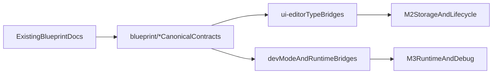

# feat: Freeze Blueprint System M1 Contracts

## Overview

本方案只覆盖 Blueprint System 的 `M1`：冻结 UI 范围内的蓝图核心语义、共享类型、宿主 API 协议、调试事件协议，以及与现有 `ui-editor` / `Dev Mode` 类型层的前向兼容桥。

`M1` **不**尝试打通运行时事件闭环，不改真实 `uigraphs.json` 存储形状，不提前实现 Visual Blueprint 编辑器或 TypeScript Blueprint 执行链。目标是让 `M2/M3/M4/M5` 能在同一组稳定术语和契约上推进，而不是继续围绕 owner、binding、frontend、programKind 反复改口。

## Problem Frame

当前仓库已经有一套可用但很薄的基础设施：

- [src/shared/types/ui-editor/document.ts](src/shared/types/ui-editor/document.ts) 已有 `UIBehaviorBinding`，但仍是 `graphId + entry` 语义。
- [src/shared/types/ui-editor/graph.ts](src/shared/types/ui-editor/graph.ts) 仍是 `UIGraphDocument = { schemaVersion, graphs }` 的单层结构。
- [src/renderer/lib/workspace/services/ui-editor/UIGraphService.ts](src/renderer/lib/workspace/services/ui-editor/UIGraphService.ts) 只支持 schema `1`，没有 migration。
- [src/shared/types/devMode.ts](src/shared/types/devMode.ts) 与 [src/main/app/application/managers/devMode/DevModeManager.ts](src/main/app/application/managers/devMode/DevModeManager.ts) 目前只把 `uidoc + uigraphs` 打进 bundle。
- [src/renderer/lib/ui-editor/behavior-graph/GraphExecutor.ts](src/renderer/lib/ui-editor/behavior-graph/GraphExecutor.ts) 已有最小执行器，但仓库里还没有 UI 事件真正派发到它。
- [src/renderer/apps/workspace/modules/properties/PropertiesPanel.tsx](src/renderer/apps/workspace/modules/properties/PropertiesPanel.tsx) 与 [src/renderer/lib/ui-editor/widget-modules/builtin/rectangle/inspector.tsx](src/renderer/lib/ui-editor/widget-modules/builtin/rectangle/inspector.tsx) 中的 Blueprint 仍是占位入口。

这意味着 `M1` 最容易失败的方式，不是“定义不够多”，而是“在协议还没稳定前就把 M2/M3 运行逻辑一起做掉”。本计划的核心是先把类型层和阶段边界钉牢。

## Requirements Trace

- `R1.` `M1` 只冻结 UI 范围内的蓝图语义，不引入全项目脚本化范围。
- `R2.` 采用你已确认的方向：新增 `src/shared/types/blueprint/`* 作为 canonical 类型层，而不是直接把现有 `ui-editor/`* 变成唯一真相。
- `R3.` 采用你已确认的兼容策略：`M1` 就在现有类型上铺前向兼容桥，但不把真实运行 shape 切换到 `M2/M3` 终态。
- `R4.` 冻结 `BlueprintOwnerRef`、`BlueprintDocument`、`Blueprint`、`BlueprintMemberIndex`、`BindingDefinition`、`BlueprintHostApiContract`、`BlueprintDebugEvent` 等核心对象。
- `R5.` 冻结 Host API 六大家族与 `pure/effectful` 语义边界，保证 Visual / TypeScript 两种前端未来共用同一套能力树。
- `R6.` 保持 `uigraphs.json` 仍为当前运行链路载体；真实 ownerIndex / lifecycle / binding persistence 迁移延后到 `M2`。
- `R7.` 明确哪些文件本次只做类型桥接，哪些文件必须保持不动，避免范围蔓延到 `M3/M4`。

## Scope Boundaries

- 不把 [src/renderer/lib/ui-editor/behavior-graph/GraphExecutor.ts](src/renderer/lib/ui-editor/behavior-graph/GraphExecutor.ts) 改成真实 Blueprint Runtime。
- 不把 [src/main/app/application/managers/devMode/DevModeManager.ts](src/main/app/application/managers/devMode/DevModeManager.ts) 改成真实蓝图 bundle 生产器；`uigraphs` 仍保留为当前必需字段。
- 不在 [src/renderer/apps/dev-mode/components/DevModeSurfaceRenderer.tsx](src/renderer/apps/dev-mode/components/DevModeSurfaceRenderer.tsx) 或 widget renderer 中接通 UI 事件 -> 图执行。
- 不在 [src/renderer/apps/workspace/modules/properties/PropertiesPanel.tsx](src/renderer/apps/workspace/modules/properties/PropertiesPanel.tsx) 或 widget inspector 中落地真实绑定 UI。
- 不做 `uigraphs.json` schema bump、ownerIndex 持久化、实例生命周期自动创建/删除、共享蓝图资产文件化。
- 不新增测试框架；`M1` 以类型编译与结构一致性校验为主。

## Context & Research

### Relevant Code and Patterns

- [src/shared/types/ui-editor/document.ts](src/shared/types/ui-editor/document.ts): 现有 `UIBehaviorBinding` 是未来桥接的第一落点。
- [src/shared/types/ui-editor/graph.ts](src/shared/types/ui-editor/graph.ts): 现有 `UIGraphDocument/UIGraph/UIGraphEntry` 是 `M1` 到 `M2` 的兼容层基础。
- [src/shared/types/devMode.ts](src/shared/types/devMode.ts): 现有 `DevModeBundle.ui.uidoc/uigraphs` 是未来 bundle 扩展的兼容面。
- [src/shared/types/ipcEvents.ts](src/shared/types/ipcEvents.ts): `devModePayloadUpdate` 已把 `DevModeBundle` 暴露为 IPC 契约的一部分。
- [src/renderer/lib/ui-editor/runtime/types.ts](src/renderer/lib/ui-editor/runtime/types.ts): `UIHostAdapter` 是未来 `BlueprintHostApiContract` 的现有运行时载体。
- [src/renderer/lib/workspace/services/ui-editor/UIGraphService.ts](src/renderer/lib/workspace/services/ui-editor/UIGraphService.ts): 明确显示 `M2` 之前不应碰真实 migration。

### Institutional Learnings

- 仓库内没有 `docs/solutions/`，本次方案主要以现有 `project/docs/blueprint-system.md`、`project/docs/blueprint-system-milestones.md`、`project/docs/dev-mode.md`、`project/docs/visual-editor-implementation-guide.md` 为依据。
- 这些文档结论一致指向：`M1` 先冻结协议，`M3` 才打通运行时，`M4` 才做编辑器。

### External References

- 本次不做外部调研。现有仓库文档和代码骨架已经足够支撑 `M1` 方案，额外外部资料不会改变阶段边界。

## Key Technical Decisions

- **Canonical 类型层新开目录**：在 [src/shared/types/blueprint/](src/shared/types/blueprint/) 下建立新的 blueprint contract namespace，而不是继续把蓝图概念散落在 `ui-editor/`* 和 `devMode.ts` 中。
- **兼容桥前置，但不切换真实运行 shape**：`M1` 在现有类型中加入可选字段/联合类型，为 `M2/M3` 铺路；当前运行文件和读写逻辑仍继续围绕 `uigraphs` 与 `graphId + entry` 工作。
- **Host API 与 Runtime substrate 分层**：`BlueprintHostApiContract` 定义未来能力树；[src/renderer/lib/ui-editor/runtime/types.ts](src/renderer/lib/ui-editor/runtime/types.ts) 中的 `UIHostAdapter` 仍保留为当前运行时适配层，不在 `M1` 强行改名或重写实现。
- **Debug 协议先于调试 UI**：先把 `BlueprintDebugEvent` 和 execution identity 定义出来，真实事件发射和 DevTools 展示放到 `M3/M5`。
- **文档与代码同时冻结**：既然 `M1` 的本质是“语义冻结”，现有蓝图文档必须和代码 contract 同步，否则后续执行仍会反复争论。

## Open Questions

### Resolved During Planning

- **Canonical 类型放哪里？** 结论：新增 [src/shared/types/blueprint/](src/shared/types/blueprint/) 作为唯一 canonical contract 层。
- **M1 对现有类型是只规划还是前置兼容？** 结论：前置兼容；在 `ui-editor/devMode/runtime` 类型层加入 optional / union bridge，但不改真实运行行为。

### Deferred to Implementation

- `**UIGraph` 上具体哪些 bridge 字段需要真正持久化？** 延后到实现时按编译压力决定；`M1` 只要求字段语义前向兼容，不要求它们立刻成为稳定磁盘 schema。
- `**DevModeBundle` 未来是 `uigraphs -> localBlueprints` 替换还是双载荷并存？** 延后到 `M3`，取决于届时 runtime 接入策略。
- **共享蓝图资产扩展名与资产索引格式**：延后到 `M5`。

## High-Level Technical Design

> *This illustrates the intended approach and is directional guidance for review, not implementation specification. The implementing agent should treat it as context, not code to reproduce.*

## Implementation Units

- **Unit 1: 建立 Blueprint canonical 类型层**

**Goal:** 在 shared types 下建立 Blueprint System 的单一术语源，覆盖 owner、document、program、member、binding、host API、debug 协议。

**Requirements:** `R1`, `R2`, `R4`, `R5`

**Dependencies:** None

**Files:**

- Create: [src/shared/types/blueprint/schema.ts](src/shared/types/blueprint/schema.ts)
- Create: [src/shared/types/blueprint/document.ts](src/shared/types/blueprint/document.ts)
- Create: [src/shared/types/blueprint/hostApi.ts](src/shared/types/blueprint/hostApi.ts)
- Create: [src/shared/types/blueprint/debug.ts](src/shared/types/blueprint/debug.ts)
- Create: [src/shared/types/blueprint/index.ts](src/shared/types/blueprint/index.ts)

**Approach:**

- 在 `document.ts` 中冻结 `BlueprintOwnerRef`、`BlueprintDocument`、`Blueprint`、`BlueprintProgramKind`、`BlueprintProgram`、`BlueprintMemberIndex`、`BindingDefinition` 及其相关子类型。
- 在 `schema.ts` 中集中放 `M1` 级别 schema/version 常量与兼容说明，避免版本语义继续分散在 service 常量和文档里。
- 在 `hostApi.ts` 中定义 `navigation`、`widget`、`state`、`persistence`、`media`、`devtools` 六大族及 `pure/effectful` 标记位。
- 在 `debug.ts` 中定义 `BlueprintDebugEvent`、execution id、node/function/binding 相关事件载荷。
- 在 `index.ts` 中做稳定再导出，供 `shared` / `main` / `renderer` 三端统一引用。

**Execution note:** 先把类型命名、分层和可选字段边界定死，再做任何 bridge 改动；这一单元不应引入运行时实现代码。

**Patterns to follow:**

- [src/shared/types/ui-editor/document.ts](src/shared/types/ui-editor/document.ts)
- [src/shared/types/ui-editor/graph.ts](src/shared/types/ui-editor/graph.ts)
- [src/shared/types/devMode.ts](src/shared/types/devMode.ts)

**Test scenarios:**

- Test expectation: none -- 类型契约冻结为主，仓库当前无现成测试框架；本单元依赖 TypeScript 编译校验而非运行测试。

**Verification:**

- `main`、`renderer`、`shared` 任一侧都能从 [src/shared/types/blueprint/index.ts](src/shared/types/blueprint/index.ts) 引入核心 contract，而不形成循环依赖。
- 文档中的 owner / frontend / programKind / binding / host API / debug 术语都能在新类型层找到一一对应定义。
- **Unit 2: 在现有 ui-editor 类型上铺前向兼容桥**

**Goal:** 让现有 `uidoc/uigraphs` 类型继续服务当前仓库，同时开始承载面向 `M2/M3` 的 blueprint-aware 语义。

**Requirements:** `R3`, `R4`, `R6`

**Dependencies:** Unit 1

**Files:**

- Modify: [src/shared/types/ui-editor/document.ts](src/shared/types/ui-editor/document.ts)
- Modify: [src/shared/types/ui-editor/graph.ts](src/shared/types/ui-editor/graph.ts)

**Approach:**

- 在 `document.ts` 中把现有 `UIBehaviorBinding` 保持可用，同时增加 blueprint-aware union 分支，允许未来从 `graphId + entry` 过渡到 `blueprintId + eventId`，但不要求当前调用方立刻切换。
- 在 `graph.ts` 中通过 optional bridge fields、类型别名或 JSDoc mapping，把 `UIGraphDocument/UIGraph/UIGraphEntry` 与新的 Blueprint 概念层建立清晰对应关系。
- 严格限制 bridge 字段只做前向兼容，不把 `ownerIndex`、共享蓝图资产、真实 bindings 持久化等 `M2` 结构直接塞进当前磁盘 schema。

**Execution note:** 这一单元的成功标准是“旧代码不坏、新术语可落位”，不是“旧 schema 已完成迁移”。

**Patterns to follow:**

- [src/shared/types/ui-editor/document.ts](src/shared/types/ui-editor/document.ts)
- [src/shared/types/ui-editor/graph.ts](src/shared/types/ui-editor/graph.ts)
- [src/renderer/lib/workspace/services/ui-editor/UIGraphService.ts](src/renderer/lib/workspace/services/ui-editor/UIGraphService.ts)

**Test scenarios:**

- Test expectation: none -- 本单元只做共享类型桥接，验证方式以旧调用方继续通过编译、且新 contract 可被引用为主。

**Verification:**

- 现有围绕 `UIGraphDocument` 与 `UIBehaviorBinding.kind === "graph"` 的调用方无需同步重写即可继续编译。
- 新的 blueprint contract 可以从 `ui-editor` 类型层被安全引用或映射，不出现术语冲突。
- **Unit 3: 冻结 Dev Mode / IPC / Runtime 的前置协议表面**

**Goal:** 让 Dev Mode、IPC 与 runtime substrate 在类型层预留 Blueprint System 的接入位点，但不提前接通真实执行链。

**Requirements:** `R3`, `R5`, `R7`

**Dependencies:** Unit 1

**Files:**

- Modify: [src/shared/types/devMode.ts](src/shared/types/devMode.ts)
- Modify: [src/shared/types/ipcEvents.ts](src/shared/types/ipcEvents.ts)
- Modify: [src/renderer/lib/ui-editor/runtime/types.ts](src/renderer/lib/ui-editor/runtime/types.ts)
- Modify if required by type fallout: [src/main/preload/ipc/interface.ts](src/main/preload/ipc/interface.ts)

**Approach:**

- 在 `devMode.ts` 中保持 `ui.uigraphs` 为当前稳定载荷，同时增加 blueprint-aware optional 扩展位，例如本地蓝图与共享蓝图的未来承载槽位。
- 在 `ipcEvents.ts` 中确保 `devModePayloadUpdate` 仍兼容旧 bundle，同时能够容纳新的 optional blueprint 字段。
- 在 `runtime/types.ts` 中把 `UIHostAdapter` 与 `BlueprintHostApiContract` 建立类型层映射关系，明确现有 adapter 是未来 host API 的 substrate，而不是另一套并行概念。
- 仅当 preload 暴露的泛型/映射因 bundle 扩展而编译报错时，才同步调整 [src/main/preload/ipc/interface.ts](src/main/preload/ipc/interface.ts)。

**Execution note:** 绝不在这一单元里把 [src/main/app/application/managers/devMode/DevModeManager.ts](src/main/app/application/managers/devMode/DevModeManager.ts) 改成真实 blueprint bundle 生产逻辑。

**Patterns to follow:**

- [src/shared/types/devMode.ts](src/shared/types/devMode.ts)
- [src/shared/types/ipcEvents.ts](src/shared/types/ipcEvents.ts)
- [src/renderer/lib/ui-editor/runtime/types.ts](src/renderer/lib/ui-editor/runtime/types.ts)

**Test scenarios:**

- Test expectation: none -- 协议面扩展为主，不引入新的运行行为；验证以 IPC/adapter 相关类型通过编译为准。

**Verification:**

- `DevModeBundle`、`IPCDevModeEvents` 与 `UIHostAdapter` 的类型层都能表达 blueprint-aware future shape。
- `DevModeManager`、renderer Dev Mode 页面与 preload 接口在不改运行逻辑的情况下继续通过编译。
- **Unit 4: 同步 M1 文档、非目标与验收标准**

**Goal:** 把本次代码级 contract freeze 反馈回现有蓝图文档，消除“文档说的是终态、代码做的是半成品桥接”之间的歧义。

**Requirements:** `R1`, `R6`, `R7`

**Dependencies:** Unit 1, Unit 2, Unit 3

**Files:**

- Modify: [project/docs/blueprint-system.md](project/docs/blueprint-system.md)
- Modify: [project/docs/blueprint-system-milestones.md](project/docs/blueprint-system-milestones.md)

**Approach:**

- 在 `blueprint-system.md` 中补清楚 `M1` 的 canonical 类型层落点、legacy bridge 策略，以及哪些文件保持不动直到 `M2/M3`。
- 在 `blueprint-system-milestones.md` 中补清楚 `M1` 的“前向兼容但不切换真实运行 shape”原则，避免后续把 `blueprintEvent` / `localBlueprints` optional bridge 误当成已交付 runtime 功能。
- 明确列出本阶段不动的关键文件：`UIGraphService.ts` 的真实 migration、`DevModeManager.ts` 的 bundle 生产、`GraphExecutor.ts` 的调试/派发、属性面板和 inspector 的真实 UI。

**Patterns to follow:**

- [project/docs/blueprint-system.md](project/docs/blueprint-system.md)
- [project/docs/blueprint-system-milestones.md](project/docs/blueprint-system-milestones.md)

**Test scenarios:**

- Test expectation: none -- 文档与验收口径同步，不涉及运行代码。

**Verification:**

- 文档中的 `M1` 目标、代码中的 contract freeze、以及后续 `M2/M3` 的职责边界不再互相矛盾。
- 实施人员可以仅根据文档和类型层判断某改动应属于 `M1`、`M2` 还是 `M3`。

## System-Wide Impact

- **Interaction graph:** [src/shared/types/ui-editor/document.ts](src/shared/types/ui-editor/document.ts) 的行为绑定、[src/shared/types/ui-editor/graph.ts](src/shared/types/ui-editor/graph.ts) 的图文档、[src/shared/types/devMode.ts](src/shared/types/devMode.ts) 的 bundle、[src/renderer/lib/ui-editor/runtime/types.ts](src/renderer/lib/ui-editor/runtime/types.ts) 的 host adapter 将首次被同一组 blueprint 术语贯穿。
- **Error propagation:** 风险主要是类型层破坏旧调用方；应优先把错误暴露为编译错误，而不是通过 runtime fallback 静默吞掉。
- **State lifecycle risks:** 若在 `M1` 过早把 optional bridge 字段写入磁盘 schema，会让 `M2` migration 语义混乱；因此 bridge 字段仅作为前向兼容 contract，不应在 `M1` 当成真实持久化源。
- **API surface parity:** `BlueprintHostApiContract` 必须同时服务未来的 Visual / TypeScript Blueprint，避免两套宿主 API 并存。
- **Integration coverage:** 本阶段不做跨层运行测试，集成验证以 `shared/main/renderer` 三侧编译通过为主。
- **Unchanged invariants:** 现阶段 `uigraphs.json`、`graphId + entry`、`DevModeBundle.ui.uigraphs`、`UIHostAdapter.effects.runEffect` 的运行语义保持不变；`M1` 只为它们加未来接入位。

## Risks & Dependencies

- **风险：bridge 字段定义过重，变相提前做 `M2` schema 迁移**  
缓解：所有 legacy optional 字段都只做类型映射，不要求 `UIGraphService` 在 `M1` 读写它们。
- *风险：canonical 类型层与现有 `ui-editor/` 重复命名，造成 import 混乱**  
缓解：通过 [src/shared/types/blueprint/index.ts](src/shared/types/blueprint/index.ts) 提供稳定入口，并在 `ui-editor/`* 中只做 bridge，不重复声明终态概念。
- **风险：Dev Mode / IPC 类型扩展诱导实现方误以为 runtime 已切换**  
缓解：文档和类型命名中显式使用 optional / bridge 语义，并在 `M1` 验收标准里写清“不切换真实运行 shape”。

## Documentation / Operational Notes

- `M1` 实施完成后，建议把蓝图相关讨论统一锚定到 [src/shared/types/blueprint/index.ts](src/shared/types/blueprint/index.ts)，而不是继续引用零散的 `UIGraph`* 旧术语。
- 由于仓库当前没有测试框架，本阶段以 `yarn lint` 的双 tsconfig 编译作为主要回归门槛。

## Sources & References

- Related code: [src/shared/types/ui-editor/document.ts](src/shared/types/ui-editor/document.ts)
- Related code: [src/shared/types/ui-editor/graph.ts](src/shared/types/ui-editor/graph.ts)
- Related code: [src/shared/types/devMode.ts](src/shared/types/devMode.ts)
- Related code: [src/shared/types/ipcEvents.ts](src/shared/types/ipcEvents.ts)
- Related code: [src/renderer/lib/ui-editor/runtime/types.ts](src/renderer/lib/ui-editor/runtime/types.ts)
- Related code: [src/renderer/lib/workspace/services/ui-editor/UIGraphService.ts](src/renderer/lib/workspace/services/ui-editor/UIGraphService.ts)
- Related code: [src/main/app/application/managers/devMode/DevModeManager.ts](src/main/app/application/managers/devMode/DevModeManager.ts)
- Planning sources: [project/docs/blueprint-system.md](project/docs/blueprint-system.md)
- Planning sources: [project/docs/blueprint-system-milestones.md](project/docs/blueprint-system-milestones.md)
- Planning sources: [project/docs/dev-mode.md](project/docs/dev-mode.md)
- Planning sources: [project/docs/visual-editor-implementation-guide.md](project/docs/visual-editor-implementation-guide.md)

