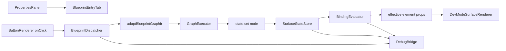

# Blueprint System M3-min + Visual Editor M4-lite 实现方案

## Overview

目标输出文件：`project/docs/implementation-plans/p2-bp-m3min-ve-m4lite-plan.md`。

本阶段只做最小可用闭环：在 `Dev Mode` 内打通 `Button click -> blueprint event -> surface state -> binding evaluator -> UI 可见变化 -> 基础调试事件`，同时把编辑器侧 Blueprint 区块从延期说明升级为真实入口层，但仍然不做完整 Visual Blueprint 编辑器，也不在属性面板内做最小绑定编辑。

## Problem Frame

当前仓库已经完成了 `Blueprint System M2` 的本地实例蓝图与 `blueprintEvent` 持久化基础，也已经有 `ReadonlyBlueprintSection`、`LocalBlueprintService`、`UIGraphService`、`GraphExecutor`、`DevModeBundle.ui.localBlueprints` 等骨架，但还缺三段关键闭环：

- `Dev Mode` 渲染树还没有真正消费 `blueprintEvent`，`Button` 也没有点击派发。
- `BlueprintDeclaration` 还没有可正式求值的最小 typed shape，导致 `binding evaluator` 无法把 `surface state` 映射回 UI。
- 编辑器侧 Blueprint 区块仍然只有只读摘要，没有真实跳转入口，也没有 `Surface` 级入口。

本方案按你确认的路线推进：

- 运行时沿现有 [src/renderer/lib/ui-editor/behavior-graph/GraphExecutor.ts](src/renderer/lib/ui-editor/behavior-graph/GraphExecutor.ts) / [src/renderer/lib/ui-editor/behavior-graph/builtinNodes.ts](src/renderer/lib/ui-editor/behavior-graph/builtinNodes.ts) 演进，不另起第二套原生执行内核。
- `Visual Editor M4-lite` 只做“状态可见 + 跳转入口”，不做属性面板内的最小绑定编辑。
- 跳转目标是编辑器内的轻量 Blueprint 入口 Tab，而不是直接把用户扔到 `Dev Mode`。
- 可见变化的最小真闭环采用 `surface state -> binding evaluator -> UI`，而不是 `widget.*` 直接改 UI 作为主要验收路径。
- `BlueprintDeclaration` 在本期正式扩出最小 typed shape，不走 `meta` 过渡。
- `DebugBridge` 的最小验收事件集固定为：`execution.started`、`execution.finished`、`execution.error`、`state.read`、`state.write`、`binding.evaluated`。

## Requirements Trace

- `R1`：在 `Dev Mode` 内真实执行本地实例蓝图事件图，形成最小运行时闭环。
- `R2`：本期最小状态桥只覆盖 `surface state`，并以 binding 求值驱动 UI 属性变化。
- `R3`：最小运行时继续复用现有 `GraphExecutor` 路线，不引入重型新执行栈。
- `R4`：属性面板 Blueprint 区块升级为真实入口层，用户能看到当前 `Surface` / 元素是否挂了逻辑。
- `R5`：用户能从当前上下文跳到对应逻辑入口，但该入口只是一页轻量 Blueprint Tab，不是完整图编辑器。
- `R6`：编辑器仍然是静态/布局预览，真实执行与基础调试事件留在 `Dev Mode`。
- `R7`：方案必须明确与后续 `Blueprint System M4 + Visual Editor M4-full` 的兼容边界，不能把后路堵死。

## Scope Boundaries

- 不做完整 `React Flow` / Visual Blueprint 编辑器，不进入 [project/docs/blueprint-system-milestones.md](project/docs/blueprint-system-milestones.md) 的 `M4` 完整工作流。
- 不在属性面板增加最小绑定编辑、新建声明成员、改绑解绑 UI；本期仍然是只读入口层。
- 不把 `global ui state`、`persistence state`、`navigation`、`media` 拉进本期验收；本期只落实 `surface state`。
- 不要求 `Workspace` 或主进程消费调试事件；`M3-min` 的调试桥停在 `Dev Mode` renderer 内部即可。
- 不要求 `node.enter` / `node.exit` 节点级追踪；该能力留给后续 `M3-full`。
- 不把 `editor` 预览升级为第二个 `Dev Mode`；编辑器中的 `UIHostAdapter` 仍然允许是 no-op。

## Context & Research

### Relevant Code and Patterns

- [src/renderer/lib/workspace/services/ui-editor/LocalBlueprintService.ts](src/renderer/lib/workspace/services/ui-editor/LocalBlueprintService.ts) 已是本地实例蓝图的业务门面，已有 `ensureEventGraph()`、`listEventGraphIds()`、`getReadonlyWidgetMainSummary()`。
- [src/renderer/lib/workspace/services/ui-editor/UIDocumentService.ts](src/renderer/lib/workspace/services/ui-editor/UIDocumentService.ts) 已提供 `setElementBlueprintEvent()` / `clearElementBlueprintEvent()`，说明 `uidoc` 与 `blueprintDocument` 的桥接真相已固定。
- [src/renderer/apps/dev-mode/components/DevModeSurfaceRenderer.tsx](src/renderer/apps/dev-mode/components/DevModeSurfaceRenderer.tsx) 与 [src/renderer/apps/dev-mode/hooks/useDevModePayload.ts](src/renderer/apps/dev-mode/hooks/useDevModePayload.ts) 已经具备独立 `Dev Mode` 渲染壳，但 `hostAdapter.effects.runEffect` 仍为空。
- [src/renderer/lib/ui-editor/behavior-graph/GraphExecutor.ts](src/renderer/lib/ui-editor/behavior-graph/GraphExecutor.ts) 已能按 `entries/nodes/edges` 执行最小图结构，适合做 `BlueprintGraphIr` 的最小适配层。
- [src/renderer/lib/ui-editor/widget-modules/shared/blueprint/ReadonlyBlueprintSection.tsx](src/renderer/lib/ui-editor/widget-modules/shared/blueprint/ReadonlyBlueprintSection.tsx) 与 [src/renderer/lib/workspace/services/ui-editor/blueprint/readonlyBlueprintSummary.ts](src/renderer/lib/workspace/services/ui-editor/blueprint/readonlyBlueprintSummary.ts) 已经把元素级逻辑摘要集中到一个共享区块。
- [src/renderer/apps/workspace/modules/properties/schemas/sceneSchema.ts](src/renderer/apps/workspace/modules/properties/schemas/sceneSchema.ts) 是 `Surface` 级属性入口，适合补 `surfaceMain` 逻辑入口。
- [src/renderer/apps/workspace/modules/ui-editor/UISurfacesPanel.tsx](src/renderer/apps/workspace/modules/ui-editor/UISurfacesPanel.tsx) 与 Workspace tab registry 已经有稳定的 `EditorTab` 打开模式，适合新增轻量 Blueprint Tab。

### Institutional Learnings

- 仓库内没有 `docs/solutions/` 经验库；本次应以 [project/docs/agent-milestone-prompts.md](project/docs/agent-milestone-prompts.md)、[project/docs/blueprint-system.md](project/docs/blueprint-system.md)、[project/docs/blueprint-system-milestones.md](project/docs/blueprint-system-milestones.md)、[project/docs/visual-editor-milestones.md](project/docs/visual-editor-milestones.md)、[project/docs/dev-mode.md](project/docs/dev-mode.md) 作为主约束来源。
- 这些文档对 P2 的共同约束是一致的：`Dev Mode` 是执行与调试主场，属性面板只做轻入口，不能提前做重型图编辑器。

### External Research

代码库里已有足够明确的本地模式，本次规划不需要额外外部资料。

## Key Technical Decisions

- **执行链路线**：`M3-min` 沿现有 `behavior-graph` 路线演进，新增 `BlueprintDispatcher`、`SurfaceStateStore`、`BindingEvaluator`、`DebugBridge` 组合层，不重新发明第二套 runtime。
- **最小状态域**：本期只正式落地 `surface state`。`global/persistence/navigation/media` 只保留契约和未来扩展位，不进本期验收。
- **声明求值形状**：`BlueprintDeclaration` 在本期新增正式 typed value-source 字段，至少支持一种可求值来源：`surface state`。不借 `meta` 做临时过渡，也不绕过声明直接让 binding 读 state。
- **可见变化路径**：`Button` 事件图负责写 `surface state`；`BindingEvaluator` 在渲染前把绑定值映射回元素有效属性；UI 变化由重新求值后的有效属性产生。
- **`UIHostAdapter` 演进**：保持其“渲染期宿主注入边界”定位，只为运行时事件派发补最小扩展位，不在本期把完整 `BlueprintHostApiContract` 全量塞回 `UIHostAdapter`。
- **调试桥边界**：`DebugBridge` 先在 `Dev Mode` renderer 内部发出和消费最小事件流，不新增 `Workspace <-> Main <-> Dev Mode` 调试回传 IPC。
- **M4-lite 入口形态**：属性面板显示真实状态与跳转按钮；跳转目标是新的轻量 Blueprint Tab，payload 只包含 `blueprintId`、owner 上下文和 `focusEventId`，为未来 `M4-full` 复用。

## High-Level Technical Design

> 这部分用于说明方案形状，是评审导向信息，不是可直接照抄的实现代码。

## Implementation Units

- [ ] **Unit 1: 收敛 M3-min 的最小声明求值语义与校验层**

**Goal:** 让 `binding evaluator` 有一个正式、可校验、可扩展的最小声明来源模型，而不是停留在名字占位。

**Requirements:** `R1`, `R2`, `R3`

**Dependencies:** None

**Files:**
- Modify: [src/shared/types/blueprint/document.ts](src/shared/types/blueprint/document.ts)
- Modify: [src/shared/types/blueprint/index.ts](src/shared/types/blueprint/index.ts)
- Modify: [src/renderer/lib/workspace/services/ui-editor/blueprint/documentValidation.ts](src/renderer/lib/workspace/services/ui-editor/blueprint/documentValidation.ts)
- Modify: [src/renderer/lib/workspace/services/ui-editor/LocalBlueprintService.ts](src/renderer/lib/workspace/services/ui-editor/LocalBlueprintService.ts)
- Modify: [src/renderer/lib/workspace/services/services.ts](src/renderer/lib/workspace/services/services.ts)
- Create: [src/renderer/lib/workspace/services/ui-editor/blueprint/declarationEvaluation.ts](src/renderer/lib/workspace/services/ui-editor/blueprint/declarationEvaluation.ts)
- Test: none -- 当前仓库没有既有自动化测试框架，验收以类型检查、lint 与手工流验证为主

**Approach:**
- 在 `BlueprintDeclaration` 上新增正式 typed source 字段，第一阶段只允许一种来源：`surface state`。
- 保持 `BindingDefinition.source` 仍然指向声明成员，不绕过声明体系。
- 把声明求值校验收敛到 `documentValidation.ts`，保证缺 key、非法 scope、缺少 source 字段都能被识别为 invalid 或 broken。
- `LocalBlueprintService` 增加读取声明求值元数据与生成轻量入口摘要的查询 API，为 `BindingEvaluator` 和轻量 Tab 共用。

**Patterns to follow:**
- [src/renderer/lib/workspace/services/ui-editor/LocalBlueprintService.ts](src/renderer/lib/workspace/services/ui-editor/LocalBlueprintService.ts)
- [src/shared/types/blueprint/document.ts](src/shared/types/blueprint/document.ts)

**Test scenarios:**
- Happy path: 声明成员能稳定表达一个 `surface state` key 的最小引用语义。
- Edge case: 指向不存在 key 的声明不会让文档结构失真，运行时按 broken 或 fallback 处理。
- Error path: 缺少 typed source 字段的声明在校验层被明确拒绝或标记不可执行。

**Verification:**
- 计划中的 `surface state -> binding evaluator -> UI` 路线已经有正式数据承载位。
- `M4-full` 后续可以在同一 typed shape 上扩展更多 declaration source，而不是回头推翻本期结构。

- [ ] **Unit 2: 建立最小 Blueprint runtime substrate，复用现有 GraphExecutor**

**Goal:** 在不另起新执行内核的前提下，补齐事件派发、surface state、binding 求值、调试桥的最小 runtime 组合层。

**Requirements:** `R1`, `R2`, `R3`, `R6`

**Dependencies:** Unit 1

**Files:**
- Create: [src/renderer/lib/ui-editor/blueprint-runtime/BlueprintRuntimeSession.ts](src/renderer/lib/ui-editor/blueprint-runtime/BlueprintRuntimeSession.ts)
- Create: [src/renderer/lib/ui-editor/blueprint-runtime/BlueprintDispatcher.ts](src/renderer/lib/ui-editor/blueprint-runtime/BlueprintDispatcher.ts)
- Create: [src/renderer/lib/ui-editor/blueprint-runtime/SurfaceStateStore.ts](src/renderer/lib/ui-editor/blueprint-runtime/SurfaceStateStore.ts)
- Create: [src/renderer/lib/ui-editor/blueprint-runtime/BindingEvaluator.ts](src/renderer/lib/ui-editor/blueprint-runtime/BindingEvaluator.ts)
- Create: [src/renderer/lib/ui-editor/blueprint-runtime/DebugBridge.ts](src/renderer/lib/ui-editor/blueprint-runtime/DebugBridge.ts)
- Create: [src/renderer/lib/ui-editor/blueprint-runtime/adaptBlueprintGraphIr.ts](src/renderer/lib/ui-editor/blueprint-runtime/adaptBlueprintGraphIr.ts)
- Create: [src/renderer/lib/ui-editor/behavior-graph/blueprintM3MinNodes.ts](src/renderer/lib/ui-editor/behavior-graph/blueprintM3MinNodes.ts)
- Modify: [src/renderer/lib/ui-editor/behavior-graph/builtinNodes.ts](src/renderer/lib/ui-editor/behavior-graph/builtinNodes.ts)
- Modify: [src/renderer/lib/ui-editor/behavior-graph/BehaviorNodeRegistry.ts](src/renderer/lib/ui-editor/behavior-graph/BehaviorNodeRegistry.ts)
- Test: none -- 运行时区域当前无自动化 harness，需以手工 `Dev Mode` 场景验证为主

**Approach:**
- `BlueprintDispatcher` 负责把 `UIBehaviorBinding.kind = "blueprintEvent"` 解析到 `Blueprint.program.graphs.events[eventId].graph`。
- `adaptBlueprintGraphIr.ts` 只做最小结构适配，让当前 `BlueprintGraphIr` 可以进入现有 `GraphExecutor`。
- `SurfaceStateStore` 维护当前 `surfaceId` 级别的运行时状态，并提供变更通知。
- `BindingEvaluator` 在渲染前解析 `BindingDefinition -> BlueprintDeclaration -> surface state`，并发出 `state.read` / `binding.evaluated`。
- `blueprintM3MinNodes.ts` 只补最小节点：至少 `state.set`，必要时允许一个轻量 `debug.log`，但不提前扩完整节点族。
- `DebugBridge` 只发出你确认的最小事件集：`execution.started`、`execution.finished`、`execution.error`、`state.read`、`state.write`、`binding.evaluated`。

**Patterns to follow:**
- [src/renderer/lib/ui-editor/behavior-graph/GraphExecutor.ts](src/renderer/lib/ui-editor/behavior-graph/GraphExecutor.ts)
- [src/shared/types/blueprint/debug.ts](src/shared/types/blueprint/debug.ts)
- [src/shared/types/blueprint/hostApi.ts](src/shared/types/blueprint/hostApi.ts)

**Test scenarios:**
- Happy path: `blueprintEvent` 能定位到事件图并完成一次执行。
- Happy path: 事件图写入 `surface state` 后，后续 binding 求值能读回同一 key。
- Edge case: `eventId` 缺失、图为空、超出 `maxSteps` 时发出 `execution.error`，且不让 `Dev Mode` 渲染树失效。
- Error path: 声明或 binding 失效时，不会导致整棵 UI 树崩溃，调试流中能看到错误或 broken 结果。

**Verification:**
- `Dev Mode` 内已经具备最小 runtime substrate，但仍明显小于完整 `Blueprint System M3`。
- `GraphExecutor` 继续是执行内核，`BlueprintRuntimeSession` 只是外围组合层，后续 `M3-full` 可继续扩节点和 host 能力。

- [ ] **Unit 3: 打通 Dev Mode 渲染链、Button 点击派发与有效属性重算**

**Goal:** 让最小闭环真正发生在运行中的 `Dev Mode` 画面里，而不是停留在文档服务层。

**Requirements:** `R1`, `R2`, `R3`, `R6`

**Dependencies:** Unit 2

**Files:**
- Modify: [src/renderer/lib/ui-editor/runtime/types.ts](src/renderer/lib/ui-editor/runtime/types.ts)
- Create: [src/renderer/lib/ui-editor/runtime/hostAdapters/devModeBlueprintHostAdapter.ts](src/renderer/lib/ui-editor/runtime/hostAdapters/devModeBlueprintHostAdapter.ts)
- Modify: [src/renderer/lib/ui-editor/widget-modules/builtin/button/renderer.tsx](src/renderer/lib/ui-editor/widget-modules/builtin/button/renderer.tsx)
- Modify: [src/renderer/apps/dev-mode/hooks/useDevModePayload.ts](src/renderer/apps/dev-mode/hooks/useDevModePayload.ts)
- Modify: [src/renderer/apps/dev-mode/components/DevModeSurfaceRenderer.tsx](src/renderer/apps/dev-mode/components/DevModeSurfaceRenderer.tsx)
- Modify: [src/renderer/apps/dev-mode/components/DevModeContent.tsx](src/renderer/apps/dev-mode/components/DevModeContent.tsx)
- Create: [src/renderer/apps/dev-mode/components/BlueprintRuntimeDebugPanel.tsx](src/renderer/apps/dev-mode/components/BlueprintRuntimeDebugPanel.tsx)
- Test: none -- 当前无 Dev Mode UI 自动化基础设施，需以手工回归为主

**Approach:**
- 在 `UIHostAdapter` 上补一个最小事件派发入口，仅供运行时 widget 把 `click` 之类的 UI 事件送入 `BlueprintDispatcher`。
- 编辑器侧 `UISurfaceEditorTab` 继续允许 no-op，不把选择/编辑态和运行态耦合在一起。
- `DevModeSurfaceRenderer` 在递归渲染前应用 `BindingEvaluator` 产出的有效属性，而不是要求每个 widget 自己理解 binding。
- `ButtonRenderer` 只在运行时 host adapter 提供事件派发能力时挂真实点击；编辑器预览继续保持静态语义。
- `BlueprintRuntimeDebugPanel` 作为 `Dev Mode` 内部的小面板展示最小事件流，不要求回传 `Workspace`。

**Patterns to follow:**
- [src/renderer/apps/dev-mode/components/DevModeSurfaceRenderer.tsx](src/renderer/apps/dev-mode/components/DevModeSurfaceRenderer.tsx)
- [src/renderer/apps/dev-mode/hooks/useDevModePayload.ts](src/renderer/apps/dev-mode/hooks/useDevModePayload.ts)
- [src/renderer/lib/ui-editor/widget-modules/builtin/button/renderer.tsx](src/renderer/lib/ui-editor/widget-modules/builtin/button/renderer.tsx)

**Test scenarios:**
- Happy path: `nl.button` 在 `Dev Mode` 点击后，触发一次 `blueprintEvent` 执行。
- Happy path: 执行写入 `surface state` 后，绑定到 `visible` 或文本属性的元素发生可见变化。
- Edge case: 未绑定 `blueprintEvent` 的按钮点击不报错，也不会发出伪执行事件。
- Edge case: `Stage Surface Link` 场景下，事件派发和属性重算仍按被解析后的有效根节点工作。
- Error path: runtime 抛错时，`Dev Mode` 仍保持当前画面可见，并显示调试错误信息。

**Verification:**
- `Button click -> blueprint event -> surface state -> binding evaluator -> UI visible change` 已在 `Dev Mode` 内走通。
- 编辑器静态预览与 `Dev Mode` 真实执行的职责边界没有被打破。

- [ ] **Unit 4: 把 Blueprint 区块升级为真实入口层，并新增轻量 Blueprint Tab**

**Goal:** 让用户在当前 `Surface` / 元素上下文里看见逻辑状态，并能跳到对应逻辑入口，但仍不进入完整图编辑器。

**Requirements:** `R4`, `R5`, `R6`, `R7`

**Dependencies:** Unit 1

**Files:**
- Modify: [src/renderer/lib/workspace/services/ui-editor/blueprint/readonlyBlueprintSummary.ts](src/renderer/lib/workspace/services/ui-editor/blueprint/readonlyBlueprintSummary.ts)
- Modify: [src/renderer/lib/workspace/services/ui-editor/LocalBlueprintService.ts](src/renderer/lib/workspace/services/ui-editor/LocalBlueprintService.ts)
- Modify: [src/renderer/lib/workspace/services/services.ts](src/renderer/lib/workspace/services/services.ts)
- Modify: [src/renderer/lib/ui-editor/widget-modules/shared/blueprint/useReadonlyBlueprintSummary.ts](src/renderer/lib/ui-editor/widget-modules/shared/blueprint/useReadonlyBlueprintSummary.ts)
- Modify: [src/renderer/lib/ui-editor/widget-modules/shared/blueprint/ReadonlyBlueprintSection.tsx](src/renderer/lib/ui-editor/widget-modules/shared/blueprint/ReadonlyBlueprintSection.tsx)
- Modify: [src/renderer/lib/ui-editor/widget-modules/builtin/rectangle/inspector.tsx](src/renderer/lib/ui-editor/widget-modules/builtin/rectangle/inspector.tsx)
- Modify: [src/renderer/lib/ui-editor/widget-modules/builtin/text/inspector.tsx](src/renderer/lib/ui-editor/widget-modules/builtin/text/inspector.tsx)
- Modify: [src/renderer/lib/ui-editor/widget-modules/builtin/image/inspector.tsx](src/renderer/lib/ui-editor/widget-modules/builtin/image/inspector.tsx)
- Modify: [src/renderer/lib/ui-editor/widget-modules/builtin/container/inspector.tsx](src/renderer/lib/ui-editor/widget-modules/builtin/container/inspector.tsx)
- Modify: [src/renderer/lib/ui-editor/widget-modules/builtin/button/inspector.tsx](src/renderer/lib/ui-editor/widget-modules/builtin/button/inspector.tsx)
- Modify: [src/renderer/apps/workspace/modules/properties/PropertiesPanel.tsx](src/renderer/apps/workspace/modules/properties/PropertiesPanel.tsx)
- Modify: [src/renderer/apps/workspace/modules/properties/schemas/sceneSchema.ts](src/renderer/apps/workspace/modules/properties/schemas/sceneSchema.ts)
- Create: [src/renderer/apps/workspace/modules/blueprint-lite/editors/BlueprintEntryTab.tsx](src/renderer/apps/workspace/modules/blueprint-lite/editors/BlueprintEntryTab.tsx)
- Create: [src/renderer/apps/workspace/modules/blueprint-lite/blueprintEntryTabId.ts](src/renderer/apps/workspace/modules/blueprint-lite/blueprintEntryTabId.ts)
- Test: none -- 当前无属性面板/Tab 自动化测试框架，需以手工交互回归为主

**Approach:**
- 元素级入口继续复用 `ReadonlyBlueprintSection` 的共享位置，但把内容升级为真实入口层：显示 `widgetMain`、事件 hook 数、event graph 数、broken 状态，以及“打开逻辑入口”按钮。
- `Surface` 级入口落在 `sceneSchema.ts`，展示 `surfaceMain` 的最小摘要与跳转按钮，保证“当前 Surface / 元素”两种上下文都成立。
- 轻量 Blueprint Tab 只展示结构化入口信息：owner、`blueprintId`、声明列表、事件入口列表、当前 `focusEventId`、当前阶段说明；不提供图编辑、连线、节点面板。
- Tab payload 固定为未来可复用的最小形状：`blueprintId`、`ownerKind`、`surfaceId`、`elementId?`、`focusEventId?`。
- Broken 或无逻辑时，入口按钮用禁用态或清晰空态解释，而不是虚假加号。

**Patterns to follow:**
- [src/renderer/lib/ui-editor/widget-modules/shared/blueprint/ReadonlyBlueprintSection.tsx](src/renderer/lib/ui-editor/widget-modules/shared/blueprint/ReadonlyBlueprintSection.tsx)
- [src/renderer/apps/workspace/modules/properties/schemas/sceneSchema.ts](src/renderer/apps/workspace/modules/properties/schemas/sceneSchema.ts)
- [src/renderer/apps/workspace/modules/ui-editor/UISurfacesPanel.tsx](src/renderer/apps/workspace/modules/ui-editor/UISurfacesPanel.tsx)

**Test scenarios:**
- Happy path: 选中挂了 `blueprintEvent` 的 `Button` 时，属性面板能看见已挂逻辑并打开对应轻量 Tab。
- Happy path: 选中 `Surface` 时，`sceneSchema` 内能展示 `surfaceMain` 摘要并打开对应轻量 Tab。
- Edge case: 没有任何事件图或逻辑的元素显示明确空态，而不是误导性入口。
- Edge case: broken binding / broken declaration 能被状态文案识别出来。
- Error path: `blueprintId` 丢失或 payload 无法定位时，Tab 打不开并返回明确错误提示。

**Verification:**
- 用户已经能从当前上下文“看见逻辑 + 跳到逻辑入口”，但不会误以为本期已经交付完整蓝图编辑器。
- 新入口形态与当前 Workspace / Properties 视觉风格一致。

- [ ] **Unit 5: 文档对齐、兼容边界与验收收口**

**Goal:** 让 P2 的真实边界在计划、设计文档和后续 P4/P5 前向兼容说明里保持一致。

**Requirements:** `R6`, `R7`

**Dependencies:** Unit 1, Unit 2, Unit 3, Unit 4

**Files:**
- Create: [project/docs/implementation-plans/p2-bp-m3min-ve-m4lite-plan.md](project/docs/implementation-plans/p2-bp-m3min-ve-m4lite-plan.md)
- Modify: [project/docs/blueprint-system-milestones.md](project/docs/blueprint-system-milestones.md)
- Modify: [project/docs/visual-editor-milestones.md](project/docs/visual-editor-milestones.md)
- Modify: [project/docs/blueprint-system.md](project/docs/blueprint-system.md)
- Modify: [project/docs/visual-editor.md](project/docs/visual-editor.md)
- Modify: [project/docs/dev-mode.md](project/docs/dev-mode.md)
- Test: none -- 文档与验收项以人工核对为主

**Approach:**
- 在 P2 计划文件中明确写清：本期执行与调试主场是 `Dev Mode`，属性面板只做入口层，轻量 Blueprint Tab 只是通向 `M4-full` 的中间形态。
- 把 `BlueprintDeclaration` 的最小 typed source、`surface state` 单一状态域、最小调试事件集写进文档，避免后续实现时重新摇摆。
- 明确写出与 `Blueprint System M4 + Visual Editor M4-full` 的兼容边界：
- `BlueprintEntryTab` 的 payload 形状后续直接复用到完整编辑器。
- `ReadonlyBlueprintSection` 的状态字段后续继续复用到 `Literal / Bound / Broken` 更完整状态机。
- `BlueprintRuntimeSession`、`BindingEvaluator`、`SurfaceStateStore` 后续继续扩成 `M3-full`，而不是被 `React Flow` 画布层取代。
- `UIHostAdapter` 本期只补最小事件派发扩展位，完整 `BlueprintHostApiContract` 映射留给后续阶段。

**Patterns to follow:**
- [project/docs/agent-milestone-prompts.md](project/docs/agent-milestone-prompts.md)
- [project/docs/blueprint-system-milestones.md](project/docs/blueprint-system-milestones.md)
- [project/docs/visual-editor-milestones.md](project/docs/visual-editor-milestones.md)

**Test scenarios:**
- Verification-only: 文档中不再出现“P2 要做完整编辑器”或“属性面板可直接编辑绑定”的歧义。
- Verification-only: `M3-min` 与 `M4-lite` 的职责切分在所有相关文档中一致。

**Verification:**
- 计划、里程碑文档和实现指南对 P2 边界的描述一致。
- 后续 `P4` 可以在不推翻本期文件组织的前提下继续扩成完整 Visual Blueprint 工作流。

## System-Wide Impact

- [src/shared/types/blueprint/document.ts](src/shared/types/blueprint/document.ts) 会从“只够持久化”升级为“也能承载最小求值语义”的共享真相层。
- `Dev Mode` 会第一次真正消费 `bundle.ui.localBlueprints`，但该消费仍局限在 renderer 内部，不需要新 IPC 才能成立。
- `ButtonRenderer` 将第一次区分“静态编辑态”和“运行点击态”，但行为入口仍通过 `UIHostAdapter` 注入而不是写死到 widget 自身。
- `PropertiesPanel` 会新增真实入口与 `Surface` 级逻辑摘要，但不会演变成完整蓝图编辑器。

## Risks & Dependencies

- 最大风险是把 `surface state -> binding evaluator -> UI` 这条链写得过宽，变成提前实现 `M3-full`；解决方式是强制把状态域限制为 `surface`，节点族限制为最小集，调试事件限制为已确认的六类。
- 第二个风险是 `BlueprintDeclaration` typed source 设计得太随意，导致 `M4-full` 还要推翻；解决方式是正式引入 discriminated union，并只开放一个稳定 variant。
- 第三个风险是轻量 Blueprint Tab 如果做得太像完整编辑器，会模糊 `M4-lite` 与 `M4-full` 边界；解决方式是只展示结构化入口信息，不出现图画布、节点编辑、连线操作。
- 第四个风险是 `Dev Mode` 内 debug panel 侵入布局过强；解决方式是以最小、可折叠的事件列表开始，保持和项目现有界面风格一致。

## Acceptance Plan

本阶段完成时，至少满足下面这些结果：

- `Dev Mode` 中的一个 `Button` 点击能真实进入 `blueprintEvent` 执行链。
- 事件图至少能完成一次 `surface state` 写入，并由 `binding evaluator` 在同一运行时会话内读回。
- UI 至少有一个清晰可见的变化由这条状态链驱动，例如 `visible` 或文本属性变化。
- `Dev Mode` 内能看到最小调试事件集：`execution.started`、`execution.finished`、`execution.error`、`state.read`、`state.write`、`binding.evaluated`。
- 属性面板在元素级和 `Surface` 级都能显示当前是否挂了逻辑，并能打开轻量 Blueprint Tab。
- 属性面板不提供绑定编辑，不出现完整图编辑器，不误导用户以为 `M4-full` 已完成。
- 相关文档与计划对 `M3-min` / `M4-lite` 的边界表述一致。

验证方式：

- 手工 `Dev Mode` 验证：打开包含 `Button` 的示例 Surface，点击后观察 UI 变化与调试事件流。
- 手工入口验证：在元素属性和 `Scene Properties` 中分别打开轻量 Blueprint Tab，检查 payload 与状态展示是否正确。
- 回归验证：`Stage Surface Link`、`Main Surface`、普通无逻辑 widget、broken 引用状态都不出现误导性 UI。
- 代码质量验证：最近改动文件通过类型检查与 lint；由于当前仓库没有既有自动化测试框架，本期不额外引入重型测试基建。

## Deferred To Later Milestones

- `global ui state`、`persistence state`、`navigation/media` host API 的真实执行与验收。
- `node.enter` / `node.exit` 节点级追踪、调用栈、变量面板等更完整调试能力。
- `Literal / Bound / Broken` 的完整属性级状态机与属性面板绑定编辑 UI。
- 完整 `Visual Blueprint` 画布、成员树、节点检查器、图级校验与 `React Flow` 集成。
- 调试事件回传 `Workspace` 或主进程的跨窗口桥接。

## Sources & References

- [project/docs/agent-milestone-prompts.md](project/docs/agent-milestone-prompts.md)
- [project/docs/blueprint-system-milestones.md](project/docs/blueprint-system-milestones.md)
- [project/docs/visual-editor-milestones.md](project/docs/visual-editor-milestones.md)
- [project/docs/blueprint-system.md](project/docs/blueprint-system.md)
- [project/docs/visual-editor.md](project/docs/visual-editor.md)
- [project/docs/dev-mode.md](project/docs/dev-mode.md)
- [src/renderer/lib/workspace/services/ui-editor/LocalBlueprintService.ts](src/renderer/lib/workspace/services/ui-editor/LocalBlueprintService.ts)
- [src/renderer/lib/workspace/services/ui-editor/UIDocumentService.ts](src/renderer/lib/workspace/services/ui-editor/UIDocumentService.ts)
- [src/renderer/lib/ui-editor/behavior-graph/GraphExecutor.ts](src/renderer/lib/ui-editor/behavior-graph/GraphExecutor.ts)
- [src/renderer/apps/dev-mode/components/DevModeSurfaceRenderer.tsx](src/renderer/apps/dev-mode/components/DevModeSurfaceRenderer.tsx)
- [src/renderer/lib/ui-editor/widget-modules/shared/blueprint/ReadonlyBlueprintSection.tsx](src/renderer/lib/ui-editor/widget-modules/shared/blueprint/ReadonlyBlueprintSection.tsx)
- [src/renderer/apps/workspace/modules/properties/schemas/sceneSchema.ts](src/renderer/apps/workspace/modules/properties/schemas/sceneSchema.ts)