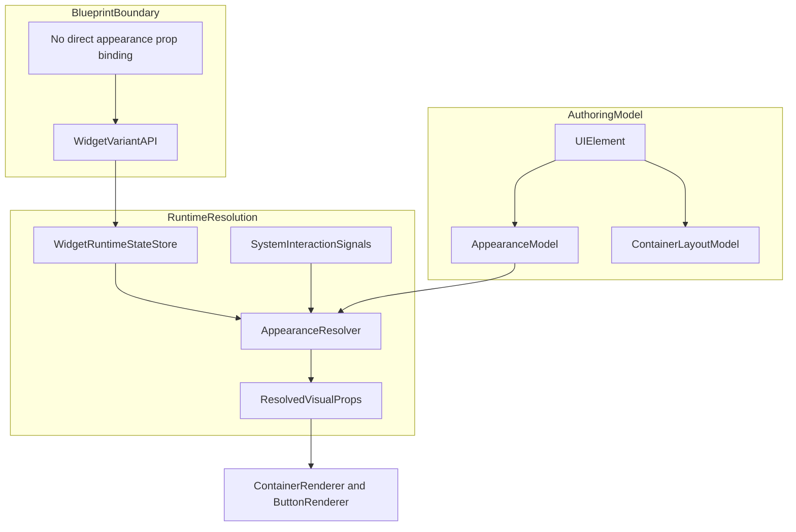

# UI Editor 主模型收敛与 Appearance 架构迁移计划

## Overview
本计划将当前 UI 编辑器从“把实现机制直接暴露成 widget 类型”的架构，重构为更接近设计工具但又面向视觉小说游戏 UI 的模型。

最终用户层只保留少量核心对象：`Container`、`Text`、`Image`、`Button`，以及一个高级语义控件 `List`。其中 `Container` 成为主要承载对象，负责背景、边框、裁剪、子元素承载、布局模式、滚动能力与预设化分隔用途；`Button` 保留为语义控件，但视觉外观不再靠独立 hover/active 属性堆叠，而是基于共享的 appearance 能力解析。

本迁移明确采用硬切换：不提供旧 `nl.rectangle` / `nl.stack` / `nl.scroll` / `nl.spacerDivider` / `nl.listRepeater` 的兼容层、兼容读取或渐进迁移桥。实现完成后，旧模型直接退出主代码路径。

## Problem Frame
当前系统的核心问题不是“控件数量略多”，而是用户层概念与实现层机制混层：

- `src/renderer/lib/ui-editor/widget-modules/builtin/index.ts` 直接把 `Rectangle`、`Stack`、`Scroll`、`SpacerDivider`、`ListRepeater` 与 `Text`、`Image`、`Button` 平铺进主 palette。
- `src/shared/types/ui-editor/document.ts` 通过 `UI_FLOW_LAYOUT_PARENT_ELEMENT_TYPES` 把 `nl.stack`、`nl.scroll`、`nl.listRepeater` 绑定为 flow parent，说明它们本质上是布局模式切换器，而不是应该与文本/图片并列的一等用户概念。
- `src/renderer/lib/ui-editor/interaction/controllers/TransformController.ts` 对 flow child 禁止拖拽，进一步证明这些类型已经在交互层承担“编辑模式切换”职责。
- 现有蓝图绑定通过 `widgetProp + declaration(surfaceState key)` 做逐属性求值，适合少量字面量属性绑定，但不适合 `Container` / `Button` 这类需要整体外观切换的对象。

同时，用户已经明确了新的产品约束：

- 主基础容器概念确定为 `Container`。
- `Appearance` 不是完整的 `variant × state` 矩阵编辑器。
- 正确模型是：`variant` 作为高层外观切换单位；在每个 variant 内，每个属性除默认值外，还可以追加带状态前提的属性行；`hovered`、`active`、`disabled` 等系统状态只负责在当前 variant 内决定命中哪条属性行。
- 蓝图只能切换 variant，不能直接驱动这些系统伪状态，也不能再对 appearance 的细粒度属性做逐项绑定。
- 形态键/appearance 属于控件自己的状态，不依赖 surface page state 作为语义来源。

## Current State Summary
### 相关现状代码
- Widget 扩展入口：`src/renderer/lib/ui-editor/widget-modules/types.ts`
- Widget 注册：`src/renderer/lib/ui-editor/widget-modules/registryInstance.ts`
- 旧的默认元素创建注册：`src/renderer/lib/ui-editor/element-types/registryInstance.ts`
- 运行时 builtin renderer 映射：`src/renderer/lib/ui-editor/runtime/builtin/index.ts`
- 插入 palette / docker：`src/renderer/lib/ui-editor/docker/UIEditorDockerBar.tsx`
- 画布右键插入：`src/renderer/apps/workspace/modules/ui-editor/editors/UISurfaceEditorTab.tsx`
- 运行时树与 layoutMode 选择：`src/renderer/lib/workspace/services/ui-editor/UIRuntimeBridgeService.tsx`、`src/renderer/lib/ui-editor/runtime/EditorNodeWrapper.tsx`
- 交互层：`src/renderer/lib/ui-editor/interaction/UIEditorInteractionLayer.tsx`、`src/renderer/lib/ui-editor/interaction/controllers/TransformController.ts`
- 蓝图绑定求值：`src/renderer/lib/ui-editor/blueprint-runtime/BindingEvaluator.ts`
- blueprint host API：`src/renderer/lib/ui-editor/blueprint-runtime/BlueprintHostApiBridge.ts`
- Dev Mode host adapter：`src/renderer/lib/ui-editor/runtime/hostAdapters/devModeBlueprintHostAdapter.ts`
- 属性框架：`src/renderer/apps/workspace/modules/properties/framework/*`
- UI inspector 入口：`src/renderer/apps/workspace/modules/ui-editor/inspector/registry.ts`

### 与迁移直接相关的现状结论
- 主 palette 目前默认暴露所有 builtin widget，没有“内部能力 vs 用户概念”的分层。
- 当前存在三条并行注册链：widget module、element type、builtin renderer；这会放大模型重构成本，也提高遗漏风险。
- 编辑器预览路径不跑 blueprint binding merge；真实运行时求值只发生在 Dev Mode。
- 当前没有现成的控件实例级运行时状态容器；`UIHostAdapterBlueprintRuntime` 只暴露 surface state，`BlueprintHostApiRuntime.widget` 只支持 `setVisible` / `setEnabled`。
- 属性框架支持 section、hidden 与静态 schema，但没有开箱即用的“动态属性行列表”字段类型；对本次迁移更合适的做法是在 UI-editor 范围内新增共享 appearance editor 组件，而不是把领域复杂度污染到整个 properties framework。
- 仓库当前没有成熟的自动化测试组织惯例；本迁移应优先把关键解析逻辑做成纯函数与小型 store，并准备一份明确的手工验证矩阵。

## Target Product Model
### 最终用户层对象
- `Container`：主要承载对象。负责视觉承载、子节点容器、布局模式切换、滚动能力与 appearance。
- `Text`：文本对象。
- `Image`：资源导向的图像对象。
- `Button`：语义控件，点击/聚焦/禁用等交互由系统状态参与 appearance 解析。
- `List`：高级语义控件。对用户暴露“列表/选项组”语义，不再使用 `Repeater` 作为用户概念。

### 从主模型移除的旧并列概念
- `Rectangle`
- `Stack`
- `Scroll`
- `SpacerDivider`
- `ListRepeater`

### 新的结构性边界
- `Container` 吸收旧 `Rectangle` 的高价值视觉能力，以及旧 `Container` / `Stack` / `Scroll` / `SpacerDivider` 的容器与布局职责。
- `Stack` 与 `Scroll` 不再是主 palette 里的控件，而是 `Container` 的布局能力或创建预设。
- `Divider` 不再是独立类型，而是 `Container` 的轻量预设。
- `Spacer` 不再作为一级概念出现；它要么退化为 `Container` 在流式布局下的特殊弹性/固定占位模式，要么直接被 gap / alignment / fill-space 能力取代。

## Key Technical Decisions
- **决策 1：使用硬切换而不是兼容桥。** 直接提高 `UI_DOCUMENT_SCHEMA_VERSION`，移除旧 widget 类型与 reader fallback，不写旧文档迁移适配层。
- **决策 2：用 `Container` 承担统一视觉容器职责。** 当前 `nl.container` 保留 type id 方向，但 props 结构需要重写，吸收旧 rectangle/container/stack/scroll/spacer 的核心能力。
- **决策 3：appearance 是共享能力，不是 class 式继承层。** 在 TypeScript 侧通过共享数据模型、共享 resolver、共享 inspector/editor 组件来实现“支持 appearance 的控件共享同一概念”，而不是引入脆弱的 OO 层级。
- **决策 4：引入控件本地运行时状态，而不是复用 surface state。** 新的 active variant 与系统交互状态属于控件实例本身，应由 widget-local runtime state 承载。
- **决策 5：蓝图只能切换 variant。** 蓝图不再逐项驱动 appearance 属性，也不控制 `hovered/active/disabled` 等系统伪状态。需要新增显式 widget variant API 或受限的 target path，而不是继续走 surfaceState -> declaration -> widgetProp 的泛化路径。
- **决策 6：appearance 只覆盖允许的视觉/尺寸字段，不覆盖结构字段。** 允许宽高、填充、描边、圆角、透明度、padding、必要的尺寸相关字段；禁止 `x/y`、父子关系、布局模式、scroll 模式、z-order、children 结构等结构性字段进入 appearance 条件行。
- **决策 7：条件属性行采用低复杂度规则。** v1 仅支持系统伪状态条件，且按“当前 variant 内、同一属性组内、最后匹配行获胜”解析；不引入通用表达式语言，不做任意状态组合编辑器。
- **决策 8：palette 暴露与 widget 实现解耦。** 不能继续让 `widgetModuleRegistry.list()` 自动等于用户 palette；需要显式的插入目录或 insertable 元数据。

## High-Level Technical Design
> This illustrates the intended approach and is directional guidance for review, not implementation specification. The implementing agent should treat it as context, not code to reproduce.

### 目标数据形状
- `UIElement.props` 中为支持 appearance 的控件保存一个共享 `appearance` 结构。
- `appearance` 至少包含：`defaultVariantId`、`variants[]`。
- 每个 `variant` 至少包含：`id`、`name`、`propertyGroups[]`。
- 每个 property group 对应一个可编辑目标属性，如 `fill.color`、`border.width`、`size.width`。
- 每个 property group 内至少有一条默认行，以及零到多条带系统状态前提的条件行。
- 运行时通过 `WidgetRuntimeStateStore` 保存 `activeVariantId` 与系统状态快照；resolver 以“active variant + system signals”计算最终视觉值。

### Container 的布局形态
- `Container.layout.kind = free | stack | scroll`
- `free` 对应当前 absolute 子布局。
- `stack` 对应当前 `nl.stack` 的 flow 子布局、gap、padding、alignment。
- `scroll` 对应当前 `nl.scroll` 的滚动视口 + 内部流式布局能力。
- `divider` 不作为 layout kind，而作为 `Container` 创建预设或 style preset。

## Scope Boundaries
- 不做旧 schema / 旧 widget 的向后兼容。
- 不保留 `Rectangle`、`Stack`、`Scroll`、`SpacerDivider`、`ListRepeater` 的双轨并存实现。
- 不在本次迁移里引入完整组件系统、模板系统或通用 style token 系统。
- 不把系统伪状态暴露成蓝图可写字段。
- 不把 appearance 变成通用表达式语言或 CSS 级联系统。
- 不让 variant 切换改变结构性树关系与画布坐标体系。

## Implementation Units

- [ ] **Unit 1: 建立最终对象集与单一注册真相源**

**Goal:** 把新的对象边界先定死，让创建、注册、palette 暴露、renderer 映射不再由三套并行注册链分别维护。

**Files:**
- Modify: `src/renderer/lib/ui-editor/widget-modules/types.ts`
- Modify: `src/renderer/lib/ui-editor/widget-modules/registryInstance.ts`
- Modify: `src/renderer/lib/ui-editor/widget-modules/builtin/index.ts`
- Modify: `src/renderer/lib/ui-editor/runtime/builtin/index.ts`
- Modify: `src/renderer/lib/workspace/services/ui-editor/UIDocumentService.ts`
- Remove or collapse: `src/renderer/lib/ui-editor/element-types/*`
- Modify: `src/renderer/lib/ui-editor/docker/UIEditorDockerBar.tsx`
- Modify: `src/renderer/apps/workspace/modules/ui-editor/editors/UISurfaceEditorTab.tsx`

**Approach:**
- 让 `UIWidgetModule` 成为唯一可插入对象与渲染对象的真相源。
- 在模块元数据中加入“是否对用户可插入”“插入分组/预设”等字段，避免 `widgetModuleRegistry.list()` 继续被直接当作 palette。
- 把 `UIDocumentService.createElement` 从旧 `elementTypeRegistry` 切到新的单一注册链，删除当前双维护层。
- 主 palette 只暴露 `Container`、`Text`、`Image`、`Button`、`List`，其他能力改为预设或 inspector 内切换。

**Patterns to follow:**
- `src/renderer/lib/ui-editor/widget-modules/types.ts`
- `src/renderer/lib/ui-editor/widget-modules/registryInstance.ts`
- `src/renderer/lib/ui-editor/runtime/builtin/index.ts`

**Verification:**
- 插入路径只有一套真实来源。
- 底部 docker palette 与画布右键菜单只出现新的对象集。
- 移除旧 registry 后，创建/渲染/inspector 不再因为注册链不同步而分叉。

- [ ] **Unit 2: 以 `Container` 重写统一视觉与布局容器**

**Goal:** 用一个高价值的 `Container` 替换旧的 `Rectangle`、`Container`、`Stack`、`Scroll`、`SpacerDivider` 用户层概念。

**Files:**
- Modify: `src/shared/types/ui-editor/document.ts`
- Create: `src/shared/types/ui-editor/container.ts`
- Modify: `src/renderer/lib/ui-editor/widget-modules/builtin/container.tsx`
- Modify: `src/renderer/lib/ui-editor/widget-modules/builtin/container/types.ts`
- Modify: `src/renderer/lib/ui-editor/widget-modules/builtin/container/renderer.tsx`
- Modify: `src/renderer/lib/workspace/services/ui-editor/UIRuntimeBridgeService.tsx`
- Modify: `src/renderer/lib/ui-editor/runtime/EditorNodeWrapper.tsx`
- Modify: `src/renderer/lib/ui-editor/interaction/controllers/TransformController.ts`
- Modify: `src/renderer/lib/ui-editor/diagnostics/rules/layoutDiagnostics.ts`
- Modify: `src/renderer/lib/ui-editor/diagnostics/rules/interactionDiagnostics.ts`
- Remove: `src/renderer/lib/ui-editor/widget-modules/builtin/rectangle*`
- Remove: `src/renderer/lib/ui-editor/widget-modules/builtin/stack*`
- Remove: `src/renderer/lib/ui-editor/widget-modules/builtin/scroll*`
- Remove: `src/renderer/lib/ui-editor/widget-modules/builtin/spacerDivider*`

**Approach:**
- 为 `Container` 建立新的 props 分层：结构字段、布局字段、视觉字段、appearance 配置字段。
- 旧 rectangle 的 fill/border/radius/image-fill 能力并入 `Container`，但 `Image` 仍保留为资源导向对象。
- 用 `layout.kind` 明确 free/stack/scroll 三种子布局模型，替代现在的 `UI_FLOW_LAYOUT_PARENT_ELEMENT_TYPES` 硬编码散落式语义。
- 统一 flow 子判断逻辑，避免继续由“某些 widget type 的字符串集合”驱动交互层分支。
- 把 `Divider` 收敛为 `Container` 创建预设，而不是独立类型。
- 若保留“占满剩余空间”诉求，作为 `Container` 在 stack 子树下的单一布局选项，而不是单独的 spacer widget。

**Patterns to follow:**
- `src/renderer/lib/workspace/services/ui-editor/UIRuntimeBridgeService.tsx`
- `src/renderer/lib/ui-editor/runtime/EditorNodeWrapper.tsx`
- `src/renderer/lib/ui-editor/interaction/controllers/TransformController.ts`

**Verification:**
- 新建 `Container` 即可覆盖旧 rectangle/container/stack/scroll/divider 的主要使用场景。
- flow 子布局与自由布局边界清晰，不再由一组历史 widget type 字符串决定。
- 交互层对 flow 子的拖拽/缩放限制与新容器模型一致。

- [ ] **Unit 3: 引入共享 Appearance 能力与控件本地运行时状态**

**Goal:** 为 `Container` 与 `Button` 建立共享的 appearance-host 架构，让外观解析从逐属性静态 props 转为“变体 + 条件属性行 + 系统状态”。

**Files:**
- Create: `src/shared/types/ui-editor/appearance.ts`
- Create: `src/renderer/lib/ui-editor/runtime/appearance/AppearanceResolver.ts`
- Create: `src/renderer/lib/ui-editor/runtime/appearance/WidgetRuntimeStateStore.ts`
- Create: `src/renderer/lib/ui-editor/runtime/appearance/SystemInteractionState.ts`
- Modify: `src/renderer/lib/ui-editor/runtime/types.ts`
- Modify: `src/renderer/lib/ui-editor/widget-modules/builtin/container/renderer.tsx`
- Modify: `src/renderer/lib/ui-editor/widget-modules/builtin/button/renderer.tsx`
- Modify: `src/renderer/lib/ui-editor/interaction/UIEditorInteractionLayer.tsx`

**Approach:**
- 抽出共享 appearance 数据模型，而不是让 `Container` 与 `Button` 各自实现一套 variant 结构。
- 抽出纯函数 resolver：输入为 authored appearance、active variant、系统状态，输出为解析后的最终视觉字段。
- 抽出 widget-local runtime state store，承载 `activeVariantId` 与系统伪状态；不要继续塞进 surface state。
- 运行时只允许解析明确白名单字段：宽高、填充、描边、圆角、opacity、padding 等；禁止结构字段进入 resolver。
- 采用“同一属性组内最后匹配条件行获胜”的低复杂度规则，避免引入表达式语言和多层优先级系统。

**Patterns to follow:**
- `src/renderer/lib/ui-editor/runtime/types.ts`
- `src/renderer/lib/ui-editor/blueprint-runtime/BindingEvaluator.ts`（只借鉴“集中解析”的位置，不复用其 surfaceState 语义）

**Verification:**
- `Container` / `Button` 的最终视觉值只由 resolver 输出，不再由 renderer 内部散落判断 hover/active 等 props。
- active variant 与系统状态可独立演进，且不依赖 surface state。
- appearance 数据结构与 resolver 可以单独阅读和维护，不与 widget 模块耦死。

- [ ] **Unit 4: 重建 Container / Button 的 inspector 为“变体 + 条件属性行”编辑器**

**Goal:** 用新的 authoring UI 取代当前扁平 appearance 字段，让变体成为一等对象，条件属性行成为 variant 内部的细粒度覆盖机制。

**Files:**
- Create: `src/renderer/lib/ui-editor/widget-modules/shared/appearance/*`
- Modify: `src/renderer/lib/ui-editor/widget-modules/builtin/container/inspector.tsx`
- Modify: `src/renderer/lib/ui-editor/widget-modules/builtin/button/inspector.tsx`
- Modify: `src/renderer/apps/workspace/modules/properties/PropertiesPanel.tsx`
- Modify only if strictly needed: `src/renderer/apps/workspace/modules/properties/framework/fields/FieldRenderer.tsx`

**Approach:**
- 不把整个 properties framework 变成领域特化系统；优先在 `widget-modules/shared/appearance/` 内提供 UI-editor 专用的共享 editor 组件，并由 container/button inspector 复用。
- 顶层先编辑 variant 列表与默认 variant；切换选中 variant 后，再在该 variant 内编辑 property groups 与条件属性行。
- 每个 property group 都明确一个受支持的目标字段；系统伪状态条件仅出现在条件行级别，不出现完整矩阵编辑器。
- 设计态允许手动预览系统状态命中效果，但这些预览不等于蓝图可写状态。
- 清理旧的 container/button 扁平外观字段，避免双模型并存。

**Patterns to follow:**
- `src/renderer/lib/ui-editor/widget-modules/builtin/stack/inspector.tsx`（字段分组风格）
- `src/renderer/lib/ui-editor/widget-modules/builtin/spacerDivider/inspector.tsx`（按条件隐藏字段）
- `src/renderer/apps/workspace/modules/properties/blueprint/BindablePropertyField.tsx`（只参考包裹式 UI 集成方式，不复用其逐属性绑定语义）

**Verification:**
- 在属性面板内可以创建/重命名/删除 variant。
- 在单个 variant 内可以对同一属性追加多条条件行。
- 切换当前编辑 variant 后，右侧内容不会混入其他 variant 的条件行。

- [ ] **Unit 5: 将蓝图边界收敛为“只能切换 variant”**

**Goal:** 让蓝图系统停止对 appearance-capable widgets 做逐属性绑定，改为显式切换 widget variant；系统伪状态继续只由运行时交互维护。

**Files:**
- Modify: `src/renderer/lib/ui-editor/runtime/types.ts`
- Modify: `src/renderer/lib/ui-editor/blueprint-runtime/BlueprintHostApiBridge.ts`
- Modify: `src/renderer/lib/ui-editor/runtime/hostAdapters/devModeBlueprintHostAdapter.ts`
- Modify: `src/renderer/lib/ui-editor/blueprint-runtime/BindingEvaluator.ts`
- Modify: `src/renderer/apps/workspace/modules/properties/blueprint/usePropertyBindingState.ts`
- Modify: `src/renderer/apps/workspace/modules/properties/blueprint/BindablePropertyField.tsx`
- Modify: `src/renderer/lib/ui-editor/behavior-graph/blueprintM3MinNodes.ts`
- Modify: `src/renderer/lib/ui-editor/behavior-graph/blueprintM3FullNodes.ts`
- Modify: `src/renderer/lib/ui-editor/behavior-graph/nodeEditorCatalog.ts`

**Approach:**
- 新增显式 widget runtime API，例如 `widget.setVariant(elementId, variantId)`，让蓝图通过明确能力切换 variant，而不是继续写任意 prop path。
- 对 appearance-capable widgets 移除逐属性 binding UI；保留或新增的 blueprint 可控入口仅限 variant 切换。
- 保持系统伪状态完全在运行时内部计算，不对蓝图暴露写入通路。
- 若仓库仍需保留 `widgetProp` 用于非 appearance widget，则给它加白名单边界，避免再次回流到外观细节绑定。
- 让 Dev Mode 的 widget runtime patch 从 `visible/enabled` 扩展为包含 variant 切换，但不要扩展为任意外观 patch。

**Patterns to follow:**
- `src/renderer/lib/ui-editor/blueprint-runtime/BlueprintHostApiBridge.ts`
- `src/renderer/lib/ui-editor/runtime/hostAdapters/devModeBlueprintHostAdapter.ts`
- `src/renderer/lib/ui-editor/behavior-graph/nodeEditorCatalog.ts`

**Verification:**
- 蓝图可以显式切换 `Container` / `Button` 的 active variant。
- 蓝图无法直接写 hovered/active/disabled 等系统状态。
- appearance-capable widgets 的右侧属性绑定 UI 不再暴露逐属性绑定入口。

- [ ] **Unit 6: 将 `ListRepeater` 重塑为语义化 `List` 控件**

**Goal:** 把列表相关能力收敛成用户可理解的 `List`，不再把 `Repeater` 作为用户概念暴露。

**Files:**
- Create or rename: `src/renderer/lib/ui-editor/widget-modules/builtin/list/*`
- Modify or replace: `src/renderer/lib/ui-editor/widget-modules/builtin/listRepeater/*`
- Modify: `src/renderer/lib/ui-editor/widget-modules/builtin/index.ts`
- Modify: `src/shared/types/ui-editor/document.ts`
- Modify: `src/renderer/lib/ui-editor/docker/UIEditorDockerBar.tsx`

**Approach:**
- 用户层改名为 `List`，属性语义改为列表方向、项间距、预览数量、模板布局等更接近列表而非 repeater 的说法。
- 内部可继续保留“预览复制模板子树”的实现思想，但 API 与 inspector 命名要彻底转向 list 心智。
- `List` 继续作为少量保留的高级语义控件，而不进入通用容器模型。

**Patterns to follow:**
- `src/renderer/lib/ui-editor/widget-modules/builtin/listRepeater/renderer.tsx`
- `src/renderer/lib/ui-editor/widget-modules/builtin/listRepeater/inspector.tsx`

**Verification:**
- palette 中出现 `List` 而不是 `ListRepeater`。
- 作者无需理解 repeater 技术词就能配置选项组/列表预览。
- 运行时点击行为仍只作用于真实实例，不被预览复制副本干扰。

- [ ] **Unit 7: 重接编辑器壳层、交互与诊断，使其围绕新模型工作**

**Goal:** 让 palette、docker、右键插入、交互限制、诊断规则全部围绕新的对象集和 Container 布局模式工作。

**Files:**
- Modify: `src/renderer/lib/ui-editor/docker/UIEditorDockerBar.tsx`
- Modify: `src/renderer/apps/workspace/modules/ui-editor/editors/UISurfaceEditorTab.tsx`
- Modify: `src/renderer/lib/ui-editor/interaction/UIEditorInteractionLayer.tsx`
- Modify: `src/renderer/lib/ui-editor/interaction/controllers/TransformController.ts`
- Modify: `src/renderer/lib/ui-editor/interaction/useMoveableHandlers.ts`
- Modify: `src/renderer/lib/ui-editor/diagnostics/collectSurfaceDiagnostics.ts`
- Modify: `src/renderer/lib/ui-editor/diagnostics/rules/*`

**Approach:**
- palette 与右键菜单只暴露新的对象集与必要预设。
- docker 对 `Container` 提供高频能力切换：布局模式、滚动模式、常用预设，而不是再切换旧 widget 类型。
- 交互层的 flow/absolute 限制逻辑从旧 widget type 判断切到 `Container.layout.kind` 或新的统一布局描述。
- 静态诊断规则也切到新的结构字段，避免继续对历史 widget type 做特判。

**Patterns to follow:**
- `src/renderer/lib/ui-editor/docker/UIEditorDockerBar.tsx`
- `src/renderer/apps/workspace/modules/ui-editor/editors/UISurfaceEditorTab.tsx`
- `src/renderer/lib/ui-editor/diagnostics/rules/layoutDiagnostics.ts`

**Verification:**
- 从空白 surface 出发，作者能仅通过新的对象集完成纵向容器、可滚动容器、列表、按钮与文本的常见搭建流。
- Docker 与 Inspector 的能力分工清晰：docker 负责高频切换，inspector 负责结构化编辑。
- 诊断提示不再提及已移除的旧类型名称。

- [ ] **Unit 8: 做硬切换清理与验证收口**

**Goal:** 删除旧模型残留，锁定新 schema 与新对象集，并给出清晰的验证矩阵供执行 agent 按图索骥完成收尾。

**Files:**
- Modify: `src/shared/types/ui-editor/document.ts`
- Remove: 已废弃 widget 模块与旧 registry 残留文件
- Review: `src/renderer/lib/workspace/services/ui-editor/UIBlueprintLifecycleCoordinator.ts`
- Review: `src/renderer/apps/dev-mode/components/DevModeSurfaceRenderer.tsx`
- Review: `src/renderer/apps/workspace/modules/properties/PropertiesPanel.tsx`

**Approach:**
- 提升 schema version，并在旧类型进入运行时路径时直接报未知类型，而不是 fallback。
- 全面删除不再进入主代码路径的旧 widget 模块、旧字符串常量、旧 type guard、旧 docker/inspector 分支。
- 收口 Dev Mode 与编辑器预览的边界：编辑器负责 authoring 预览与状态模拟，Dev Mode 负责真实运行时 variant/系统状态求值。
- 形成一份执行用验证矩阵，覆盖编辑态、交互态、Dev Mode、蓝图 variant 切换与布局模式。

**Verification:**
- 代码库内不再保留旧 widget 残余入口或双轨语义。
- schema 与 runtime 路径只服务新模型。
- 执行 agent 可以按验证矩阵逐项确认迁移完成。

## Verification Matrix
### 编辑器创作流
- 新建 surface 后，palette 仅出现 `Container`、`Text`、`Image`、`Button`、`List`。
- 仅用 `Container` 能完成自由布局容器、纵向堆叠容器、滚动容器、分隔条预设。
- 在 `Container` / `Button` inspector 内可创建 variant，并给单一属性追加条件行。
- 设计态可切换 variant，并可预览 hovered/active/disabled 等系统状态命中结果。

### 交互与布局流
- `Container.layout.kind = free` 时子元素仍按绝对坐标放置。
- `Container.layout.kind = stack/scroll` 时子元素进入统一 flow 逻辑，交互层限制与诊断规则同步生效。
- flow 子的拖拽/缩放行为符合新规则，不再被历史 widget type 字符串驱动。

### Dev Mode / 运行时流
- `Button` 点击仍可触发 blueprint event。
- blueprint 只能切换 widget variant，不能直接改写 appearance 属性。
- 系统 hover/active/disabled 状态可在当前 variant 内命中条件行并得到最终视觉结果。
- `visible/enabled` runtime patch 与 variant runtime patch 可以共存，不互相覆盖。

### 架构与清理
- `UIDocumentService.createElement` 只有一条注册真相源。
- runtime renderer、inspector、palette、右键菜单、diagnostics 不再引用旧 widget 类型。
- 新 appearance resolver 与 widget-local runtime state 为清晰独立模块，不散落在各 renderer 内。

## Risks and Mitigations
- **风险：Container 吸收职责过多，props 结构变成新的大泥球。** 缓解：把结构字段、布局字段、appearance 配置字段明确分层，appearance 只处理白名单视觉字段。
- **风险：继续把外观能力塞进通用 properties framework，导致全局耦合。** 缓解：优先在 `widget-modules/shared/appearance/` 下落 UI-editor 专用共享 editor，框架只做最小接线。
- **风险：variant 与系统伪状态的优先级不清。** 缓解：明确规则为“先确定 active variant，再在 variant 内按条件行命中，最后匹配行获胜”。
- **风险：blueprint 入口若仍保留逐属性 binding，会让新 appearance 模型被绕开。** 缓解：对 appearance-capable widgets 移除逐属性绑定入口，只保留显式 variant 控制能力。
- **风险：没有自动化测试基础设施，重构容易只靠体感。** 缓解：把 resolver/store 写成纯模块，并在计划执行时严格按验证矩阵做编辑器与 Dev Mode 双路径手工回归。

## File Arrangement Principles
- 新的共享模型与白名单类型放在 `src/shared/types/ui-editor/`，保证数据结构定义不依赖 renderer。
- 新的 runtime resolver 与 widget-local store 放在 `src/renderer/lib/ui-editor/runtime/appearance/`，不要混进 blueprint-runtime，避免把控件局部外观状态与 surface state 再次混层。
- 新的 appearance authoring 共享 UI 放在 `src/renderer/lib/ui-editor/widget-modules/shared/appearance/`，避免污染通用 `properties/framework`。
- `Container`、`Button`、`List` 的具体 inspector / renderer / dockerBar 仍各自留在对应 widget 模块目录下，复用 shared appearance 能力而不是互相 import 具体实现。

## Sources
- `project/docs/ui-editor-architecture.md`
- `project/docs/visual-editor-arch.md`
- `src/shared/types/ui-editor/document.ts`
- `src/renderer/lib/ui-editor/widget-modules/builtin/index.ts`
- `src/renderer/lib/ui-editor/docker/UIEditorDockerBar.tsx`
- `src/renderer/apps/workspace/modules/ui-editor/editors/UISurfaceEditorTab.tsx`
- `src/renderer/lib/ui-editor/runtime/EditorNodeWrapper.tsx`
- `src/renderer/lib/ui-editor/interaction/controllers/TransformController.ts`
- `src/renderer/lib/ui-editor/blueprint-runtime/BindingEvaluator.ts`
- `src/renderer/lib/ui-editor/blueprint-runtime/BlueprintHostApiBridge.ts`
- `src/renderer/lib/ui-editor/runtime/hostAdapters/devModeBlueprintHostAdapter.ts`
- `src/renderer/apps/workspace/modules/properties/framework/*`
- `src/renderer/apps/workspace/modules/properties/blueprint/*`