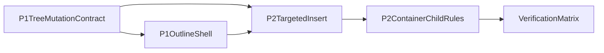

# feat: 完善 UI Editor Outline 与 Container 子控件系统

## Overview

本计划将工作拆为两个明确阶段：

- **P1：完整生产级 Outline**。目标不是再做一个“能看树”的面板，而是把图层树做成真实 authoring 入口：全树展开/折叠、深层拖放、跨父移动、显隐、重命名、上下文菜单、折叠状态记忆，并与画布 selection、link surface、container 规则完全一致。
- **P2：Container 子控件系统落地**。以当前统一 `Container` 模型为基础，不扩展到 grid/constraints 新布局体系，只把现有 `free / stack / scroll` 三种模式做完整，打通容器内插入、移动、重排、删除、序列化、交互限制与 Dev Mode 一致性。

这份计划默认交给其他 agent 继续执行，因此会把**源码真相、边界决策、依赖顺序、验证点、风险**一次性写清。

## Problem Frame

当前仓库并不是“没有 outline / 没有 container 系统”，而是两者都处于**半成品状态**：

- `src/renderer/lib/ui-editor/interaction/UILayersPanel.tsx` 已能显示完整树，但拖放只覆盖 `surface.rootElementId` 的直接子节点，深层节点只能选中、不能排序或换父。
- `src/renderer/lib/workspace/services/ui-editor/UIDocumentService.ts` 只有 `createElement()`、`reorderChildren()`、`deleteElements()`，缺少稳定的 `reparent / move` 服务层能力，因此完整 tree DnD 无法成立。
- 插入路径目前写死到 `surface.rootElementId`：`src/renderer/lib/ui-editor/interaction/useSurfaceInteractionEvents.ts` 与 `src/renderer/apps/workspace/modules/ui-editor/editors/UISurfaceEditorTab.tsx` 都直接 `createElement(surface.rootElementId, ...)`，导致容器子控件 authoring 无法闭环。
- 当前渲染、诊断、Dev Mode 已通过 `src/renderer/lib/ui-editor/runtime/resolveSurfaceRoot.ts` 按 **effective root** 处理 `Stage Surface -> App Surface link`，但 outline 仍然读 `surface.rootElementId`，在 link 场景下有潜在不一致。
- `src/shared/types/ui-editor/container.ts` 已经明确了统一 `Container` 的 `layoutKind = free | stack | scroll`，说明容器布局主路线已经确定；真正缺的是把这套模型在编辑体验上落地，而不是回退到独立 `Stack/Scroll` widget 路线。

## Requirements Trace

- **R1**：P1 必须交付完整生产级 outline，包括深层树拖放、跨父移动、显隐、重命名、上下文菜单与折叠状态记忆。
- **R2**：P1 的 outline 必须以 **effective rendered root** 为真相源，在 linked stage surface 场景中与画布、诊断、Dev Mode 保持一致。
- **R3**：P1 之前或之内必须建立稳定的 tree move / reparent 不变量，避免 UI 先行后返工。
- **R4**：P2 必须以当前统一 `Container` 模型为基础，不额外引入 grid/constraints 新布局体系。
- **R5**：P2 必须把 `free / stack / scroll` 三种模式的容器子控件操作做完整：插入、移动、重排、删除、序列化、交互规则、Outline 联动。
- **R6**：P2 结束时，插入路径不能再永远落到 surface root，而要支持目标容器 authoring。
- **R7**：编辑器预览与 Dev Mode 的职责边界保持不变：编辑器负责 authoring/静态预览，Dev Mode 负责真实运行时；但树结构和布局行为在两者间必须一致。

## Scope Boundaries

- 不把本计划扩展成新的 appearance / blueprint / variant 迁移计划；已有 `.cursor/plans/ui-model-migration_db8f2ab6.plan.md` 与 `.cursor/plans/ui-model-migration-phases_db8f2ab6.plan.md` 继续作为相关背景，但不是本计划的主目标。
- 不新增 grid、constraints、per-child grow/fill 等新的布局模型。
- 不引入完整组件系统、模板系统或新的文档文件格式。
- 不改变“编辑器静态预览、Dev Mode 真实执行”的产品边界。
- 不把 `nl.root` 暴露成普通可编辑节点。

## Context & Research

### Relevant Code and Patterns

- Outline 壳层与入口：`src/renderer/apps/workspace/modules/ui-editor/editors/UISurfaceEditorTab.tsx`
- 当前图层树实现：`src/renderer/lib/ui-editor/interaction/UILayersPanel.tsx`
- 文档树与 flow 判定：`src/shared/types/ui-editor/document.ts`
- 容器布局模型：`src/shared/types/ui-editor/container.ts`
- 文档编辑服务：`src/renderer/lib/workspace/services/ui-editor/UIDocumentService.ts`
- 编辑态插入路径：`src/renderer/lib/ui-editor/interaction/useSurfaceInteractionEvents.ts`
- 编辑器渲染 root 解析：`src/renderer/lib/workspace/services/ui-editor/UIRuntimeBridgeService.tsx`
- Dev Mode 渲染 root 解析：`src/renderer/apps/dev-mode/components/DevModeSurfaceRenderer.tsx`
- effective root helper：`src/renderer/lib/ui-editor/runtime/resolveSurfaceRoot.ts`
- 交互限制：`src/renderer/lib/ui-editor/interaction/UIEditorInteractionLayer.tsx`、`src/renderer/lib/ui-editor/interaction/controllers/TransformController.ts`
- 容器 inspector：`src/renderer/lib/ui-editor/widget-modules/builtin/container/inspector.tsx`

### Architectural Conclusions

- 当前源码已经采用**统一 `Container` 承担布局模式**的路线；P2 应继续沿这条线把 authoring 闭环做完，而不是重新设计 widget taxonomy。
- `childrenIds` 已经是单一树顺序真相；P1/P2 的核心不是新建树模型，而是补全**合法移动 API**与 UI 层对它的消费。
- `flow` 子节点在交互层已被视为特殊节点，说明容器系统与 outline 必须共享一套“哪些操作允许、哪些不允许”的规则，而不能各自判断。
- `project/docs/visual-editor.md` 对 widget 名称与现状存在漂移；执行时必须以源码和 `project/docs/visual-editor-arch.md` 的总体边界为准，而不是以旧文档中的 `nl.stack` / `nl.scroll` / `nl.listRepeater` 枚举为准。

## Key Technical Decisions

- **决策 1：P1 先补服务层，再补 Outline 壳层。** 先在 `UIDocumentService` 层定义稳定的 tree mutation contract，再做全树 DnD 和上下文操作，避免 UI 直接操纵 `parentId/childrenIds`。
- **决策 2：Outline 的根使用 effective root。** linked stage surface 场景下，outline 与渲染、诊断、Dev Mode 一样，基于 `resolveSurfaceRootElementId()` 的结果工作。
- **决策 3：P1 的“完整 outline”包含结构编辑与壳层操作。** 不只做 DnD，还包括显隐、重命名、右键菜单、折叠状态记忆。
- **决策 4：P2 继续沿用统一 `Container`。** 只把当前 `free / stack / scroll` 做完整，不引入 grid/constraints。
- **决策 5：插入逻辑必须支持目标容器。** 新元素不能继续默认挂在 surface root；必须有一致的 target-parent 决策规则，供右键插入、拖拽插入和未来 outline 操作复用。
- **决策 6：flow 子节点仍不在画布上自由拖拽定位。** `stack / scroll / list` 子节点的位置语义由父容器顺序与布局决定；画布 Moveable 不负责“改序”，改序主要通过 outline 或明确的容器内排序入口完成。
- **决策 7：优先统一 selection 语义。** ~~目前 outline 的 Shift 是区间选、画布的 Shift 是追加选~~ **P1 已完成：outline 与画布均为 Shift 追加、Ctrl/Meta 切换。**

## Resolved Planning Questions

- **P1 范围**：采用“完整生产级 outline”，而不是仅做结构编辑闭环。
- **P2 范围**：采用“当前统一 `Container` 三模式做完整”，不扩展到高级布局模型。
- **link surface 的 outline 语义**：采用“follow effective root”，与画布/诊断/Dev Mode 一致。

## High-Level Technical Design

> *This illustrates the intended approach and is directional guidance for review, not implementation specification. The implementing agent should treat it as context, not code to reproduce.*

## P1 — 完整生产级 Outline

### Goal

把 `UI Outline` 从“只读树 + root 一级排序”升级为真正可编辑的生产级图层面板，成为容器系统 authoring 的上游基础设施。

### Dependencies

- 无前置开发依赖。
- 但执行时应先确认并统一 effective-root 读取方式，再做 link surface 相关 UI。

### Files

- Modify: `src/renderer/lib/workspace/services/ui-editor/UIDocumentService.ts`
- Modify: `src/renderer/lib/workspace/services/services.ts`
- Modify: `src/renderer/lib/ui-editor/interaction/UILayersPanel.tsx`
- Modify: `src/renderer/apps/workspace/modules/ui-editor/editors/UISurfaceEditorTab.tsx`
- Modify: `src/renderer/lib/ui-editor/runtime/resolveSurfaceRoot.ts`（若需补充 helper 或暴露更易复用的 tree source）
- Modify: `src/renderer/lib/ui-editor/interaction/useSurfaceInteractionEvents.ts`
- Modify: `src/renderer/lib/workspace/services/ui-editor/UIEditorStateService.ts`
- Modify: `src/renderer/apps/workspace/modules/properties/PropertiesPanel.tsx`（若需配合 rename/visible 的 primary selection 展示）
- Optional test: `src/renderer/lib/workspace/services/ui-editor/__tests__/UIDocumentTreeMutations.test.ts`
- Optional test: `src/renderer/lib/ui-editor/interaction/__tests__/outlineSelectionRules.test.ts`

### Approach

- 在 `UIDocumentService` 增加统一的 tree mutation API，至少覆盖：
  - 同父重排
  - 跨父移动 / reparent
  - 多选移动时的非法组合过滤（祖先与后代同时移动、root 参与移动、跨 surface 非法移动）
  - flow/free 父切换时 `layout` 字段的归一化规则
- 让 `UILayersPanel` 从“root 一级 sortable + 递归只读展示”改为**全树结构化交互组件**：
  - 每个节点支持展开/折叠
  - 深层同父排序
  - 跨父拖放与插入提示
  - 上下文菜单与快捷操作
  - `visible` 快捷切换
  - inline rename 或最小化 rename 流
- 折叠状态不要写进 `uidoc.json`；优先放在 editor state / project settings 范围内，避免污染运行时文档。
- 把 outline 的 tree source 与 `resolveSurfaceRootElementId()` 对齐，确保 link surface 的画布和 outline 看的是同一棵树。
- 明确并统一 selection 规则：**P1 已统一** — `Shift+点击` 追加进当前选择；`Ctrl/Meta+点击` 切换成员。画布（`useSurfaceInteractionEvents`）与 Outline 面板使用同一套规则；原 outline 的 Shift 区间选已移除。

### Patterns to Follow

- 现有 selection 统一入口：`src/shared/types/ui-editor/selection.ts`
- 现有有效 root 解析：`src/renderer/lib/ui-editor/runtime/resolveSurfaceRoot.ts`
- 现有树结构真相：`src/shared/types/ui-editor/document.ts`

### Test Scenarios

- Happy path: 在普通 app surface 中，outline 能展开/折叠多层 tree，并对深层兄弟完成拖放重排。
- Happy path: 将节点从一个 container 移动到另一个 container 后，`parentId` 与两个父节点的 `childrenIds` 同步正确。
- Happy path: 在 linked stage surface 中，outline 显示并编辑的是 linked app tree，且与画布内容一致。
- Edge case: 多选集合中同时包含父节点与其子节点时，拖放应被阻止或自动规整，不允许写出非法树。
- Edge case: `nl.root` 不可重命名为业务节点、不可删除、不可作为普通拖放目标。
- Edge case: `visible = false` 的节点仍能在 outline 中被管理，但显示状态明确，不造成“消失后无法找回”。
- Error path: 拖放目标非法、目标父不存在、linked surface 失效时，UI 有明确回退或提示，不写坏文档。
- Integration: Outline 点击、多选、重命名、显隐切换后，画布 selection、属性面板、文档 dirty 状态同步正确。
- Optional unit test: 如果 tree move 规则被抽为纯 helper，覆盖 reparent、ancestor filtering、order normalization。

### Verification

- `UILayersPanel` 不再只支持 root 直接子排序。
- link surface 下，outline 与画布看到的是同一棵 tree。
- P2 所需的树操作 API 已可复用，不需要在容器 authoring 中再发明第二套移动逻辑。

## P2 — Container 子控件系统落地

### Goal

在当前统一 `Container` 模型上，补完整个容器 authoring 闭环，让作者能够在 `free / stack / scroll` 下稳定地创建、插入、移动、重排和管理子控件。

### Dependencies

- 依赖 P1 的 tree mutation contract。
- 最好复用 P1 已完成的 effective-root 和 outline tree 语义。

### Files

- Modify: `src/renderer/lib/ui-editor/interaction/useSurfaceInteractionEvents.ts`
- Modify: `src/renderer/apps/workspace/modules/ui-editor/editors/UISurfaceEditorTab.tsx`
- Modify: `src/renderer/lib/ui-editor/interaction/UIEditorInteractionLayer.tsx`
- Modify: `src/renderer/lib/ui-editor/interaction/controllers/TransformController.ts`
- Modify: `src/renderer/lib/workspace/services/ui-editor/UIDocumentService.ts`
- Modify: `src/shared/types/ui-editor/document.ts`
- Modify: `src/shared/types/ui-editor/container.ts`
- Modify: `src/renderer/lib/workspace/services/ui-editor/UIRuntimeBridgeService.tsx`
- Modify: `src/renderer/apps/dev-mode/components/DevModeSurfaceRenderer.tsx`
- Modify: `src/renderer/lib/ui-editor/runtime/EditorNodeWrapper.tsx`
- Modify: `src/renderer/lib/ui-editor/widget-modules/builtin/container/inspector.tsx`
- Modify: `src/renderer/lib/ui-editor/widget-modules/builtin/container/inspectorLayoutFields.tsx`
- Modify: `src/renderer/lib/ui-editor/widget-modules/builtin/container/renderer.tsx`
- Modify: `src/renderer/lib/ui-editor/diagnostics/rules/layoutDiagnostics.ts`
- Modify: `src/renderer/lib/ui-editor/diagnostics/rules/interactionDiagnostics.ts`
- Optional test: `src/renderer/lib/ui-editor/interaction/__tests__/targetParentResolution.test.ts`
- Optional test: `src/renderer/lib/workspace/services/ui-editor/__tests__/flowLayoutMoveRules.test.ts`

### Approach

- 定义统一的 **target parent resolution** 规则，供所有插入路径共享：
  - 右键插入
  - insert tool 拖拽插入
  - outline / context menu 插入子节点
  - 未来 docker 快捷插入
- 目标容器决策至少要区分：
  - 当前 primary selection 是否为合法 parent
  - 鼠标命中的 container 是否优先于 surface root
  - flow parent 与 free parent 的插入默认位置
  - linked surface 的有效 tree 中是否允许直接插入
- 对 `free / stack / scroll` 明确子节点行为：
  - `free`：保留绝对定位编辑
  - `stack / scroll`：位置由顺序和父布局决定，画布不负责自由拖位；outline/容器内排序负责顺序编辑
- 容器 inspector 不需要引入新布局模型，但需要把现有三模式做成可完整 authoring 的入口，包括空状态说明、模式切换后的行为提示、必要的 drop affordance 或结构提示。
- 保证 `UIRuntimeBridgeService` 与 `DevModeSurfaceRenderer` 在树结构和 flow 判定上继续保持一致；P2 不能只修编辑器预览，不修 Dev Mode。
- 诊断规则同步更新，避免在 flow 子/scroll 容器等场景下继续沿用 root-only 或 absolute-only 的假设。

### Patterns to Follow

- 容器布局真相：`src/shared/types/ui-editor/container.ts`
- flow child 判定：`src/shared/types/ui-editor/document.ts`
- 编辑器/Dev Mode 渲染一致性：`src/renderer/lib/workspace/services/ui-editor/UIRuntimeBridgeService.tsx`、`src/renderer/apps/dev-mode/components/DevModeSurfaceRenderer.tsx`

### Test Scenarios

- Happy path: 选中一个 `Container(layoutKind = free)` 后，通过右键插入或 insert tool 创建子节点，新节点正确挂入该 container。
- Happy path: 选中 `Container(layoutKind = stack)` 后，新子节点加入该 container 的 `childrenIds` 末尾，并在画布与 outline 中按 flow 顺序出现。
- Happy path: 在 `scroll` 容器内通过 outline 调整子节点顺序，编辑器预览与 Dev Mode 顺序一致。
- Edge case: 从 free 父移动到 stack/scroll 父后，节点不再按旧 `x/y` 参与布局；从 flow 父移动回 free 父时，有可预测的默认落点规则。
- Edge case: 删除容器中的一个子节点后，兄弟顺序正确闭合，空容器在 outline 与画布上仍可再次作为插入目标。
- Edge case: 多选跨父移动时，只允许合法组合；非法目标不会写坏 `childrenIds`。
- Error path: 向不可作为 parent 的节点插入时，操作被阻止并有明确反馈。
- Integration: `free / stack / scroll` 三种模式在编辑器预览与 Dev Mode 中使用相同的 tree 和 flow 判定，不出现“编辑器正常、Dev Mode 错序”的分叉。
- Optional unit test: 如果 target-parent 解析或 flow move 规则被抽为纯 helper，覆盖命中优先级、fallback root、flow/free 切换。

### Verification

- 新元素不再默认永远插入到 `surface.rootElementId`。
- 作者可以仅依靠统一 `Container` 完成嵌套 authoring，而不是退回“所有东西都挂根节点”。
- `free / stack / scroll` 的编辑规则、序列化结果与 Dev Mode 表现一致。

## Risks & Mitigations

- **风险：P1 直接从 UI 开始做，导致拖放逻辑散落在 outline 组件里。** 缓解：先在 `UIDocumentService` 定义 tree mutation contract。
- **风险：linked stage surface 继续使用不同 tree source。** 缓解：P1 先统一到 `resolveSurfaceRootElementId()`。
- **风险：P2 只修插入，不修 Dev Mode / diagnostics。** 缓解：把 `UIRuntimeBridgeService.tsx`、`DevModeSurfaceRenderer.tsx`、diagnostics 一起列为核心文件而非收尾文件。
- **风险：selection 语义不统一导致作者困惑。** 缓解：把 Shift/Ctrl 规则作为 P1 的显式产品决策与验证项。
- **风险：范围膨胀到新布局系统。** 缓解：P2 明确不做 grid/constraints，仅完成现有三模式闭环。

## Handoff Notes

- 本计划应以**源码为真相源**，特别是 `Container` / `List` 路线；`project/docs/visual-editor.md` 中关于旧 widget taxonomy 的内容只能作为历史背景，不可直接当成当前实现边界。
- 如果执行 agent 在 P1 中发现 tree mutation 规则过于复杂，优先抽纯 helper 再写 UI，不要在 `UILayersPanel.tsx` 内直接维护 `parentId/childrenIds` 细节。
- 如果执行 agent 在 P2 中需要新增布局字段，必须先验证该字段是否真的属于“完成现有三模式闭环”，而不是在偷偷扩 scope。

## Sources & References

- [project/docs/visual-editor-arch.md](project/docs/visual-editor-arch.md)
- [project/docs/visual-editor.md](project/docs/visual-editor.md)
- [src/shared/types/ui-editor/document.ts](src/shared/types/ui-editor/document.ts)
- [src/shared/types/ui-editor/container.ts](src/shared/types/ui-editor/container.ts)
- [src/renderer/lib/workspace/services/ui-editor/UIDocumentService.ts](src/renderer/lib/workspace/services/ui-editor/UIDocumentService.ts)
- [src/renderer/lib/ui-editor/interaction/UILayersPanel.tsx](src/renderer/lib/ui-editor/interaction/UILayersPanel.tsx)
- [src/renderer/lib/ui-editor/interaction/useSurfaceInteractionEvents.ts](src/renderer/lib/ui-editor/interaction/useSurfaceInteractionEvents.ts)
- [src/renderer/apps/workspace/modules/ui-editor/editors/UISurfaceEditorTab.tsx](src/renderer/apps/workspace/modules/ui-editor/editors/UISurfaceEditorTab.tsx)
- [src/renderer/lib/workspace/services/ui-editor/UIRuntimeBridgeService.tsx](src/renderer/lib/workspace/services/ui-editor/UIRuntimeBridgeService.tsx)
- [src/renderer/apps/dev-mode/components/DevModeSurfaceRenderer.tsx](src/renderer/apps/dev-mode/components/DevModeSurfaceRenderer.tsx)
- [src/renderer/lib/ui-editor/runtime/resolveSurfaceRoot.ts](src/renderer/lib/ui-editor/runtime/resolveSurfaceRoot.ts)
- Related existing plans: [.cursor/plans/ui-model-migration_db8f2ab6.plan.md](.cursor/plans/ui-model-migration_db8f2ab6.plan.md), [.cursor/plans/ui-model-migration-phases_db8f2ab6.plan.md](.cursor/plans/ui-model-migration-phases_db8f2ab6.plan.md)