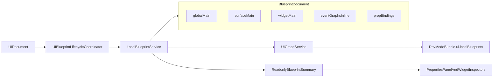

# Visual Editor M2-A + Blueprint System M2 实现方案

## Overview

本方案面向 `Visual Editor M2-A` 与 `Blueprint System M2` 的联合落地，目标是在不进入运行时闭环和完整 Blueprint 编辑器的前提下，先把 UI 承载层与本地实例蓝图数据层做实。

前置默认成立：`Visual Editor M1`、`Blueprint System M1` 已完成。计划产物目标路径为 [project/docs/implementation-plans/p1-ve-m2a-bp-m2-plan.md](project/docs/implementation-plans/p1-ve-m2a-bp-m2-plan.md)。

## Scope

本阶段必须完成：

- `Visual Editor M2-A`：新增 `Text`、`Image`、`Button`、`Container/Frame` 四类核心 widget。
- `Blueprint System M2`：本地实例蓝图存储、`globalMain/surfaceMain/widgetMain` 生命周期、`blueprintEvent` 事件绑定持久化、属性绑定持久化、与现有 UI 编辑器生命周期同步。
- 编辑器只做 Blueprint 只读可见性，不做真实图编辑和最小绑定编辑。
- `Button` 按容器式 widget 设计。
- `Text`、`Image`、`Button`、`Container/Frame` 四类 M2-A widget 全部自动拥有 `widgetMain`。
- 旧 `uigraphs.json` 继续采用 `strict fail`，不做读时迁移。
- `blueprintEvent` 的事件图主存储收敛到 `Blueprint.program.graphs.events[eventId].graph`，不继续把顶层 `UIGraphDocument.graphs` 作为长期真相。
- 复制生命周期在 P1 只定义规则与 helper 挂点，不新增完整复制/粘贴 UI。

## Non-Goals

本阶段不做：

- `Stack`、`Scroll`、`Spacer/Divider`、`Option List/Repeater`。
- 完整 Visual Blueprint 编辑器、节点画布、成员树、图校验 UI。
- Blueprint 运行时执行闭环、绑定求值、Host API 落地、调试事件发射。
- 编辑器内真实交互预览；编辑器仍保持静态/布局预览。
- 完整元素复制/粘贴工作流；只预留 Blueprint remap 规则与服务挂点。
- 共享蓝图资产、TypeScript Blueprint、DevTools 强化。

## Current Baseline

### 已有基础

- [src/renderer/lib/ui-editor/widget-modules/types.ts](src/renderer/lib/ui-editor/widget-modules/types.ts) 已提供 `UIWidgetModule` 扩展点，含 `supportsBlueprintLogic`。
- [src/renderer/lib/ui-editor/widget-modules/builtin/index.ts](src/renderer/lib/ui-editor/widget-modules/builtin/index.ts) 当前只注册了 `Rectangle`。
- [src/renderer/apps/workspace/modules/ui-editor/editors/UISurfaceEditorTab.tsx](src/renderer/apps/workspace/modules/ui-editor/editors/UISurfaceEditorTab.tsx) 已支持按 registry 动态生成插入菜单，并从当前 `surface.rootElementId` 创建元素。
- [src/renderer/apps/workspace/modules/properties/PropertiesPanel.tsx](src/renderer/apps/workspace/modules/properties/PropertiesPanel.tsx) 已将 `surfaceId` 传给 widget inspector，可承载 Blueprint 只读可见性。
- [src/shared/types/blueprint/document.ts](src/shared/types/blueprint/document.ts) 已冻结 `BlueprintDocument`、`Blueprint`、`BindingDefinition`、`BlueprintOwnerRef` 等 M1 契约。
- [src/renderer/lib/workspace/services/ui-editor/LocalBlueprintService.ts](src/renderer/lib/workspace/services/ui-editor/LocalBlueprintService.ts) 已具备 `surfaceMain/widgetMain` 创建、声明 CRUD、属性绑定持久化与 broken 标记。
- [src/renderer/lib/workspace/services/ui-editor/UIBlueprintLifecycleCoordinator.ts](src/renderer/lib/workspace/services/ui-editor/UIBlueprintLifecycleCoordinator.ts) 已挂到 `UIDocumentService.afterMutateHook`，能随文档变化同步 surface/widget owner。
- [src/renderer/lib/workspace/services/ui-editor/UIGraphService.ts](src/renderer/lib/workspace/services/ui-editor/UIGraphService.ts) 已对 `uigraphs.json` 执行 `strict fail` 校验，并要求 `blueprintDocument` 必填。
- [src/shared/types/devMode.ts](src/shared/types/devMode.ts) 与 [src/main/app/application/managers/devMode/DevModeManager.ts](src/main/app/application/managers/devMode/DevModeManager.ts) 已把 `localBlueprints` 带入 Dev Mode bundle。

### 关键缺口

- M2-A 四类 widget 尚不存在，当前内置仅 `Rectangle`。
- Blueprint M2 现有服务只覆盖 owner 与声明/属性绑定，尚未收敛 `blueprintEvent` 对应的事件图 API。
- 当前 `UIGraphDocument` 仍保留顶层 `graphs` 与 `UIGraph` 旧架构，和用户已确认的 Blueprint M2 主心智模型不一致。
- 当前 inspector 的 Blueprint 区块仍是 [src/renderer/lib/ui-editor/widget-modules/builtin/rectangle/inspector.tsx](src/renderer/lib/ui-editor/widget-modules/builtin/rectangle/inspector.tsx) 内部的延期说明，未形成共享的只读摘要组件。
- [src/renderer/apps/workspace/modules/ui-editor/editors/UISurfaceEditorTab.tsx](src/renderer/apps/workspace/modules/ui-editor/editors/UISurfaceEditorTab.tsx) 仍存在 Rectangle 专属双击图片裁剪逻辑，新 Image widget 需要明确不复用这条行为或后续再统一。

## 文档与实现冲突

以下冲突需要在本阶段单独列出并修正：

- [project/docs/blueprint-system-milestones.md](project/docs/blueprint-system-milestones.md) 仍把 `UIBehaviorBinding.kind = "graph"` 与 `blueprintDocument` 可选视为桥接现状，但代码里 [src/shared/types/ui-editor/document.ts](src/shared/types/ui-editor/document.ts) 已只有 `blueprintEvent`，而 [src/shared/types/ui-editor/graph.ts](src/shared/types/ui-editor/graph.ts) 已要求 `blueprintDocument` 必填。
- [project/docs/blueprint-system.md](project/docs/blueprint-system.md) 仍保留 `graphId + entry` 与可选 `blueprintDocument` 的旧描述，需要更新为 P1 的新主心智模型。
- [project/docs/visual-editor-milestones.md](project/docs/visual-editor-milestones.md) 定义了完整 M2 八件套，但未显式拆出 `M2-A`；P1 方案需要把 `M2-A = Text/Image/Button/Container` 写清楚。
- `Blueprint M2` 里程碑要求“旧 `uigraphs` 至少有迁移或兼容读取策略”，但本次明确选择 `strict fail`；文档必须同步到新的产品决策，否则验收口径冲突。

## Resolved Planning Decisions

本次通过用户确认的关键决策：

- `Button` 采用容器式模型，而不是原子按钮。
- Blueprint M2 在本阶段只做到编辑器只读可见性，不做最小编辑入口。
- `Text`、`Image`、`Button`、`Container/Frame` 四类 widget 全部自动拥有 `widgetMain`。
- 旧 `uigraphs.json` 继续采用 `strict fail`，不做自动升级。
- 事件图主存储收敛到 `Blueprint.program.graphs.events[eventId].graph`，不保留顶层 `UIGraphDocument.graphs` 作为长期真相。
- 复制生命周期在 P1 只定义规则与 helper 挂点，不新增复制/粘贴 UI。

## High-Level Technical Design

> 这部分用于表达方案形状，不是可直接照抄的实现代码。

## 数据模型与生命周期设计

### 数据模型

- `UIDocument` 继续作为 UI 树、布局、字面量 props、元素行为挂点的唯一真相，文件路径保持 [editor/ui/uidoc.json](editor/ui/uidoc.json) 对应的约定。
- `uigraphs.json` 继续作为本地 Blueprint 文档文件，但其主语义收敛为“本地实例蓝图壳”，不再把顶层 `graphs` 视为长期真实图容器。
- `UIBehaviorBinding` 继续使用 `blueprintEvent`：事件行为挂在 [src/shared/types/ui-editor/document.ts](src/shared/types/ui-editor/document.ts) 的 `element.behavior.events[eventName]`。
- 事件图体收敛到 [src/shared/types/blueprint/document.ts](src/shared/types/blueprint/document.ts) 的 `Blueprint.program.graphs.events[eventId].graph`。
- 属性绑定继续使用 `Blueprint.bindings`，`UIElement.props` 只保存字面量。
- `BindingDefinition.target` 继续使用 `(surfaceId, elementId, propPath)`，`BindingDefinition.source` 继续使用 `(blueprintId, declarationId)`。

### 生命周期

- 项目加载时：`UIGraphService` 修复 `globalMain` 缺失，但对旧 schema 或缺失 `blueprintDocument` 直接失败。
- 创建 Surface：`UIBlueprintLifecycleCoordinator` 确保存在 `surfaceMain:<surfaceId>`。
- 创建 M2-A widget：四类 widget 统一 `supportsBlueprintLogic: true`，创建后自动拥有 `widgetMain:<surfaceId>:<elementId>`。
- 重命名元素：只更新 blueprint `name`，不改 `blueprintId`、`ownerIndex key`。
- 删除元素或父容器子树：移除对应 `widgetMain`，并清理 `target` 指向该元素的属性绑定；删除 Surface 时移除该 Surface 下所有 `surfaceMain/widgetMain` 与目标指向该 Surface 的绑定。
- 删除声明：保留现有 `broken` 策略，继续把引用该声明的 binding 标为 `broken`。
- 复制语义：P1 只定义规则和 helper，不在编辑器 UI 暴露复制功能。规则层要求未来复制时生成新 `elementId`、新 `widgetMain`、新 `blueprintId`，并显式 remap `bindings`/`blueprintEvent`。

## Widget 模块分层与新增文件清单

### 新增共享文件

- Create: [src/renderer/lib/ui-editor/widget-modules/shared/blueprint/ReadonlyBlueprintSection.tsx](src/renderer/lib/ui-editor/widget-modules/shared/blueprint/ReadonlyBlueprintSection.tsx)
- Create: [src/renderer/lib/ui-editor/widget-modules/shared/blueprint/useReadonlyBlueprintSummary.ts](src/renderer/lib/ui-editor/widget-modules/shared/blueprint/useReadonlyBlueprintSummary.ts)

职责：

- 为所有支持 Blueprint 的 widget 统一提供只读 Blueprint 区块。
- 汇总 `widgetMain` 是否存在、声明数量、属性绑定数量、broken 数量、事件占位情况。
- 维持当前项目的属性面板视觉风格，不引入新的独立设计语言。

### 新增 M2-A widget 文件

- Create: [src/renderer/lib/ui-editor/widget-modules/builtin/text.tsx](src/renderer/lib/ui-editor/widget-modules/builtin/text.tsx)
- Create: [src/renderer/lib/ui-editor/widget-modules/builtin/text/types.ts](src/renderer/lib/ui-editor/widget-modules/builtin/text/types.ts)
- Create: [src/renderer/lib/ui-editor/widget-modules/builtin/text/helpers.ts](src/renderer/lib/ui-editor/widget-modules/builtin/text/helpers.ts)
- Create: [src/renderer/lib/ui-editor/widget-modules/builtin/text/renderer.tsx](src/renderer/lib/ui-editor/widget-modules/builtin/text/renderer.tsx)
- Create: [src/renderer/lib/ui-editor/widget-modules/builtin/text/inspector.tsx](src/renderer/lib/ui-editor/widget-modules/builtin/text/inspector.tsx)
- Create: [src/renderer/lib/ui-editor/widget-modules/builtin/image.tsx](src/renderer/lib/ui-editor/widget-modules/builtin/image.tsx)
- Create: [src/renderer/lib/ui-editor/widget-modules/builtin/image/types.ts](src/renderer/lib/ui-editor/widget-modules/builtin/image/types.ts)
- Create: [src/renderer/lib/ui-editor/widget-modules/builtin/image/helpers.ts](src/renderer/lib/ui-editor/widget-modules/builtin/image/helpers.ts)
- Create: [src/renderer/lib/ui-editor/widget-modules/builtin/image/renderer.tsx](src/renderer/lib/ui-editor/widget-modules/builtin/image/renderer.tsx)
- Create: [src/renderer/lib/ui-editor/widget-modules/builtin/image/inspector.tsx](src/renderer/lib/ui-editor/widget-modules/builtin/image/inspector.tsx)
- Create: [src/renderer/lib/ui-editor/widget-modules/builtin/container.tsx](src/renderer/lib/ui-editor/widget-modules/builtin/container.tsx)
- Create: [src/renderer/lib/ui-editor/widget-modules/builtin/container/types.ts](src/renderer/lib/ui-editor/widget-modules/builtin/container/types.ts)
- Create: [src/renderer/lib/ui-editor/widget-modules/builtin/container/helpers.ts](src/renderer/lib/ui-editor/widget-modules/builtin/container/helpers.ts)
- Create: [src/renderer/lib/ui-editor/widget-modules/builtin/container/renderer.tsx](src/renderer/lib/ui-editor/widget-modules/builtin/container/renderer.tsx)
- Create: [src/renderer/lib/ui-editor/widget-modules/builtin/container/inspector.tsx](src/renderer/lib/ui-editor/widget-modules/builtin/container/inspector.tsx)
- Create: [src/renderer/lib/ui-editor/widget-modules/builtin/button.tsx](src/renderer/lib/ui-editor/widget-modules/builtin/button.tsx)
- Create: [src/renderer/lib/ui-editor/widget-modules/builtin/button/types.ts](src/renderer/lib/ui-editor/widget-modules/builtin/button/types.ts)
- Create: [src/renderer/lib/ui-editor/widget-modules/builtin/button/helpers.ts](src/renderer/lib/ui-editor/widget-modules/builtin/button/helpers.ts)
- Create: [src/renderer/lib/ui-editor/widget-modules/builtin/button/renderer.tsx](src/renderer/lib/ui-editor/widget-modules/builtin/button/renderer.tsx)
- Create: [src/renderer/lib/ui-editor/widget-modules/builtin/button/inspector.tsx](src/renderer/lib/ui-editor/widget-modules/builtin/button/inspector.tsx)

### 必改注册与桥接文件

- Modify: [src/renderer/lib/ui-editor/widget-modules/builtin/index.ts](src/renderer/lib/ui-editor/widget-modules/builtin/index.ts)
- Modify: [src/renderer/lib/ui-editor/element-types/builtin/index.ts](src/renderer/lib/ui-editor/element-types/builtin/index.ts)
- Modify: [src/renderer/lib/ui-editor/runtime/builtin/index.ts](src/renderer/lib/ui-editor/runtime/builtin/index.ts)
- Modify: [src/renderer/lib/workspace/services/ui-editor/UIDocumentService.ts](src/renderer/lib/workspace/services/ui-editor/UIDocumentService.ts)

## Blueprint M2 类型、服务、持久化、兼容与迁移策略

### 类型层

- Modify: [src/shared/types/ui-editor/graph.ts](src/shared/types/ui-editor/graph.ts)
- Modify: [src/shared/types/ui-editor/document.ts](src/shared/types/ui-editor/document.ts)
- Modify: [src/shared/types/devMode.ts](src/shared/types/devMode.ts)
- Modify if needed: [src/shared/types/blueprint/schema.ts](src/shared/types/blueprint/schema.ts)

策略：

- `UIGraphDocument` 收敛成以 `blueprintDocument` 为核心的本地蓝图文件壳，顶层 `graphs` 不再作为 Blueprint 事件图真相。
- 若需要 bump schema 版本，应将其视为“P1 最终 M2 形态”，并与 `strict fail` 一起执行，不提供旧版自动迁移。
- `UIBehaviorBinding.blueprintEvent` 保持事件入口引用，语义上明确为“指向某个实例主蓝图中的事件图”。

### 服务层

- Modify: [src/renderer/lib/workspace/services/ui-editor/UIGraphService.ts](src/renderer/lib/workspace/services/ui-editor/UIGraphService.ts)
- Modify: [src/renderer/lib/workspace/services/ui-editor/LocalBlueprintService.ts](src/renderer/lib/workspace/services/ui-editor/LocalBlueprintService.ts)
- Modify: [src/renderer/lib/workspace/services/ui-editor/UIBlueprintLifecycleCoordinator.ts](src/renderer/lib/workspace/services/ui-editor/UIBlueprintLifecycleCoordinator.ts)
- Modify: [src/renderer/lib/workspace/services/ui-editor/blueprint/blueprintFactories.ts](src/renderer/lib/workspace/services/ui-editor/blueprint/blueprintFactories.ts)
- Modify: [src/renderer/lib/workspace/services/ui-editor/blueprint/documentValidation.ts](src/renderer/lib/workspace/services/ui-editor/blueprint/documentValidation.ts)
- Modify: [src/renderer/lib/workspace/services/ui-editor/blueprint/ownerKeys.ts](src/renderer/lib/workspace/services/ui-editor/blueprint/ownerKeys.ts)
- Modify: [src/renderer/lib/workspace/services/services.ts](src/renderer/lib/workspace/services/services.ts)

策略：

- `UIGraphService` 负责新的 `uigraphs.json` shape 读写与 `strict fail`。
- `LocalBlueprintService` 成为 Blueprint M2 的唯一业务门面，除现有声明/属性绑定 API 外，还要新增：
  - 读取 `surfaceMain/widgetMain/globalMain` 摘要的查询 API。
  - 事件图查询与 upsert API，直接操作 `Blueprint.program.graphs.events[eventId]`。
  - 复制 remap helper 的规则级 API，但不暴露 UI 入口。
  - 供 inspector 读取的只读 summary API。
- `UIBlueprintLifecycleCoordinator` 继续监听 `UIDocumentService.afterMutateHook`，并把四类 M2-A widget 纳入 owner 自动创建范围。
- `documentValidation.ts` 补充对 inline event graph、binding target/source、ownerIndex 一致性的校验。

### 兼容与迁移

- 不做旧 schema 自动迁移。
- 不做 `graphId + entry` 兼容桥。
- 不保留顶层 `UIGraphDocument.graphs` 作为持续写入路径。
- 对现有旧行为图代码的处理原则：从持久化与服务层移除它的“当前架构”地位；若编译仍依赖旧类型，则将其隔离为明确的 legacy 内部实现，不再让 shared persisted model 继续围绕它设计。

## UI 入口 / 属性面板 / 插入菜单 / Dev Mode 关联点

### Properties / Inspector

- 主入口仍在属性面板，不在画布上新增新的主入口位。
- 将 Rectangle 私有的 `BlueprintDeferredNotice` 升级为共享的 `ReadonlyBlueprintSection`，并接入 `Rectangle` 与四类 M2-A widget。
- 只读内容只展示：当前 `widgetMain` 是否存在、声明数、属性绑定数、broken 数、事件图条目数、当前阶段边界提示。
- 不提供创建/编辑/跳转到完整 Blueprint 编辑器的伪入口，避免与后续 `Visual Editor M4-lite/full` 冲突。

### Insert Menu

- `UISurfaceEditorTab` 的右键菜单与 `UIEditorDockerBar` 自动从 registry 增加 `Text`、`Image`、`Button`、`Container/Frame`。
- 本阶段不新增额外的分组菜单系统；保持与现有编辑器风格一致。

### Dev Mode

- `DevModeManager` 与 `DevModeBundle` 继续携带 `localBlueprints`，但本阶段只要求 schema 与 bundle 同步，不要求 Dev Mode 执行 `blueprintEvent`。
- 文案必须继续强调：编辑器是静态/布局预览，真实逻辑执行属于后续 M3 / Dev Mode。

## Implementation Units

- [ ] **Unit 1: 收敛本地 Blueprint 文档形状与服务边界**

**Goal:** 让 `uigraphs.json` 的 M2 形态与用户确认的新心智模型一致，并把 `LocalBlueprintService` 升级为唯一 Blueprint M2 门面。

**Requirements:** 本地实例蓝图存储、owner 生命周期、事件图主存储收敛、strict-fail 兼容策略

**Dependencies:** None

**Files:**

- Modify: [src/shared/types/ui-editor/graph.ts](src/shared/types/ui-editor/graph.ts)
- Modify: [src/shared/types/ui-editor/document.ts](src/shared/types/ui-editor/document.ts)
- Modify: [src/renderer/lib/workspace/services/ui-editor/UIGraphService.ts](src/renderer/lib/workspace/services/ui-editor/UIGraphService.ts)
- Modify: [src/renderer/lib/workspace/services/ui-editor/LocalBlueprintService.ts](src/renderer/lib/workspace/services/ui-editor/LocalBlueprintService.ts)
- Modify: [src/renderer/lib/workspace/services/ui-editor/blueprint/blueprintFactories.ts](src/renderer/lib/workspace/services/ui-editor/blueprint/blueprintFactories.ts)
- Modify: [src/renderer/lib/workspace/services/ui-editor/blueprint/documentValidation.ts](src/renderer/lib/workspace/services/ui-editor/blueprint/documentValidation.ts)
- Modify: [src/renderer/lib/workspace/services/services.ts](src/renderer/lib/workspace/services/services.ts)

**Approach:**

- 以 `Blueprint.program.graphs.events[eventId].graph` 为事件图唯一真相。
- 把 `LocalBlueprintService` 扩展为 owner 查询、事件图 upsert、只读 summary、复制 remap helper 的统一门面。
- 保留 `strict fail`，拒绝旧 `uigraphs.json` 自动升级。
- 如需 schema bump，则一并更新文档校验与错误文案。

**Patterns to follow:**

- [src/renderer/lib/workspace/services/ui-editor/LocalBlueprintService.ts](src/renderer/lib/workspace/services/ui-editor/LocalBlueprintService.ts)
- [src/renderer/lib/workspace/services/ui-editor/UIGraphService.ts](src/renderer/lib/workspace/services/ui-editor/UIGraphService.ts)

**Test scenarios:**

- Happy path: 新建项目时自动存在 `globalMain`，且 `uigraphs.json` 能通过校验。
- Happy path: 新建 Surface 后自动存在 `surfaceMain`。
- Happy path: 新建支持逻辑的 widget 后自动存在 `widgetMain`。
- Edge case: 删除 Surface 后，其下 `surfaceMain/widgetMain` 与目标指向该 Surface 的 binding 一并清理。
- Edge case: 删除声明后，引用该声明的 binding 进入 `broken`。
- Error path: 读取旧 schema 或缺失 `blueprintDocument` 的 `uigraphs.json` 时明确失败。

**Verification:**

- `uigraphs.json` 的读写、校验、bundle 生产均围绕同一份 `BlueprintDocument` 工作。
- 代码中不再把顶层 `UIGraphDocument.graphs` 当作当前 Blueprint 事件图真相。

- [ ] **Unit 2: 建立共享的只读 Blueprint inspector 模块**

**Goal:** 用一个共享组件替换当前 Rectangle 私有延期提示，并为所有 Blueprint-capable widget 输出一致的只读摘要。

**Requirements:** 编辑器只读可见性、UI 风格一致、后续 M4 可扩展

**Dependencies:** Unit 1

**Files:**

- Create: [src/renderer/lib/ui-editor/widget-modules/shared/blueprint/ReadonlyBlueprintSection.tsx](src/renderer/lib/ui-editor/widget-modules/shared/blueprint/ReadonlyBlueprintSection.tsx)
- Create: [src/renderer/lib/ui-editor/widget-modules/shared/blueprint/useReadonlyBlueprintSummary.ts](src/renderer/lib/ui-editor/widget-modules/shared/blueprint/useReadonlyBlueprintSummary.ts)
- Modify: [src/renderer/lib/ui-editor/widget-modules/builtin/rectangle/inspector.tsx](src/renderer/lib/ui-editor/widget-modules/builtin/rectangle/inspector.tsx)
- Modify: [src/renderer/apps/workspace/modules/properties/PropertiesPanel.tsx](src/renderer/apps/workspace/modules/properties/PropertiesPanel.tsx)

**Approach:**

- 沿用当前 Properties framework，不新增独立面板系统。
- 只读区块显示摘要与阶段提示，不提供真实编辑动作。
- 组件样式复用当前属性面板卡片风格，与现有 Workspace 保持一致。

**Patterns to follow:**

- [src/renderer/lib/ui-editor/widget-modules/builtin/rectangle/inspector.tsx](src/renderer/lib/ui-editor/widget-modules/builtin/rectangle/inspector.tsx)
- [src/renderer/apps/workspace/modules/properties/PropertiesPanel.tsx](src/renderer/apps/workspace/modules/properties/PropertiesPanel.tsx)

**Test scenarios:**

- Happy path: 选中支持 Blueprint 的 widget 时能看到只读摘要。
- Happy path: 无绑定/无事件图时展示空状态文案，而不是虚假入口。
- Edge case: binding broken 时显示 broken 计数与原因提示。
- Edge case: 非 Blueprint-capable widget 不展示该区块或展示统一的非适用状态。

**Verification:**

- Rectangle 与 M2-A 四类 widget 使用同一套 Blueprint 只读区块。
- 文案不会暗示当前已经存在完整 Blueprint 编辑器。

- [ ] **Unit 3: 落地 Text / Image / Container 三类基础 widget**

**Goal:** 补齐 M2-A 的静态承载面，摆脱“只用 rectangle 拼 UI”的现状。

**Requirements:** Text、Image、Container/Frame 可插入、可选中、可编辑、可删除、自动拥有 widgetMain

**Dependencies:** Unit 1, Unit 2

**Files:**

- Create: [src/renderer/lib/ui-editor/widget-modules/builtin/text.tsx](src/renderer/lib/ui-editor/widget-modules/builtin/text.tsx)
- Create: [src/renderer/lib/ui-editor/widget-modules/builtin/text/types.ts](src/renderer/lib/ui-editor/widget-modules/builtin/text/types.ts)
- Create: [src/renderer/lib/ui-editor/widget-modules/builtin/text/helpers.ts](src/renderer/lib/ui-editor/widget-modules/builtin/text/helpers.ts)
- Create: [src/renderer/lib/ui-editor/widget-modules/builtin/text/renderer.tsx](src/renderer/lib/ui-editor/widget-modules/builtin/text/renderer.tsx)
- Create: [src/renderer/lib/ui-editor/widget-modules/builtin/text/inspector.tsx](src/renderer/lib/ui-editor/widget-modules/builtin/text/inspector.tsx)
- Create: [src/renderer/lib/ui-editor/widget-modules/builtin/image.tsx](src/renderer/lib/ui-editor/widget-modules/builtin/image.tsx)
- Create: [src/renderer/lib/ui-editor/widget-modules/builtin/image/types.ts](src/renderer/lib/ui-editor/widget-modules/builtin/image/types.ts)
- Create: [src/renderer/lib/ui-editor/widget-modules/builtin/image/helpers.ts](src/renderer/lib/ui-editor/widget-modules/builtin/image/helpers.ts)
- Create: [src/renderer/lib/ui-editor/widget-modules/builtin/image/renderer.tsx](src/renderer/lib/ui-editor/widget-modules/builtin/image/renderer.tsx)
- Create: [src/renderer/lib/ui-editor/widget-modules/builtin/image/inspector.tsx](src/renderer/lib/ui-editor/widget-modules/builtin/image/inspector.tsx)
- Create: [src/renderer/lib/ui-editor/widget-modules/builtin/container.tsx](src/renderer/lib/ui-editor/widget-modules/builtin/container.tsx)
- Create: [src/renderer/lib/ui-editor/widget-modules/builtin/container/types.ts](src/renderer/lib/ui-editor/widget-modules/builtin/container/types.ts)
- Create: [src/renderer/lib/ui-editor/widget-modules/builtin/container/helpers.ts](src/renderer/lib/ui-editor/widget-modules/builtin/container/helpers.ts)
- Create: [src/renderer/lib/ui-editor/widget-modules/builtin/container/renderer.tsx](src/renderer/lib/ui-editor/widget-modules/builtin/container/renderer.tsx)
- Create: [src/renderer/lib/ui-editor/widget-modules/builtin/container/inspector.tsx](src/renderer/lib/ui-editor/widget-modules/builtin/container/inspector.tsx)
- Modify: [src/renderer/lib/ui-editor/widget-modules/builtin/index.ts](src/renderer/lib/ui-editor/widget-modules/builtin/index.ts)
- Modify: [src/renderer/lib/workspace/services/ui-editor/UIDocumentService.ts](src/renderer/lib/workspace/services/ui-editor/UIDocumentService.ts)

**Approach:**

- 所有 widget 均按现有 `Rectangle` 模块目录形状拆分，避免再引入第二套 widget 组织方式。
- `Text` 只做最小文字展示与基础排版 props，不提前引入本地化模型。
- `Image` 只做基础资源引用与 fit/opacity/圆角等最小展示，不把当前 Rectangle 的图片裁剪交互强行泛化到 P1。
- `Container/Frame` 作为通用容器，负责子元素承载与基础背景/描边/圆角视觉能力。
- 三者统一 `supportsBlueprintLogic: true`，让 owner 模型保持一致。

**Patterns to follow:**

- [src/renderer/lib/ui-editor/widget-modules/builtin/rectangle](src/renderer/lib/ui-editor/widget-modules/builtin/rectangle)

**Test scenarios:**

- Happy path: 三类 widget 能从右键菜单和 docker 插入。
- Happy path: 插入后自动创建 `widgetMain`，且属性面板可看到只读摘要。
- Happy path: Text 可编辑文本内容与基础样式；Image 可设置资源与显示方式；Container 可承载子元素并显示 frame 样式。
- Edge case: 删除 Container 时其子树 widgetMain 与指向子树元素的 binding 清理正确。
- Edge case: 重命名元素后 widgetMain 名称同步更新，id 不变。

**Verification:**

- 用户可以不再只靠 Rectangle 拼出基础文本块、图片块和包裹容器。
- 三类 widget 在插入、选择、编辑、删除链路上表现与现有 editor 交互一致。

- [ ] **Unit 4: 落地容器式 Button widget**

**Goal:** 提供可承载子元素的核心交互容器，为后续最小 `blueprintEvent` 入口预留稳定宿主。

**Requirements:** Button 采用容器式、可承载子元素、自动拥有 `widgetMain`

**Dependencies:** Unit 1, Unit 2, Unit 3

**Files:**

- Create: [src/renderer/lib/ui-editor/widget-modules/builtin/button.tsx](src/renderer/lib/ui-editor/widget-modules/builtin/button.tsx)
- Create: [src/renderer/lib/ui-editor/widget-modules/builtin/button/types.ts](src/renderer/lib/ui-editor/widget-modules/builtin/button/types.ts)
- Create: [src/renderer/lib/ui-editor/widget-modules/builtin/button/helpers.ts](src/renderer/lib/ui-editor/widget-modules/builtin/button/helpers.ts)
- Create: [src/renderer/lib/ui-editor/widget-modules/builtin/button/renderer.tsx](src/renderer/lib/ui-editor/widget-modules/builtin/button/renderer.tsx)
- Create: [src/renderer/lib/ui-editor/widget-modules/builtin/button/inspector.tsx](src/renderer/lib/ui-editor/widget-modules/builtin/button/inspector.tsx)
- Modify: [src/renderer/lib/ui-editor/widget-modules/builtin/index.ts](src/renderer/lib/ui-editor/widget-modules/builtin/index.ts)
- Modify if needed: [src/renderer/apps/workspace/modules/ui-editor/editors/UISurfaceEditorTab.tsx](src/renderer/apps/workspace/modules/ui-editor/editors/UISurfaceEditorTab.tsx)

**Approach:**

- Button 本质上是“可点击的视觉容器”，不是叶子节点。
- P1 不把点击执行闭环接进 editor 预览，但要为 `onClick -> blueprintEvent` 的数据模型留出稳定宿主。
- Inspector 先覆盖按钮视觉状态与基础交互字段，不在本阶段暴露真正事件编辑。

**Patterns to follow:**

- [src/renderer/lib/ui-editor/widget-modules/builtin/rectangle](src/renderer/lib/ui-editor/widget-modules/builtin/rectangle)
- [src/renderer/apps/workspace/modules/ui-editor/editors/UISurfaceEditorTab.tsx](src/renderer/apps/workspace/modules/ui-editor/editors/UISurfaceEditorTab.tsx)

**Test scenarios:**

- Happy path: Button 能插入子 Text/Image/Container。
- Happy path: Button 自动拥有 `widgetMain`，且只读摘要可见。
- Edge case: 删除 Button 时其子树 blueprint 生命周期正确收口。
- Edge case: 选中父 Button 与选中子元素的行为不互相破坏层级编辑体验。

**Verification:**

- Button 可以作为后续 P2 `button.click -> blueprintEvent` 的稳定宿主，而无需再回头重做 widget 结构。

- [ ] **Unit 5: 完成 Blueprint M2 的事件/绑定 API 与复制挂点**

**Goal:** 把 `blueprintEvent` 事件绑定持久化、属性绑定持久化与复制 remap 规则明确化，避免 P2 再回头补数据层。

**Requirements:** `blueprintEvent` 持久化、属性绑定持久化、owner 生命周期、复制 hooks only

**Dependencies:** Unit 1

**Files:**

- Modify: [src/renderer/lib/workspace/services/ui-editor/LocalBlueprintService.ts](src/renderer/lib/workspace/services/ui-editor/LocalBlueprintService.ts)
- Modify: [src/renderer/lib/workspace/services/ui-editor/UIDocumentService.ts](src/renderer/lib/workspace/services/ui-editor/UIDocumentService.ts)
- Modify: [src/renderer/lib/workspace/services/services.ts](src/renderer/lib/workspace/services/services.ts)
- Modify: [src/shared/types/ui-editor/document.ts](src/shared/types/ui-editor/document.ts)
- Modify: [src/renderer/lib/workspace/services/ui-editor/blueprint/documentValidation.ts](src/renderer/lib/workspace/services/ui-editor/blueprint/documentValidation.ts)

**Approach:**

- 在 `LocalBlueprintService` 中补齐 `ensureEventGraph`、`setBlueprintEventBinding`、`clearBlueprintEventBinding`、`listBlueprintEvents` 之类的统一 API。
- `UIDocumentService` 只保留对元素行为字段的写入口，不自己承担 Blueprint 文档业务判断。
- 为未来复制功能增加纯数据 remap helper，不在本阶段暴露剪贴板 UI。
- 绑定与事件的 broken/空状态规则写进 validation 与只读 summary。

**Patterns to follow:**

- [src/renderer/lib/workspace/services/ui-editor/LocalBlueprintService.ts](src/renderer/lib/workspace/services/ui-editor/LocalBlueprintService.ts)
- [src/shared/types/blueprint/document.ts](src/shared/types/blueprint/document.ts)

**Test scenarios:**

- Happy path: 给元素某事件设置 `blueprintEvent` 后，`UIDocument.behavior` 与 `Blueprint.program.graphs.events` 能同时保持一致。
- Happy path: 重复设置同一事件时执行 upsert，而不是创建重复事件图条目。
- Edge case: 清理元素后，其事件绑定与属性 binding 不残留脏引用。
- Edge case: 复制 remap helper 遇到子树蓝图时，能输出新旧 id 映射规则而不是复用旧 id。
- Error path: 指向不存在 `blueprintId/eventId/declarationId` 的数据在 validation 中明确失败或被标记为 broken。

**Verification:**

- P2 无需再为 `blueprintEvent` 补新的存储层，只需接运行时和轻量入口即可。

- [ ] **Unit 6: 对齐 Dev Mode、legacy graph 残留与文档**

**Goal:** 把 P1 的真实新心智模型同步到文档和周边接口，避免后续继续围绕旧行为图架构产生歧义。

**Requirements:** 文档对齐、Dev Mode 关联点、legacy 架构去主位、风险可回退

**Dependencies:** Unit 1, Unit 5

**Files:**

- Modify: [src/shared/types/devMode.ts](src/shared/types/devMode.ts)
- Modify: [src/main/app/application/managers/devMode/DevModeManager.ts](src/main/app/application/managers/devMode/DevModeManager.ts)
- Modify if compile fallout requires: [src/renderer/lib/ui-editor/behavior-graph/GraphExecutor.ts](src/renderer/lib/ui-editor/behavior-graph/GraphExecutor.ts)
- Modify if compile fallout requires: [src/renderer/lib/ui-editor/behavior-graph/BehaviorNodeRegistry.ts](src/renderer/lib/ui-editor/behavior-graph/BehaviorNodeRegistry.ts)
- Modify: [project/docs/blueprint-system.md](project/docs/blueprint-system.md)
- Modify: [project/docs/blueprint-system-milestones.md](project/docs/blueprint-system-milestones.md)
- Modify: [project/docs/visual-editor.md](project/docs/visual-editor.md)
- Modify: [project/docs/visual-editor-milestones.md](project/docs/visual-editor-milestones.md)
- Modify: [project/docs/visual-editor-implementation-guide.md](project/docs/visual-editor-implementation-guide.md)

**Approach:**

- 明确 `DevModeBundle` 消费的是新的 Blueprint M2 文件形状，但本阶段不执行逻辑。
- 把旧 `UIGraphDocument.graphs` / `graphId + entry` 的描述从主文档里移除，避免继续误导后续阶段。
- 若旧 `behavior-graph` 代码因共享类型收敛而受影响，则将其降级为 legacy 隔离实现或删除其主架构地位，但不在 P1 把运行时重写成 Blueprint Runtime。
- 在文档中显式写清 `M2-A` 子阶段、只读可见性边界、strict-fail 策略、复制 hooks only。

**Patterns to follow:**

- [project/docs/agent-milestone-prompts.md](project/docs/agent-milestone-prompts.md)
- [project/docs/blueprint-system-milestones.md](project/docs/blueprint-system-milestones.md)

**Test scenarios:**

- Happy path: Dev Mode bundle 仍能读取 `localBlueprints`，且不因为 schema 收敛而崩溃。
- Edge case: 遇到旧 `uigraphs.json` 时 Workspace 与 Dev Mode 都给出明确错误，而不是静默空白。
- Verification-only: 文档中不再同时存在“graphId + entry 是当前事实”和“blueprintEvent 是当前事实”的双重叙述。

**Verification:**

- 新计划、代码、里程碑文档、实现指南对 P1 边界的表述一致。

## System-Wide Impact

- `UIDocument` 仍负责 UI 树和字面量，`BlueprintDocument` 负责实例逻辑与绑定；两者通过 `blueprintEvent` 和 `BindingDefinition.target` 连接。
- `LocalBlueprintService` 成为 P1 之后唯一可扩展的 Blueprint M2 服务边界，避免把蓝图逻辑散进 `UIDocumentService`、inspector 和 editor tab。
- `PropertiesPanel` 获得只读摘要，但不引入新编辑器入口，避免抢占后续 M4 的职责。
- `DevModeBundle` 继续带出本地蓝图，但执行闭环明确属于后续 P2/M3。

## Risks & Rollback

### 风险

- 收敛 `UIGraphDocument` 真相层时，旧 `behavior-graph` 代码会出现编译 fallout。
- 四类 widget 全部 `supportsBlueprintLogic: true` 会显著增加 `widgetMain` 数量，需要保证 owner 清理和 summary 查询足够稳定。
- 容器式 Button 若命中/层级行为设计不清，可能影响编辑体验。
- 文档若不同步更新，会导致评审继续按旧 `graphId + entry` 和“可选 `blueprintDocument`”理解系统。

### 回退策略

- 若 `UIGraphDocument` 结构收敛波及面超出 P1，可先保留最小 legacy compile shim，但禁止继续作为新写路径。
- 若 Button 容器命中影响当前编辑体验，可在 P1 只固定数据模型与 renderer 结构，把高级命中优化留到后续迭代。
- 若只读 summary 信息过多，可先保留核心计数与状态，再逐步增加字段，但不回退到虚假入口。

## Acceptance & Validation Plan

完成 P1 时，至少满足以下验收标准：

- 用户可以在编辑器里插入 `Text`、`Image`、`Button`、`Container/Frame`，不再只能依赖 `Rectangle`。
- 四类 M2-A widget 都会自动拥有 `widgetMain`，并随创建、删除、重命名与文档加载保持一致。
- `blueprintEvent` 与属性绑定都已有稳定持久化模型，且事件图体以内联 `Blueprint.program.graphs.events[eventId].graph` 为真相。
- `uigraphs.json` 对旧 schema 继续明确失败，不发生静默升级。
- 属性面板能看到统一的 Blueprint 只读摘要，但不会出现虚假可编辑入口。
- Dev Mode 仍能消费新的 bundle shape，但不会被误解为已经打通 Blueprint 执行闭环。
- 文档中关于 `UIBehaviorBinding`、`blueprintDocument`、`M2-A`、strict-fail 与只读可见性的叙述全部一致。

验证方式：

- 手动验证编辑器流：插入、删除、重命名、父删子、切换 Surface、重新加载项目。
- 手动验证 Blueprint 摘要：有 owner、无 owner、binding broken、空事件图、空声明。
- 手动验证 strict-fail：使用旧版或缺字段的 `uigraphs.json` 启动 Workspace/Dev Mode，确认错误可见且明确。
- 回归验证：Docker 插入、右键插入、PropertiesPanel、Dev Mode bundle 组装不回归。
- 代码质量门槛：最近改动文件通过类型检查和 lint；若当前区域缺少自动化测试框架，则以类型/lint + 人工流验证为主。

## 实施记录（2026-04）

- 仓库内落地文件清单与验收摘要见 `project/docs/implementation-plans/p1-ve-m2a-bp-m2-plan.md`。
- 类型检查：`npx tsc --noEmit -p src/renderer/tsconfig.json` 与 `src/main/tsconfig.json`。

## Sources & References

- [project/docs/agent-milestone-prompts.md](project/docs/agent-milestone-prompts.md)
- [project/docs/visual-editor-milestones.md](project/docs/visual-editor-milestones.md)
- [project/docs/visual-editor.md](project/docs/visual-editor.md)
- [project/docs/visual-editor-implementation-guide.md](project/docs/visual-editor-implementation-guide.md)
- [project/docs/blueprint-system.md](project/docs/blueprint-system.md)
- [project/docs/blueprint-system-milestones.md](project/docs/blueprint-system-milestones.md)
- [project/docs/dev-mode.md](project/docs/dev-mode.md)
- [src/renderer/lib/workspace/services/ui-editor/UIGraphService.ts](src/renderer/lib/workspace/services/ui-editor/UIGraphService.ts)
- [src/renderer/lib/workspace/services/ui-editor/LocalBlueprintService.ts](src/renderer/lib/workspace/services/ui-editor/LocalBlueprintService.ts)
- [src/renderer/lib/workspace/services/ui-editor/UIBlueprintLifecycleCoordinator.ts](src/renderer/lib/workspace/services/ui-editor/UIBlueprintLifecycleCoordinator.ts)
- [src/shared/types/ui-editor/document.ts](src/shared/types/ui-editor/document.ts)
- [src/shared/types/ui-editor/graph.ts](src/shared/types/ui-editor/graph.ts)
- [src/shared/types/blueprint/document.ts](src/shared/types/blueprint/document.ts)
- [src/renderer/lib/ui-editor/widget-modules/types.ts](src/renderer/lib/ui-editor/widget-modules/types.ts)
- [src/renderer/apps/workspace/modules/properties/PropertiesPanel.tsx](src/renderer/apps/workspace/modules/properties/PropertiesPanel.tsx)