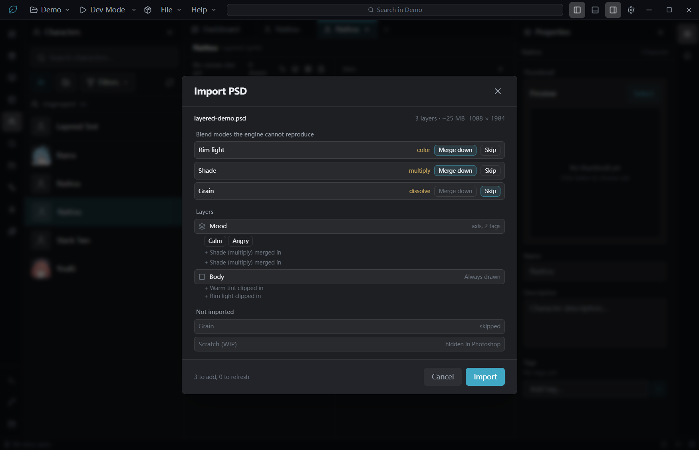
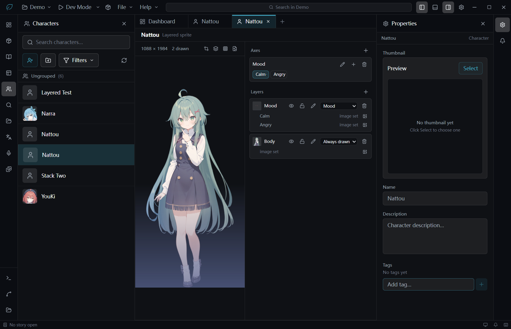
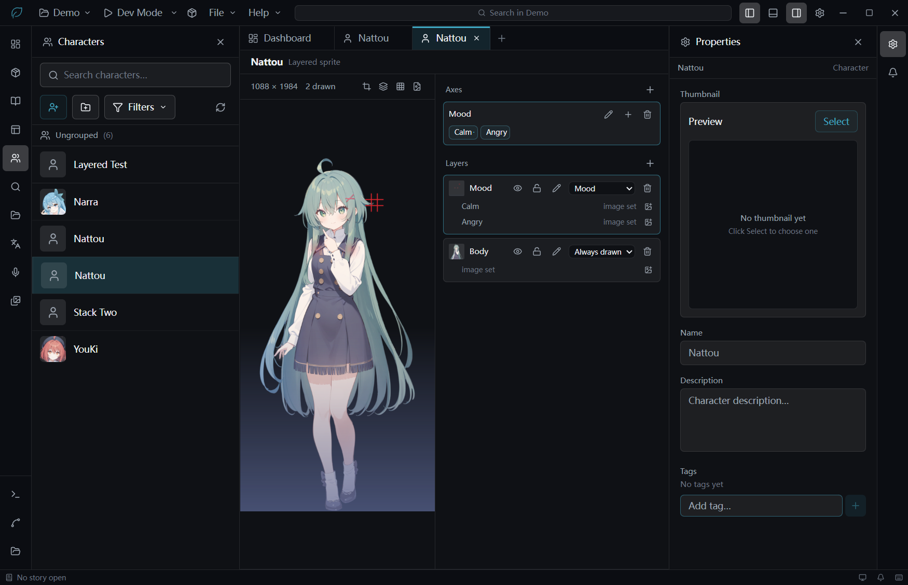

# Demo: importing a layered sprite from a PSD

A five-minute route through the layered-sprite feature, ending with a character whose expression
switches and whose lighting survives the switch. Everything it needs is in this repo except one
finished character sprite, which it takes from a project you already have.

## 1. Build the sample PSD

```bash
node project/demo/make-demo-psd.js --project <your-project-dir> --asset Nattou.png demo.psd
```

Any transparent-background character PNG works — swap `--asset` for whatever your project has, or
pass a plain file path instead of `--project`/`--asset`. The script paints everything except the
base sprite, so what comes out is a real 1088×1984 sheet with all of this in it:

| Layer                     | Why it is there                                                                       |
| ------------------------- | ------------------------------------------------------------------------------------- |
| `Body`                    | the sprite itself, the constant layer                                                 |
| `Warm tint`               | full-canvas, **clipped** to the body — without the clip it floods the whole rectangle |
| `Rim light`               | full-canvas, **clipped**, blend mode `color` — a mode that mixes channels             |
| `Mood/` → `Calm`, `Angry` | a top-level group, and the two layers inside it are cropped to the face               |
| `Shade`                   | `multiply`, sitting **above** the group                                               |
| `Grain`                   | `dissolve` — deliberately something Studio refuses to flatten                         |
| `Scratch (WIP)`           | hidden, the way a real working file always has one                                    |

## 2. Make a layered character

Characters panel → **+** → **Layered sprite** → name it. The editor opens empty: no canvas size, no
axes, no layers.

## 3. Import

Toolbar above the preview, fourth button (after Set canvas / Onion skin / Combinations) → **Import
PSD** → **Choose a PSD…** → pick `demo.psd`.

What the wizard shows, and what each part is telling you:



- **`5 layers · ~41 MB`** — what this import will add to the asset library, and what the character
  will cost in decoded memory on stage. Every layer is baked to the full canvas, so this is layers ×
  canvas no matter how little each one draws. It turns amber past 24 layers or 256 MB.
- **Three blend rows.** `Import` is disabled until each has been answered. There is deliberately no
  default, because importing a non-`normal` layer silently is forbidden and pre-selecting an answer
  would just be doing that with extra steps.
  - `Rim light` (`color`) and `Shade` (`multiply`) can be **merged** — Studio flattens them into the
    pixels using their own blend mode.
  - `Grain` (`dissolve`) has **Merge down greyed out**. Dissolve is stochastic and Photoshop's
    dither pattern is undocumented, so every bake would come out different. Skip is the only answer.
- **Mapping.** `Mood` became an axis with two tags. `Body` shows what got folded into it —
  `+ Warm tint clipped in`, `+ Rim light clipped in`. Nothing is folded in silently.
- **Not imported.** `Scratch (WIP)` because it is hidden; `Grain` once you skip it.

Answer: **Merge down** on `Rim light` and `Shade`, **Skip** on `Grain`. The readout drops to
`3 layers · ~25 MB`, the footer reads `3 to add, 0 to refresh`, and `Import` lights up.

Note what happened to `Shade` when you chose Merge: **`+ Shade (multiply) merged in` appears twice**,
once under each Mood tag. It sits above the whole group in Photoshop, so it has to survive on every
mood — attaching it to the topmost tag alone would make the shadow vanish the moment you switched.

## 4. What you get



Canvas `1088 × 1984`, one axis (`Mood`), two layers (`Body`, `Mood`). The warm tint and the rim
light are in the body's pixels and stop at her silhouette — that is the clipping mask. The lower
half is darkened by the multiply shade.



Click **Angry** in the Axes panel. The anger mark appears at her temple — **and the shadow on her
legs is still there**. Same pixels in both tags: `(91,104,151,98)` at (544,1500), either way.

## 5. Re-import, after you have made it yours

Rename the axis, rename the layers, reorder the stack, rebind a layer to a different axis. Then run
the wizard again on the same PSD.

The footer now reads **`0 to add, 3 to refresh`**. Import: the art is replaced in place and every
one of your edits survives. Studio does not keep the PSD — it keeps a fingerprint mapping each PSD
layer to the slot it became, which is what a re-import reconnects to. Nothing in the import path
ever deletes or renames anything, so there is no "this will overwrite your work" prompt because
there is no such case.

## What this route does not cover

- **A merge landing on a group is duplicated into every tag.** Correct, but it means the shadow's
  pixels are stored once per tag. A large adjustment layer over a wide axis costs real disk.
- Portrait cropping, `preset` ↔ `layered` conversion, and Dev Mode snapshot compositing are not
  built yet.
