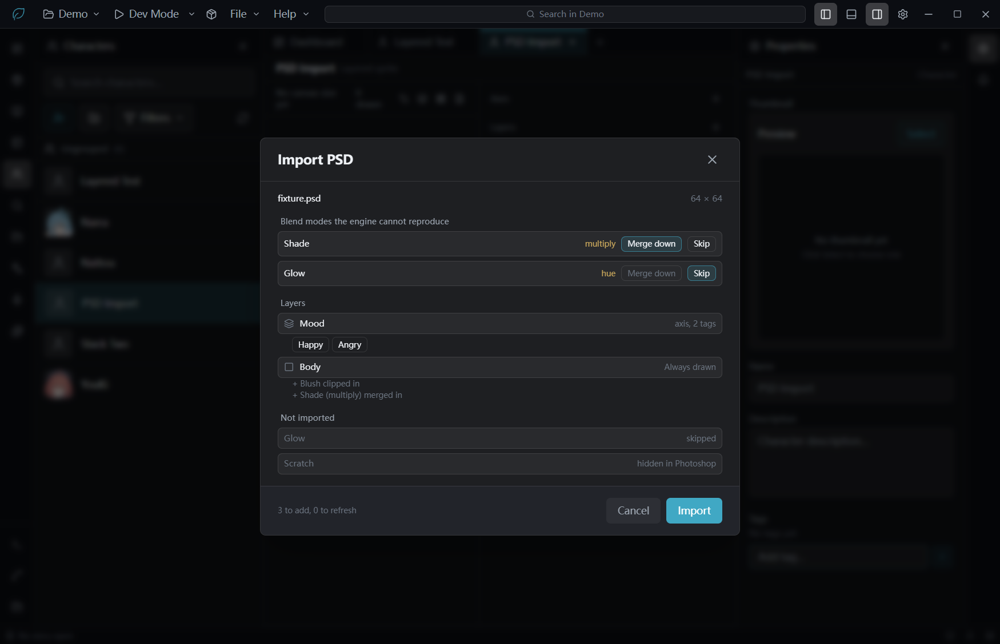
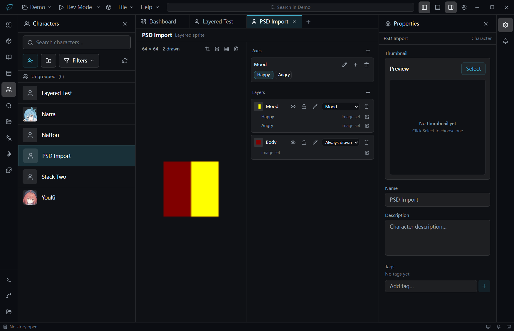

# L3 PSD 导入

母卡 `2026-07-26-013` §5「L3」。管线（§2–§4）与向导 UI（§5）都已落地并按母卡 §8 判据 5 验收，
见 §7。蒙版合成本来记在 §6「明确不做」，验收判据要求「蒙版已合成」，用户 2026-07-26 裁决一起做，
已实现，§6 相应改写。

## 1. 新依赖：ag-psd 31.0.2

母卡明确允许（「自写 PSD 解析器不现实」）。worktree 有自己独立的 node_modules 与 yarn 状态，
**不是指向主检出的 junction**，所以装它没有碰到别的会话。本仓 `yarn.lock` 是 gitignore 的，
所以改动只有 `package.json` 一行。

## 2. 管线

| 位置 | 做什么 |
|---|---|
| `src/main/buildWorker/psdWorker.ts` | utility process 入口。`read` 只回图层树（无像素），`bake` 才出图 |
| `psd/bakePsdLayers.ts` | `describePsd` / `indexLayers` / `rasterizeLayer` / `bakeLayers` |
| `psd/blendModes.ts` | 可分离混合模式的实现 + Porter-Duff over |
| `psd/initializePsdImageData.ts` | 见 §4 的坑 |
| `shared/utils/psdLayerPlan.ts` | 纯函数：拍平、默认映射、拦截判定、烘焙目标 |
| `shared/utils/pngOpaque.ts` | 新增 `encodeRgbaPng`（颜色类型 6）；原有的是类型 2 |
| `managers/psdImportManager.ts` + `handlers/psdImport.ts` | 起进程、原生选文件、临时目录授权 |

**几条设计**：

- **read 与 bake 是两条消息**，不是一次。作者必须先看到树、先决定混合模式怎么办，才轮到烘焙一个像素。
- **一次任务一个进程**。一次 read 把整张大图的每一层解压在内存里；让进程退出是把内存还回去最省事的办法。
  代价是 bake 要再解析一次文件。
- **回来的是文件路径不是字节**。六层立绘是上百 MB 的 PNG，而且走路径就能复用资产库自己的
  文件导入管线，不用长出第二套"造资产"的办法。主进程选临时目录并授权读，渲染层永远不报路径。
- **烘焙到全文档画布**：引擎在 `autoFit` 下对每层独立缩放，裁过的层会被单独放大到舞台。
  Photoshop 存的是裁过的层，这一步就是把它还原回文档坐标。
- **图层不透明度乘进 alpha**：引擎没有逐层不透明度，像素是它唯一能活下来的地方。
- **顶层组 = 轴，组内层 = tag，组外层 = 恒定层**。只有一个成员的组**不**建轴——单 tag 的轴驱动不了
  任何东西，引擎还会因为空组报错。
- **隐藏层直接丢**：Photoshop 用隐藏放草稿，导进来一个看不见的层跟 bug 没法区分。

## 3. 混合模式拦截

母卡：「非 normal 的图层必须在向导里显式处理——二选一：(a) 与其下方图层合并烘焙成一层，
(b) 跳过并告知。不允许静默按 normal 导入。」

- `merge` 是**真的合并**：用该层**自己的**混合模式合成到下面最近的一个保留层上。
- 只支持**可分离**模式（multiply / screen / overlay / softLight / difference …）。
  hue / saturation / color / luminosity 跨通道混合，做错了比不做更糟——这些只能 skip，
  `canMergeBlendMode` 就是给 UI 用来把 merge 这个选项关掉的。
- 底部没有可合并对象时，该层退化成自己一层，而不是消失。

## 4. 判据与结果（2026-07-26）

真机验收的是**管线**，用 ag-psd 现写了一份 fixture PSD（8×8，一个 Body、一个 Mood 组含
Happy/Angry、一个 multiply 的 Shade、一个隐藏的 Scratch），跑的是打包后的同一份模块：

| # | 判据 | 结果 |
|---|---|---|
| 1 | 读出树与元信息 | ✅ `Body` / `Mood/`（pass through）含 `Happy`+`Angry` / `Shade [multiply]` / `Scratch (hidden)` |
| 2 | 烘焙到全文档画布、位置正确 | ✅ 4×4 的 Happy/Angry 出来是 **8×8**、中心有色、四角 alpha=0 |
| 3 | merge 用的是该层自己的混合模式 | ✅ Body 200 灰 + multiply 128 → **100**。裸叠会是 128，不合并会是 200 |
| 4 | PNG 带 alpha | ✅ IHDR colourType 6 |
| 5 | 单测 | ✅ 24 条（bake 8 / blend 5 / plan 11），五个 tsconfig 全绿 |

**一个只有真跑才会露出来的坑**：`readPsd(..., { useImageData: true })` **不够**——ag-psd 仍然
调它的 canvas 工厂去**构造** ImageData，解第一层时就抛 "Canvas not initialized"。
只喂 `initializeCanvas` 的第二个参数（createImageData）就够了，canvas 那一半故意留成抛异常：
这个 worker 不该走到需要 canvas 的路径上，悄悄给个空 canvas 只会把错误变成一张空图。
这样也省掉了 node-canvas —— 为了读一个文件格式在三个平台上编译原生模块不值得。

另一个：ag-psd 把组的默认混合模式拼成 `"pass through"`（带空格），不是 `"passThrough"`。
`isUnsupportedBlend` 两种拼法都认。

## 5. 向导 UI

`PsdImportWizard.tsx`（角色编辑器 `components/` 下），入口是分层立绘工具条的第四个按钮
（Crop / Layers / Grid3x3 之后）。

**拦截就是那道闸。** 模态先读树、只显示映射，`Import` 一直是 disabled，直到**每一个**引擎无法
还原的混合模式都被作者点过 merge 或 skip 为止。不给默认值是有意的：给了默认值，「不允许静默按
normal 导入」就退化成「默认帮你选了，你没看见」。不可分离的模式（hue/saturation/color/
luminosity）的 merge 按钮直接 disabled，只能 skip。

**全程只增不删。** 认得出的 PSD 只刷新它上次建的那些槽，作者的改名、重排、换轴一律不动；
认不出的才新建。所以向导没有「会覆盖现有内容」这条路径，也就不需要二次确认。
页脚在烘焙前就报「新建 N 层，更新 M 层」。

**落地时补的三件事**（都不在原计划里，但判据要求或被判据暴露）：

- **图层蒙版**乘进 alpha（`rasterizeLayer`），含 `disabled`、`defaultColor`、
  `positionRelativeToLayer` 三种情况。ag-psd 把蒙版值抄在每个颜色通道上，读红通道。
- **剪贴蒙版**：剪贴层不单独成层、也不成 tag，而是按底层**自己的** alpha 裁剪后合并进底层
  （`PsdMergeSource.clip`）。底层 alpha 在任何 merge 之前快照——PS 的剪贴是对着那一层，
  不是对着累积画布。底层没被导入的剪贴层按 PS 语义丢弃，理由 `clip-base-dropped` 显示在
  「未导入」里，而不是悄悄摊平成一张全画布的图。
- **`toBakeTargets` 从 plan 读**而不是重读作者的决定，`planImport` 顺带修了一个真 bug：
  旧代码把「被合并掉的层」也算成该组的一个 tag，于是轴上会多出一个永远没有图的 tag。

**指纹**：`PsdFingerprint.layerPaths: string[][]` 改成
`slots: {path, layerId, tagId?}[]`——只有路径清单是重连不了的，得知道每层去了哪个槽。
写它的是 §3 的 `applyPsdPlan`，读它的是 `CharacterAppearance.findPsdSlot`（会校验 layer/tag
还在，作者删掉的读作 miss 而不是崩）。

**顺带修的 dev 环境缺陷**：`project/build/build-main.js` 有 psdWorker 的打包步骤，
`project/app/dev-electron.js` **没有**——`yarn dev` 下 `dist/main/psdWorker.js` 从来不存在，
任何一次导入都直接 "PSD worker exited before answering"。也就是说 PSD 导入在 dev 模式下
从第一天起就是死的，管线那轮验收走的是打包产物所以没照出来。已补上（和 compileWorker 那段
注释记的是同一个坑）。

## 6. 明确不做

- 常驻 PSD、双向同步、增量回流——母卡已裁决不做。
- `dissolve`：随机且抖动图案未公开，只能 skip。见 §8。

## 7. 向导验收（2026-07-26，orchestrator 亲手驱动 + 亲自读图）

判据与断言脚本在**看到实现之前**写好（母卡 §8 判据 5 展开成 A–F 共 24 条）。真机：worktree
dev 实例（`NLS_DEV_RELOAD_PORT=9230`），工程副本 `D:/Temp/nls-l3-verify/demo`，新建一个空的
分层角色 `PSD Import`。原生文件对话框走 Win32（`WM_SETTEXT` 到 id 1148 + `BM_CLICK` 到 IDOK）。

fixture 用 `ag-psd` 的 `writePsdBuffer` 现造，64×64，`children` 自下而上：
`Body`(32×32@16,16 灰200) → `Blush`(全画布纯红, **clipping**) → `Shade`(32×32 灰128,
**multiply**) → `Mood/`{`Happy`(黄, **带左半遮住的图层蒙版**), `Angry`(蓝)} →
`Glow`(**hue**) → `Scratch`(**hidden**)。

| # | 判据 | 结果 |
|---|---|---|
| A1 | 工具条第四个按钮，可见、22×22 | ✅ 顺序 `Set canvas / Onion skin / Combinations / Import PSD`，可见实例恰好 1 个 |
| A2 | 点击弹出模态 | ✅ 标题 `Import PSD`，面板 664×304 |
| B1 | 文档尺寸 | ✅ `64 × 64` |
| B2 | 组→轴映射 | ✅ 唯一一个轴 `Mood`，tag 恰好 `Happy` `Angry` |
| B3 | 恒定层 | ✅ 决定完混合模式后恰好 `["Body"]`；`Blush`/`Shade`/`Glow`/`Scratch` 都不在 |
| B4 | 丢弃项与理由 | ✅ `Scratch: hidden in Photoshop`、`Glow: skipped` |
| B5 | 拦截行 | ✅ 恰好两行：`Shade[multiply]`、`Glow[hue]` |
| B6 | 不可分离模式禁用 merge | ✅ `Shade.merge.disabled=false`，`Glow.merge.disabled=**true**` |
| B7 | 未决时 Import 禁用 | ✅ `disabled=true`，页脚「Decide what to do with 2 more」 |
| B8 | 决定后可导入 | ✅ `disabled=false`，页脚「3 to add, 0 to refresh」 |
| C1 | 画布取自文档 | ✅ `{width:64,height:64}` |
| C2 | 轴与 tag | ✅ 1 个轴、2 个 tag、默认 tag = 第一个 |
| C3 | 层与不变式 1 | ✅ 2 层：`Body`(常量,有图) + `Mood`(绑轴, options 两个键**全部非空**)；options 的键集 == 该轴 tag id 集 |
| D1 | 剪贴生效 | ✅ Body(0,0) α=**0**（Blush 是全画布的，没裁就会是不透明红） |
| D2 | 蒙版+混合都进了像素 | ✅ Body(32,32) = **(128,0,0,255)**：红 ⇒ Blush 合成进来了；128 ⇒ multiply 生效（裸叠是 255，不合并也是 255） |
| D3 | 图层蒙版生效 | ✅ Happy(20,32) α=**0**（被蒙版遮住的左半） |
| D4 | 蒙版另一侧完好 | ✅ Happy(40,32) = (255,255,0,255) |
| D5 | 等画布硬约束 | ✅ 两张资产都是 64×64（位图与资产元数据一致） |
| E1–E4 | 指纹 | ✅ `fixture.psd` / 64×64 / 三条 slot：`Body`→层`Body`(无 tag)、`Mood/Happy`→层`Mood`+tag`Happy`、`Mood/Angry`→同层+`Angry` |
| F1 | 重导不再建第二个轴 | ✅ 仍是 1 个轴，名字仍是作者改过的 `表情` |
| F2 | 作者的改名幸存 | ✅ 仍是 2 层，`layers[0].name` 仍是 `躯干` |
| F3 | art 就地刷新 | ✅ 三个 assetId 全部变成新的（tag id 不变，options 键集不变） |
| F4 | 指纹更新 | ✅ `importedAt` 1785104233209 → 1785104386828；重导前页脚就已经报「0 to add, **3 to refresh**」 |

资产命名也按母卡走：`000-PSD-Import_Body.png` / `001-PSD-Import_Mood_Happy.png`。

决定完之后：`Mood` 是轴、`Body` 下挂着「+ Blush clipped in」「+ Shade (multiply) merged in」，
`Glow`/`Scratch` 落到「Not imported」。

导完的合成预览就是判据 D 的肉眼版：深红的躯干（灰200 → 剪贴的红 → multiply 压成 128）
+ 右半边的黄（Happy 的左半被蒙版吃掉，露出下面的躯干）。

**方法说明**：F 的前置（把轴改名 `表情`、把层改名 `躯干`）走服务层，因为改名不是本卡要验的东西；
被验的重导本身全程走 UI（工具条 → 模态 → 原生选择器 → 两个拦截行 → Import）。

**基线**：五个 tsconfig 全绿；vitest 2433 通过 / 8 失败，8 条仍是 win32 既有基线（未新增失败）。
PSD 相关单测从 24 条增到 **38** 条（plan 20 / bake 13 / blend 5），另加 builder 11 条。

## 8. §7 之后补的三件事（口子已收）

上一轮 §8 记的三个口子已全部做掉，验收见 §9。

**1. 合并落点跨组** —— 这是三件里唯一的真缺陷。`toBakeTargets` 把 merge 挂到下方最近的一个
**叶子**上，而一个组会塌成多个叶子（一个 tag 一个），所以压在组上方的 multiply 只并进最上面那个
tag：作者一切差分，阴影就没了。改成**并进该组的每一个 tag**——PS 里它就压在整个组上方，
哪个 tag 亮着它都在。实现上只需在 `planImport` 里把 `bases[last]` 换成「与它同组的全部 base」；
组的叶子在 `flattenLeaves` 里是连续的，而 merge 叶又排在它们之后，所以此刻 `bases` 已经收齐整组。
代价要认：阴影像素会**按 tag 存一份**，宽轴上的大调整层是真占盘。

**2. 非可分离混合模式** —— 原来的判断是「做错了比不做更糟」，但 W3C 合成规范把
hue/saturation/color/luminosity 写死了（`Lum`/`ClipColor`/`SetLum`/`Sat`/`SetSat`），
Photoshop 实现的就是它，照抄即可，不是近似。顺带补了 PS 自己的 darkerColor/lighterColor
（整像素择一）。`blendOver` 改成每像素先算出整条 RGB 三元组，再走 Porter-Duff。
**`dissolve` 仍然拒绝**——它是随机的，PS 的抖动图案没有公开，每次烘焙都会不一样。

一个测试上的坑：`saturation` 的结果饱和度**不一定**等于源的饱和度——`SetLum` 会把通道顶出色域，
规范的 `ClipColor` 再把它拉回来，而拉回来的办法就是**降饱和度**。这是正确行为，所以那条性质
只能用不会溢出的颜色对来验。

**3. 规模守卫** —— `estimateImportCost` 报「N 层 · 约 X MB」，超过 24 层或 256 MB 转警告色。
不拦截：60 层的立绘是合法的，只有作者能判断。两笔成本在「选择的那一刻」都看不见——
每层各成一个资产，且每层都烘到**全画布**，所以解码内存是 层数 × 画布，跟每层画了多少无关。

**两张表必须同步**：`MERGEABLE_BLEND_MODES`（shared，向导用来置灰）和 worker 里的 `canMerge`
（实现）跨进程重复了一份。向导必须在作者点下去**之前**就把做不到的选项灰掉，烘焙后再说太晚，
所以这份重复是有意的——`blendModes.test.ts` 里那条遍历断言是唯一防止它们漂移的东西。

## 9. 三件事的验收（2026-07-26，orchestrator 亲手驱动 + 亲自读图）

这一轮直接拿 **demo PSD** 验，因为它本来就是为了同时踩满这三条造的：
`project/demo/make-demo-psd.js` 用工程自带的 `Nattou.png`（1088×1984，真立绘）当底，
其余全部现画 —— `Warm tint`(剪贴) / `Rim light`(剪贴 + **color**) / `Mood/`{Calm,Angry}(裁过的脸部图) /
`Shade`(**multiply**，压在组**上方**) / `Grain`(**dissolve**) / `Scratch (WIP)`(隐藏)。

| # | 判据 | 结果 |
|---|---|---|
| 1 | 三条拦截行与可合并性 | ✅ `Rim light[color]` 与 `Shade[multiply]` merge **可用**；`Grain[dissolve]` merge **禁用**，只能 skip |
| 2 | 规模读数 | ✅ 决定前「5 layers · ~41 MB」，决定后「3 layers · ~25 MB」（3 × 1088×1984×4 = 25.9MB），`heavy=false` |
| 3 | 跨组合并在 UI 上可见 | ✅ 「+ Shade (multiply) merged in」在 Mood 下出现**两次**，每个 tag 一条 |
| 4 | 跨组合并在像素上成立 | ✅ Calm 与 Angry 在 (544,1500) **完全相同**：`(91,104,151,98)`——正是画上去的阴影色 [92,104,150]。修之前 Calm 在这里是全透明 |
| 5 | 差分本身仍然只属于自己 | ✅ Angry 在 (749,237) 是 `(214,38,46,255)`（怒气符），Calm 同点全透明 |
| 6 | 非可分离模式真的合成了 | ✅ Body 在 (200,1000) 是 `(146,176,191,255)`——偏蓝，`color` 模式的 Rim light 进了像素 |
| 7 | 剪贴仍然把它们关在角色里 | ✅ Body 在 (0,0) α=0；(544,1500) 是 `(237,191,177,254)`（暖调），说明 Warm tint 也进了像素 |
| 8 | 等画布 | ✅ 三张资产都是 1088×1984 |
| 9 | 映射与指纹 | ✅ 1 轴 `Mood`{Calm,Angry} + 2 层（Body 常量 / Mood 绑轴且 options 全非空）；指纹三条 slot |

命名：`000-Nattou_Body.png` / `001-Nattou_Mood_Calm.png` / `002-Nattou_Mood_Angry.png`。

**基线**：五个 tsconfig 全绿；vitest 与既有 win32 基线一致（8 条既有失败，无新增）。
PSD 相关单测 38 → **50** 条（plan 26 / bake 13 / blend 11），另加 builder 11 条。

演示路线写在 `docs/demo-layered-sprite.md`。

## 10. 仍然没做

- **合并落点的存储代价**：并进每个 tag 意味着阴影像素按 tag 各存一份。宽轴 + 大调整层会明显占盘，
  真正的解法是引擎支持「组之上的一层」，那是引擎卡。
- `dissolve` 永远只能 skip（除非有人逆出 PS 的抖动图案）。
- 头像裁剪 `portrait`、preset↔layered 冷切换、Dev Mode 快照合成、预览与合成器摆放不一致 ——
  都在交接文档 `-025` §3，各自独立成卡。
