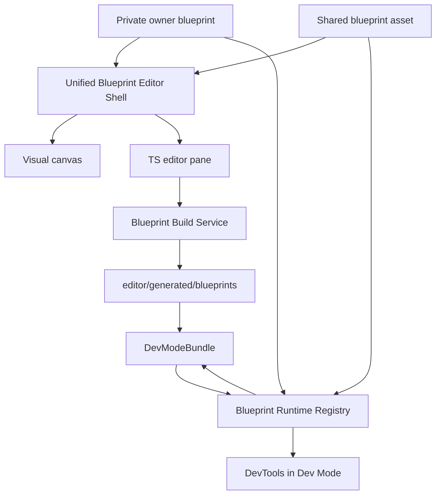
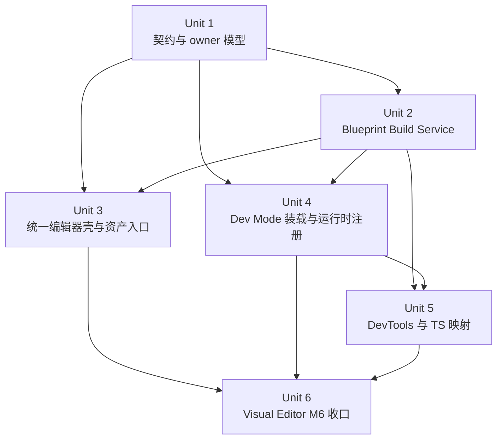
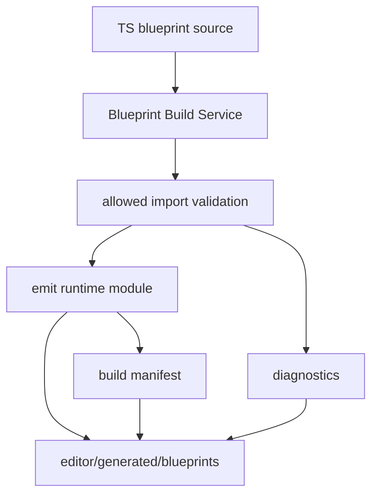

# Blueprint System M5 + Visual Editor M6 实现方案

## Overview

- 在保持 `Visual Blueprint` 与 `TypeScript Blueprint` 共用同一套运行时契约、宿主 API、调试协议的前提下，补齐 `Blueprint System M5`：TS 编辑器、独立构建链、共享蓝图资产、DevTools 强化。
- 在不把 Workspace 变成第二个 Dev Mode 的前提下，完成 `Visual Editor M6`：插入/搜索/复制复用入口优化、属性面板体验统一、错误与空状态文案收口、团队级最佳实践沉淀。
- 本方案按用户本轮确认的方向推进：单一 `blueprint` 资产类型、单一蓝图编辑器壳、独立 `Blueprint Build Service`、项目内生成目录 `editor/generated/blueprints/`、私有蓝图支持同一 owner 多份保留但只有一个 `active`。

## Problem Frame

- 文档侧目标已经很明确：`project/docs/blueprint-system-milestones.md` 将 `M5` 定义为 TS Blueprint、共享资产与 DevTools 强化；`project/docs/visual-editor-milestones.md` 将 `M6` 定义为生产级收口与团队复用性。
- 仓库侧已经具备可演进的基础：`src/shared/types/blueprint/`、`src/renderer/lib/workspace/services/ui-editor/LocalBlueprintService.ts`、`src/renderer/apps/workspace/modules/blueprint-lite/`、`src/main/app/application/managers/devMode/DevModeManager.ts`、`src/renderer/apps/dev-mode/components/BlueprintRuntimeDebugPanel.tsx`，但仍停留在 Visual 图编辑 + 最小运行时 + 基础 debug 的阶段。
- 当前仓库并没有与本阶段严格对齐的 `P5` 计划文件；`project/docs/agent-milestone-prompts.md` 已将本阶段定义为 `P6`，因此本计划按“`Blueprint System M4`、`Blueprint System M3-full`、`Visual Editor M5` 已完成”作为目标前置契约来写，同时显式标出当前仓库仍需补齐的衔接点。
- 本阶段的核心难点不是单个编辑器控件，而是如何在不引入 TS 专属特殊分支的前提下，把“私有蓝图、共享资产、Build Service、Dev Mode、DevTools、属性面板、资产面板”收敛到一条统一主线。

| 维度 | 私有蓝图 | 共享蓝图资产 |
|---|---|---|
| 生命周期 | 绑定在 `global/surface/widget` owner 下 | 绑定在资产系统下 |
| frontend 选择 | 第一次初始化私有蓝图时选择 | 创建资产时选择 |
| 并存规则 | 同一 owner 可保留多份私有蓝图，但只有一个 `active` | 一个资产对应一个蓝图实体 |
| 编辑入口 | 单一蓝图编辑器壳 | 单一蓝图编辑器壳 |
| 运行时解析 | 先解析 owner，再取 `active` 私有蓝图 | 通过资产注册表与 `blueprintId` 解析 |

## Requirements Trace

- R1. `Visual Blueprint` 与 `TypeScript Blueprint` 必须继续共用同一套 Runtime Contract、Host API、Debug Protocol，不能形成两条独立系统。
- R2. `TypeScript Blueprint` 的编译真相必须由独立 `Blueprint Build Service` 负责，Workspace、Dev Mode、未来正式构建都复用这一条链。
- R3. TS 生成产物必须落到项目内 `editor/generated/blueprints/`，并被视为可再生产物而不是新的资产真相。
- R4. 私有蓝图初始化时选择 frontend；同一 owner 允许保留多个私有蓝图，但只有一个 `active` 参与绑定解析与运行时派发。
- R5. 共享蓝图继续使用单一 `blueprint` 资产类型，编辑时进入单一蓝图编辑器壳，按 `frontend` 切换中间编辑区。
- R6. 共享蓝图资产要能进入资产面板、被搜索、被打开、被引用，并与 Dev Mode bundle / runtime registry 对齐。
- R7. 编译失败策略采用严格阻断：无论是激活私有 TS 蓝图、打开 Dev Mode，还是热重载使用该蓝图，都必须先通过编译。
- R8. DevTools 必须继续以 Dev Mode 为真实运行与调试主场，Workspace 只提供结构编辑、静态诊断、状态概览与跳转。
- R9. Visual Editor 生产级收口必须覆盖插入/搜索/复制复用入口、属性面板一致性、错误与空状态文案、团队最佳实践沉淀。
- R10. 整体方案必须高扩展、低耦合，避免“TS Blueprint 一套、Visual Blueprint 一套、共享资产又一套”的长期维护灾难。

## Scope Boundaries

- 不做 `Visual Blueprint` / `TypeScript Blueprint` 互转。
- 不做断点、单步、时光回溯、协作编辑、共享蓝图继承、monkey patch、网络请求与外部服务编排。
- 不把 Workspace 编辑器升级成第二个 Dev Mode；真实执行、严格运行时错误与调用栈以 Dev Mode 为主。
- 不引入新的重型模板/组件系统；`Visual Editor M6` 只做现有编辑器能力的生产级收口与复用入口优化。
- 不要求在本阶段补齐与 `P5` 等价的所有历史计划文档；本计划只负责定义 `P6` 的目标落点、前置依赖与衔接边界。

## Context & Research

### Relevant Code and Patterns

- `src/shared/types/blueprint/document.ts` 已经具备 `frontend: "visual" | "typescript"`、`programKind: "graph" | "scriptModule"` 与 `TypeScriptBlueprintSource` 的基础契约，但仍是单一 `ownerIndex` 模型。
- `src/shared/blueprint/parseSharedBlueprintAsset.ts` 与 `src/renderer/lib/workspace/services/assets/BlueprintService.ts` 已经证明共享蓝图资产走“shared parser + renderer 资产薄封装”的模式。
- `src/shared/types/devMode.ts` 与 `src/main/app/application/managers/devMode/DevModeManager.ts` 已经建立了 `DevModeBundle`、`sharedBlueprints` 加载、文件监视与 reload 的基本管线。
- `src/main/app/application/managers/devMode/compiler/INLangCompiler.ts` 目前只有 `NullNLangCompiler`，适合作为 Build Service 编排的既有注入点，而不是另起完全平行的 Dev Mode 管道。
- `src/renderer/lib/workspace/services/serviceRegistry.ts` 与 `src/renderer/lib/workspace/services/services.ts` 使用显式服务枚举 + 单例注册的模式，适合新增 `BlueprintBuild` 级服务。
- `src/renderer/apps/workspace/modules/blueprint-lite/` 已经具备统一蓝图编辑壳的雏形：`BlueprintEntryTab.tsx`、`BlueprintEditorLayout.tsx`、`BlueprintMemberTree.tsx`、`BlueprintDiagnosticsPanel.tsx`、`BlueprintInspectorPane.tsx`。
- `src/renderer/apps/workspace/modules/assets/AssetsPanel.tsx`、`src/renderer/apps/workspace/modules/assets/state/useAssetActions.ts`、`src/renderer/apps/workspace/modules/assets/hooks/useAssetsContextMenu.tsx` 已经是资产面板的实际工作流入口。
- `src/renderer/lib/ui-editor/blueprint-runtime/BlueprintDispatcher.ts`、`BindingEvaluator.ts`、`DebugBridge.ts` 与 `src/renderer/apps/dev-mode/hooks/useDevModeBlueprintRuntime.ts` 已提供运行时派发、绑定求值与调试总线的既有扩展位。
- `src/renderer/apps/dev-mode/components/BlueprintRuntimeDebugPanel.tsx` 已有最小 debug 面板，适合作为 DevTools 强化的收敛点。
- `src/renderer/lib/workspace/services/ui-editor/blueprint/blueprintCopyRemap.ts` 已提前为复制复用留好了数据层 remap 纯函数，但 UI 尚未真正接通。

### Institutional Learnings

- 仓库中不存在 `docs/solutions/`；当前最重要的过程约束来自 `project/docs/agent-milestone-prompts.md`，尤其是“先提问再定技术选型”“精确到文件”“避免 TS 特殊分支”。
- `project/docs/implementation-plans/p1-ve-m2a-bp-m2-plan.md` 与 `project/docs/implementation-plans/p2-bp-m3min-ve-m4lite-plan.md` 已经形成了“范围 / 非目标 / 关键文件 / 验收”的计划写法，本计划延续同样风格，但提升到深度计划粒度。
- `project/docs/blueprint-system-milestones.md` 与 `project/docs/visual-editor-milestones.md` 都强调不要颠倒顺序，不要因为更重的编辑器或 TS 前端而破坏底层统一契约。

### External References

- 本次未额外引入外部方案作为主依据；现有里程碑文档与仓库模式已经足够定义 `P6` 的主要技术边界。

## Key Technical Decisions

| 决策 | 结论 | 理由 |
|---|---|---|
| 编译真相 | 使用独立 `Blueprint Build Service` | 让 Workspace、Dev Mode、未来正式构建共享同一条 TS 链路，避免 Dev Mode 特判 |
| 生成目录 | 使用 `editor/generated/blueprints/` | 强调它是项目内生成物，同时贴近编辑器与 Dev Mode 的现有文件组织 |
| 私有蓝图 owner 模型 | 用 richer owner record 替换旧 `ownerIndex` | 支持“同一 owner 多份私有蓝图 + 单一 active”而不在外围拼补丁 |
| 私有蓝图 frontend 规则 | 初始化时选择 frontend；切换类型时创建新私有蓝图，旧蓝图保留但非 active | 满足用户需要，同时保留私有与共享的分层边界 |
| 共享资产模型 | 单一 `blueprint` 资产类型 | 避免 `visualBlueprint` / `tsBlueprint` 平行资产类型造成维护分叉 |
| 编辑器模型 | 单一蓝图编辑器壳，按 `frontend` 切换中间编辑区 | 简化心智模型，最大化复用 `BlueprintEntryTab`、诊断面板、导航与样式 |
| 编译失败策略 | 严格阻断 | 保证“源码、产物、Dev Mode 实际运行”一致，避免“旧产物继续跑”的隐式真相 |
| 运行时引用 | 继续以 `blueprintId` 作为跨蓝图解析主键，资产层只负责注册与元数据 | 避免共享资产与私有蓝图在引用模型上分叉 |
| 调试主场 | Dev Mode | 与既有文档一致，Workspace 只展示静态诊断和跳转入口 |

## Open Questions

### Resolved During Planning

- `TypeScript Blueprint` 编译真相放在哪里：独立 `Blueprint Build Service`。
- 编译产物如何持久化：落到项目内 `editor/generated/blueprints/`。
- 私有蓝图 frontend 范围如何定义：初始化时选择 frontend，同一 owner 可保留多份私有蓝图，但只有一个 `active`。
- owner 级持久化如何演进：用 richer owner record 替换旧 `ownerIndex`。
- 共享蓝图资产与编辑器壳如何组织：单一 `blueprint` 资产类型 + 单一蓝图编辑器壳。
- 编译失败时运行策略：严格阻断。

### Deferred to Implementation

- Monaco 语言服务最终采用内嵌 worker、轻量 facade，还是与 Build Service 共享更深的语言缓存，只要不改变 Build Service 单一真相即可。
- `editor/generated/blueprints/` 下 manifest 采用“一蓝图一 manifest”还是“目录级汇总 manifest”，只要 hash、moduleId、diagnostics 与 cache 清理语义一致即可。
- 非 `active` 私有蓝图在第一版是可直接编辑还是默认只读，只影响 UI 细节，不影响 owner record 主模型。
- TS 成员级定位第一版做到“成员 / 入口 / 函数 / 诊断位置”还是补更细粒度 source map，属于增强深度问题，不影响整体架构。

## High-Level Technical Design

> *This illustrates the intended approach and is directional guidance for review, not implementation specification. The implementing agent should treat it as context, not code to reproduce.*

## Implementation Units

- [x] **Unit 1: 演进蓝图契约与 owner 持久化模型**

**Goal:** 把当前“单 owner -> 单 blueprint”的本地模型升级为支持“同一 owner 多份私有蓝图 + 单一 active”的 canonical contract，并同时保持共享蓝图资产的统一引用模型。

**Requirements:** R1, R4, R5, R10

**Dependencies:** None

**Files:**
- Modify: `src/shared/types/blueprint/document.ts`
- Modify: `src/shared/types/blueprint/schema.ts`
- Modify: `src/shared/types/devMode.ts`
- Modify: `src/shared/types/ui-editor/graph.ts`
- Modify: `src/shared/blueprint/parseSharedBlueprintAsset.ts`
- Modify: `src/renderer/lib/workspace/services/services.ts`
- Modify: `src/renderer/lib/workspace/services/ui-editor/LocalBlueprintService.ts`
- Modify: `src/renderer/lib/workspace/services/ui-editor/UIBlueprintLifecycleCoordinator.ts`
- Create: `src/renderer/lib/workspace/services/ui-editor/blueprint/ownerRecords.ts`
- Test: `src/shared/blueprint/__tests__/ownerRecords.test.ts`

**Approach:**
- 用 richer owner record 替换旧 `ownerIndex`，至少承载 `activeBlueprintId`、`privateBlueprintIds`、frontend 初始化元数据与后续切换所需的轻量状态。
- 保留每个 `Blueprint` 自身的 `owner` 字段，私有蓝图仍然归属于 `globalMain` / `surfaceMain` / `widgetMain`；共享蓝图仍通过资产包装与 `owner.kind = "sharedAsset"` 区分。
- 继续以 `blueprintId` 作为运行时与编辑器侧的主引用 key，不引入“私有引用一种 id、共享引用另一种 id”的双轨模型。
- 为旧 `ownerIndex` 与单私有蓝图文档提供 schema migration；迁移后默认把历史唯一蓝图标记为 `active`。

**Patterns to follow:**
- `src/shared/types/blueprint/document.ts`
- `src/renderer/lib/workspace/services/ui-editor/LocalBlueprintService.ts`
- `src/shared/blueprint/parseSharedBlueprintAsset.ts`

**Test scenarios:**
- Happy path: 旧单蓝图文档升级后生成 owner record，并保持原 `blueprintId` 为 `active`。
- Happy path: 同一 owner 创建第二份私有蓝图后，record 中保留两份 id，但运行时只解析 `activeBlueprintId`。
- Edge case: 删除或失效的 `activeBlueprintId` 被移除时，owner record 能退回到下一个可用私有蓝图或明确进入空状态。
- Edge case: 共享资产解析时 `frontend` / `programKind` 与内部 blueprint 不一致，应被 schema 校验拒绝。
- Integration: `LocalBlueprintService`、`UIBlueprintLifecycleCoordinator`、Dev Mode bundle 构建都消费同一 owner record，而不是各自推断 active 蓝图。

**Verification:**
- 本地蓝图文档能够表达“一个 owner 多私有蓝图、一 active”的结构，而不需要外围状态补丁。
- 共享资产与私有蓝图在引用层只保留一个主键体系。

- [x] **Unit 2: 建立独立 Blueprint Build Service 与 TS 生成产物契约**（主进程 esbuild 编译链 + bundle 内联脚本；未单独落盘 `editor/generated/blueprints/`，见下方风险）

**Goal:** 建立既能被 Workspace 调用、又能被 Dev Mode / 正式构建复用的 `Blueprint Build Service`，并定义 `editor/generated/blueprints/` 的文件布局、manifest、诊断与严格阻断语义。

**Requirements:** R2, R3, R7, R10

**Dependencies:** Unit 1

**Files:**
- Create: `src/shared/blueprint/build/types.ts`
- Create: `src/shared/blueprint/build/manifest.ts`
- Create: `src/shared/blueprint/build/virtualModules.ts`
- Create: `src/shared/blueprint/build/cacheLayout.ts`
- Create: `src/renderer/lib/workspace/services/blueprint/BlueprintBuildService.ts`
- Create: `src/renderer/lib/workspace/services/blueprint/BlueprintBuildStore.ts`
- Modify: `src/renderer/lib/workspace/services/services.ts`
- Modify: `src/renderer/lib/workspace/services/serviceRegistry.ts`
- Create: `src/main/app/application/managers/devMode/compiler/blueprint/BlueprintBuildCoordinator.ts`
- Modify: `src/main/app/application/managers/devMode/compiler/INLangCompiler.ts`
- Modify: `src/shared/types/blueprint/document.ts`
- Test: `src/shared/blueprint/build/__tests__/BlueprintBuildManifest.test.ts`
- Test: `src/shared/blueprint/build/__tests__/BlueprintBuildService.test.ts`

**Approach:**
- 把 TS Blueprint 的“解析源码、校验 allowed imports、生成 diagnostics、输出运行模块元数据”收敛为独立 Build Service，而不是塞进 `DevModeManager` 的 `if (typescript)` 分支。
- 在 `editor/generated/blueprints/` 下定义稳定 cache layout，至少包含源 hash、frontend、module id、入口导出映射、允许的虚拟模块版本与最近一次编译 diagnostics。
- Workspace 侧负责主动触发编译、显示 diagnostics 与 cache 状态；主进程侧通过 `BlueprintBuildCoordinator` 复用同一套 shared build core 进行 Dev Mode / future build 编排。
- 严格阻断策略必须落实到 Build Service 结果对象：编译失败时禁止蓝图进入 `active` 运行态，Dev Mode reload 也不能悄悄沿用旧产物。

**Technical design:** *(directional guidance, not implementation specification)*

**Patterns to follow:**
- `src/main/app/application/managers/devMode/compiler/INLangCompiler.ts`
- `src/main/app/application/managers/devMode/DevModeManager.ts`
- `src/shared/blueprint/parseSharedBlueprintAsset.ts`

**Test scenarios:**
- Happy path: 同一份源码重复编译时，source hash 未变化则命中 cache，manifest 保持稳定。
- Happy path: 允许列表内虚拟模块可正常通过编译并产出 module id 与成员映射。
- Error path: 非允许 import、语法错误、宿主 API 版本不匹配时，Build Service 返回明确 diagnostics，并标记当前蓝图不可激活。
- Edge case: 连续快速保存触发多次编译时，旧结果不会覆盖较新的 source hash。
- Integration: Workspace 与 Dev Mode 通过同一 manifest 结构理解编译结果，而不是各自拼接路径。

**Verification:**
- TS 编译链在架构上不再属于 Dev Mode 专属逻辑。
- `editor/generated/blueprints/` 的目录语义、cache 生命周期与 diagnostics 来源都被写死为同一份契约。

- [x] **Unit 3: 用单一编辑器壳承接私有蓝图、共享资产与 TS 编辑**（TS 为 debounce 文本区 + 修订条；Monaco 仍属计划内增强）

**Goal:** 把现有 `BlueprintEntryTab` 演进为真正的统一蓝图编辑器壳，同时承接私有蓝图、共享蓝图资产以及 TS frontend 的 Monaco 编辑体验。

**Requirements:** R1, R4, R5, R6, R8, R10

**Dependencies:** Unit 1, Unit 2

**Files:**
- Modify: `package.json`
- Modify: `src/renderer/apps/workspace/modules/blueprint-lite/blueprintEntryTabId.ts`
- Modify: `src/renderer/apps/workspace/modules/blueprint-lite/hooks/useOpenBlueprintTarget.ts`
- Modify: `src/renderer/apps/workspace/modules/blueprint-lite/editors/BlueprintEntryTab.tsx`
- Modify: `src/renderer/apps/workspace/modules/blueprint-lite/components/BlueprintEditorLayout.tsx`
- Modify: `src/renderer/apps/workspace/modules/blueprint-lite/components/BlueprintMemberTree.tsx`
- Modify: `src/renderer/apps/workspace/modules/blueprint-lite/components/BlueprintInspectorPane.tsx`
- Modify: `src/renderer/apps/workspace/modules/blueprint-lite/components/BlueprintDiagnosticsPanel.tsx`
- Create: `src/renderer/apps/workspace/modules/blueprint-lite/components/BlueprintFrontendBadge.tsx`
- Create: `src/renderer/apps/workspace/modules/blueprint-lite/ts/TypeScriptBlueprintEditorPane.tsx`
- Create: `src/renderer/apps/workspace/modules/blueprint-lite/ts/useTypeScriptBlueprintEditorState.ts`
- Create: `src/renderer/apps/workspace/modules/blueprint-lite/ts/BlueprintMonacoBridge.ts`
- Modify: `src/renderer/apps/workspace/modules/assets/AssetsPanel.tsx`
- Modify: `src/renderer/apps/workspace/modules/assets/state/useAssetActions.ts`
- Modify: `src/renderer/apps/workspace/modules/assets/hooks/useAssetsContextMenu.tsx`
- Modify: `src/renderer/apps/workspace/modules/registry.ts`
- Test expectation: UI-heavy unit -- prioritize lint + structured manual verification; repository currently has no stable frontend test harness for this area.

**Approach:**
- 继续复用 `blueprint-lite` 目录中的现有壳层，而不是为共享资产或 TS Blueprint 再开一套平行编辑器。
- 统一 payload / tab id 语义，让“打开 owner 私有蓝图”和“打开共享蓝图资产”都进入同一个编辑器模块，只是上下文来源不同。
- 中间编辑区按 `frontend` 切换：`visual` 继续走 React Flow；`typescript` 使用 Monaco，并展示 Build Service diagnostics、允许的虚拟模块、成员概览与 cache 状态。
- 左侧导航区增加 owner 私有蓝图列表与 `active` 标识；右侧面板承载 frontend 无关的资产信息、frontend 相关的成员与诊断信息。
- 资产面板对 `AssetType.Blueprint` 的打开逻辑直接复用统一 shell，避免“资源面板一套编辑器、owner 入口一套编辑器”。

**Patterns to follow:**
- `src/renderer/apps/workspace/modules/blueprint-lite/editors/BlueprintEntryTab.tsx`
- `src/renderer/apps/workspace/modules/assets/AssetsPanel.tsx`
- `src/renderer/apps/workspace/modules/assets/state/useAssetActions.ts`

**Test scenarios:**
- Happy path: 从 Surface/元素入口打开私有蓝图、从资产面板打开共享蓝图，进入同一编辑器壳，头部与中间区正确切换。
- Happy path: 私有蓝图第一次初始化时要求选择 frontend；选择后创建对应 blueprint 并进入对应编辑区。
- Happy path: 同一 owner 下切换 `active` 私有蓝图时，列表、badge、诊断与后续运行目标保持一致。
- Edge case: 共享蓝图资产为空、私有蓝图列表为空、TS 源码为空时，中间区与侧栏都要给出明确的空状态引导。
- Edge case: 编译失败的 TS 蓝图在编辑器内显示“不可激活/不可运行”的明确状态，而不是静默保持旧态。
- Integration: `useOpenBlueprintTarget` 成为 owner 入口、属性入口、资产入口的统一导航 helper。

**Verification:**
- 用户始终只理解“Blueprint Editor”一个概念，而不是“Visual 蓝图编辑器 / TS 蓝图编辑器 / 资产蓝图编辑器”三套入口。
- 新增 frontend 不需要再复制一整套 Tab 壳层。

- [x] **Unit 4: 把 TS 产物、共享资产与 active 私有蓝图接入 Dev Mode 运行链**（`__NL_BP_MODULES__` + Dispatcher 脚本分支；绑定侧 `bound.*` 未接 evaluator）

**Goal:** 让 Dev Mode bundle、运行时注册表与派发链能够同时理解 `visual`、`typescript`、共享资产、active 私有蓝图，并严格执行编译失败阻断规则。

**Requirements:** R1, R2, R3, R4, R6, R7, R8, R10

**Dependencies:** Unit 1, Unit 2

**Files:**
- Modify: `src/shared/types/devMode.ts`
- Modify: `src/shared/types/ipcEvents.ts`
- Modify: `src/shared/types/renderer.ts`
- Modify: `src/main/preload/ipc/interface.ts`
- Modify: `src/renderer/lib/workspace/services/core/DevModeService.ts`
- Modify: `src/main/app/application/managers/devMode/DevModeManager.ts`
- Create: `src/main/app/application/managers/devMode/compiler/blueprint/collectBlueprintBuildArtifacts.ts`
- Create: `src/renderer/lib/ui-editor/blueprint-runtime/BlueprintRuntimeRegistry.ts`
- Create: `src/renderer/lib/ui-editor/blueprint-runtime/scriptModule/ScriptModuleLoader.ts`
- Create: `src/renderer/lib/ui-editor/blueprint-runtime/scriptModule/ScriptModuleRegistry.ts`
- Modify: `src/renderer/lib/ui-editor/blueprint-runtime/BlueprintDispatcher.ts`
- Modify: `src/renderer/lib/ui-editor/blueprint-runtime/BindingEvaluator.ts`
- Modify: `src/renderer/apps/dev-mode/hooks/useDevModeBlueprintRuntime.ts`
- Modify: `src/renderer/lib/ui-editor/runtime/hostAdapters/devModeBlueprintHostAdapter.ts`
- Test: `src/renderer/lib/ui-editor/blueprint-runtime/__tests__/BlueprintRuntimeRegistry.test.ts`
- Test: `src/renderer/lib/ui-editor/blueprint-runtime/__tests__/ScriptModuleLoader.test.ts`

**Approach:**
- `DevModeManager` 在组 bundle 前必须显式收集 Build Service 结果与 active 私有蓝图记录，而不是仅仅打包 `uigraphs.json`。
- Dev Mode runtime 侧建立统一 `BlueprintRuntimeRegistry`：对私有蓝图按 owner 解析 active，对共享资产按 `blueprintId` 注册，对 `scriptModule` 与 `graph` 两类程序通过统一 dispatcher contract 暴露事件、函数、声明与 debug 钩子。
- 严格阻断策略要直达会话状态：若 active TS 蓝图编译失败，启动 / reload 都应进入明确 error 状态，且 bundle 不应伪装为最新可运行版本。
- `BindingEvaluator` 与跨蓝图调用逻辑必须通过 registry 层解析共享蓝图与私有蓝图，而不是在 evaluator / dispatcher 中各写一套分叉判断。

**Patterns to follow:**
- `src/main/app/application/managers/devMode/DevModeManager.ts`
- `src/renderer/apps/dev-mode/hooks/useDevModeBlueprintRuntime.ts`
- `src/renderer/lib/ui-editor/blueprint-runtime/BlueprintDispatcher.ts`

**Test scenarios:**
- Happy path: Dev Mode 启动时能同时装载 active 私有 graph blueprint、active 私有 TS blueprint、共享蓝图资产索引。
- Happy path: owner 切换 active 私有蓝图后，下一次 reload 使用新的 active blueprint。
- Error path: active TS blueprint 编译失败时，Dev Mode 进入明确错误状态，且不会把失败源码当成已生效版本。
- Edge case: 共享资产存在但 module cache 缺失、manifest 版本不匹配或路径失效时，bundle 构建应失败并给出明确原因。
- Integration: `BindingEvaluator` 从共享蓝图声明读取值时，与私有蓝图声明读取走同一 registry 路径。
- Integration: 同一事件入口在 `graph` 与 `scriptModule` frontend 下都通过同一 dispatcher contract 触发。

**Verification:**
- Dev Mode 不需要为 TS Blueprint 写第二套运行时主线。
- 私有与共享、graph 与 scriptModule 在 runtime lookup 上都收敛到 registry 层。

- [x] **Unit 5: 强化 DevTools 与 TS/Runtime 定位能力**（面板分区：错误 / 状态写 / 绑定 / Host 调用 / 全量流）

**Goal:** 把当前“事件列表”级别的 debug 面板提升为真正可读的 DevTools，覆盖调用栈、状态快照、副作用日志、绑定求值记录、TS 诊断与运行时成员定位。

**Requirements:** R1, R6, R7, R8, R10

**Dependencies:** Unit 2, Unit 4

**Files:**
- Modify: `src/shared/types/blueprint/debug.ts`
- Create: `src/shared/types/blueprint/devtools.ts`
- Modify: `src/renderer/lib/ui-editor/blueprint-runtime/DebugBridge.ts`
- Create: `src/renderer/lib/ui-editor/blueprint-runtime/SourceMappingRegistry.ts`
- Modify: `src/renderer/apps/dev-mode/components/BlueprintRuntimeDebugPanel.tsx`
- Modify: `src/renderer/apps/dev-mode/components/DevModeContent.tsx`
- Create: `src/renderer/apps/dev-mode/components/devtools/BlueprintCallStackPanel.tsx`
- Create: `src/renderer/apps/dev-mode/components/devtools/BlueprintStateSnapshotPanel.tsx`
- Create: `src/renderer/apps/dev-mode/components/devtools/BlueprintBindingTracePanel.tsx`
- Create: `src/renderer/apps/dev-mode/components/devtools/BlueprintEffectLogPanel.tsx`
- Modify: `src/renderer/apps/workspace/modules/blueprint-lite/components/BlueprintDiagnosticsPanel.tsx`
- Test expectation: UI-heavy unit -- prioritize lint + structured manual verification; add pure-model tests only if the target area gains a stable test harness during implementation.

**Approach:**
- 把 debug 事件模型从“只够看 event log”扩展到“能驱动多个 DevTools 面板”的结构，但仍坚持 Dev Mode 为主场。
- `SourceMappingRegistry` 只做本阶段所需的最小可用映射：源码位置 -> blueprint member / event / function / module diagnostic，不强求完整 source map 才能落地。
- Workspace 编辑器继续显示静态 diagnostics，但要能明确区分“编译错误”“运行错误”“当前源码未生效”等不同来源。
- DevTools UI 以现有 `BlueprintRuntimeDebugPanel` 的右侧停靠模式为基础，扩成多面板或分区视图，而不是另起新的独立窗口体系。

**Patterns to follow:**
- `src/renderer/apps/dev-mode/components/BlueprintRuntimeDebugPanel.tsx`
- `src/renderer/lib/ui-editor/blueprint-runtime/DebugBridge.ts`
- `src/renderer/apps/workspace/modules/blueprint-lite/components/BlueprintDiagnosticsPanel.tsx`

**Test scenarios:**
- Happy path: graph 与 scriptModule 的调用都能生成统一可读的调用栈与状态快照。
- Happy path: TS 编译 diagnostics 能定位到对应 blueprint 成员或入口，而不是只显示原始编译文本。
- Error path: 运行时模块装载错误能定位到 blueprint、module id 与成员级别，而不是只报窗口级异常。
- Edge case: 没有事件、没有副作用、没有绑定记录时，DevTools 各面板展示明确空状态而不是空白区域。
- Integration: Workspace 中的 diagnostics 点击后能跳到对应成员，再通过 Dev Mode 验证真实运行结果。

**Verification:**
- DevTools 由“事件流可见”升级为“执行状态可读、错误可定位、graph 与 TS 体验一致”。
- Workspace 与 Dev Mode 不再对同一问题给出相互矛盾的提示。

- [~] **Unit 6: 完成 Visual Editor M6 的生产级收口与团队复用入口**（属性面板/只读区文案与「Blueprint」统一用语；未实现 InsertSearchPopover / 剪贴板 remap UI）

**Goal:** 收口 UI 编辑器的人机体验，让插入/搜索/复制复用、属性面板、错误/空状态与团队最佳实践进入稳定可生产状态，并与新蓝图模型保持一致。

**Requirements:** R4, R6, R8, R9, R10

**Dependencies:** Unit 3, Unit 4, Unit 5

**Files:**
- Modify: `src/renderer/apps/workspace/modules/ui-editor/editors/UISurfaceEditorTab.tsx`
- Modify: `src/renderer/lib/ui-editor/interaction/UIEditorInteractionLayer.tsx`
- Create: `src/renderer/apps/workspace/modules/ui-editor/components/InsertSearchPopover.tsx`
- Create: `src/renderer/apps/workspace/modules/ui-editor/hooks/useUISurfaceClipboard.ts`
- Modify: `src/renderer/apps/workspace/modules/properties/PropertiesPanel.tsx`
- Modify: `src/renderer/apps/workspace/modules/properties/blueprint/SurfaceBlueprintEntrySection.tsx`
- Modify: `src/renderer/lib/ui-editor/widget-modules/shared/blueprint/ReadonlyBlueprintSection.tsx`
- Modify: `src/renderer/lib/workspace/services/ui-editor/blueprint/blueprintCopyRemap.ts`
- Modify: `src/renderer/lib/workspace/services/ui-editor/LocalBlueprintService.ts`
- Modify: `src/renderer/apps/workspace/modules/assets/components/AssetSelector.tsx`
- Modify: `project/docs/visual-editor.md`
- Modify: `project/docs/visual-editor-milestones.md`
- Modify: `project/docs/blueprint-system-milestones.md`
- Test expectation: UI-heavy unit -- prioritize lint + manual acceptance scripts; no current automated end-to-end harness exists for this workflow cluster.

**Approach:**
- 插入、搜索、复制复用入口要围绕既有编辑器与资产面板模式收敛成统一语言，避免画布右键、属性面板、资产 selector、蓝图壳层四处各说各话。
- 真正接通 `blueprintCopyRemap.ts`，让复制含蓝图绑定的 subtree 时能跟随新的 owner / private blueprint 规则正确 remap。
- 属性面板里的 blueprint 摘要、私有/共享状态、`active` 标识、编译失败状态、空状态文案全部统一到一套 badge / helper 语义里。
- 团队最佳实践沉淀优先更新既有文档与示例路径，不新增新的文档体系；重点是把“怎么初始化私有蓝图、怎么切换 active、什么时候做共享资产、如何看错误与 DevTools”写成项目内统一约定。

**Patterns to follow:**
- `src/renderer/apps/workspace/modules/ui-editor/editors/UISurfaceEditorTab.tsx`
- `src/renderer/apps/workspace/modules/properties/PropertiesPanel.tsx`
- `src/renderer/lib/workspace/services/ui-editor/blueprint/blueprintCopyRemap.ts`
- `src/renderer/apps/workspace/modules/assets/components/AssetSelector.tsx`

**Test scenarios:**
- Happy path: 通过统一插入/搜索入口快速插入控件、蓝图入口、资产引用时，文案、键盘流与空状态保持一致。
- Happy path: 复制带蓝图绑定的 subtree 后，新元素能得到正确的 owner / 私有蓝图 remap，不误连到旧 blueprint。
- Edge case: 没有任何蓝图、没有任何共享资产、当前 owner 无 active blueprint、TS 编译失败时，属性面板与入口文案都能解释下一步操作。
- Edge case: 资产 selector、插入弹层、蓝图壳层的搜索无结果时，都有一致的空状态语言与 CTA。
- Integration: `active` 私有蓝图切换后，属性面板摘要、Dev Mode 运行目标、复制复用结果与资产入口状态同步更新。
- Integration: 更新后的文档与 UI 文案不再和里程碑文档互相打架。

**Verification:**
- 用户能从“创建 / 选择 / 复制 / 激活 / 调试 / 共享”这整条链路完成生产级工作流，而不是拼凑多个实验性入口。
- Visual Editor M6 的收口建立在既有系统之上，而不是再发明一个新层。

## System-Wide Impact

- **Interaction graph:** `PropertiesPanel` / `UISurfaceEditorTab` / `AssetsPanel` / `BlueprintEntryTab` -> `BlueprintBuildService` -> `DevModeManager` -> `DevModeBundle` -> `BlueprintRuntimeRegistry` -> `DebugBridge` / DevTools。
- **Error propagation:** TS 编译错误在 Build Service 产生并阻断 activation；运行时装载错误在 Dev Mode / runtime registry 产生并映射回 blueprint member；Workspace 只展示静态诊断和来源说明。
- **State lifecycle risks:** owner active 切换、复制 remap、共享资产引用、cache 失效、reload 竞态，都会同时影响编辑器状态、文档真相与运行时目标。
- **API surface parity:** graph frontend 与 scriptModule frontend 必须共享同一套 Host API 能力与调试事件结构；共享资产与私有蓝图也必须共享同一套 runtime lookup 主键。
- **Integration coverage:** active 切换、TS 编译失败、Dev Mode reload、共享资产搜索/打开、复制带蓝图 subtree、属性面板摘要同步，是本阶段最高风险的跨层场景。
- **Unchanged invariants:** Dev Mode 仍是主要真实运行与调试入口；绑定系统仍保持纯计算；`Visual Blueprint` 与 `TypeScript Blueprint` 不做互转；共享蓝图继承仍不进入本阶段。

## Alternative Approaches Considered

- **把 TS 编译塞进 `DevModeManager` 或 `INLangCompiler` 专属分支**：放弃。这样会让 Workspace 与正式构建无法复用同一条链，并把 TS Blueprint 永久钉死在 Dev Mode 特判上。
- **把共享蓝图资产拆成 `visualBlueprint` / `tsBlueprint` 两种资产类型**：放弃。虽然表面清晰，但会让资产面板、编辑器壳、运行时解析和文档路径都产生重复分叉。
- **继续维持“每个 owner 只有一个私有蓝图”**：放弃。它无法满足用户确认的“切换类型创建新私有蓝图并保留旧蓝图”的需求，只能靠隐藏归档或外部状态打补丁。
- **编译失败沿用最近一次成功产物继续跑**：放弃。虽然对 Dev Mode 更宽松，但会制造“当前源码未生效而用户不自知”的隐式真相。

## Dependencies / Prerequisites

- 逻辑前置以 `Blueprint System M4`、`Blueprint System M3-full`、`Visual Editor M5` 为准，本计划不重复定义这些阶段的完整交付。
- 实施前需要先核对当前仓库与这些前置阶段的实际落差，尤其是 `Host API` 完整度、运行时节点族、Workspace / Dev Mode 调试桥是否达到 `M3-full` 预期。
- 需要确认 `editor/generated/blueprints/` 的忽略策略与清理脚本，避免本地能跑、CI 或他人工作区不一致。

## Risks & Dependencies

| Risk | Likelihood | Impact | Mitigation |
|------|-----------|--------|------------|
| richer owner record 迁移破坏现有本地蓝图文档 | Med | High | 在 Unit 1 明确 schema migration 与回滚策略，先保守迁移再扩展 UI |
| TS Build Service 与现有 Dev Mode 编排出现双真相 | Med | High | 通过 Unit 2/4 把 manifest、cache、strict-block 语义写成单一契约 |
| `editor/generated/blueprints/` cache 漂移或被误删 | Med | Med | 使用 source hash + manifest 校验，并在 Dev Mode 启动前强校验 |
| 单一编辑器壳被 frontend 差异拖成内部特判泥球 | Med | High | 固定“壳层不变、中间编辑区切换、右侧只加 frontend 局部面板”的边界 |
| DevTools 试图在 Workspace 复制 Dev Mode 功能 | Low | High | 在 Unit 5/6 明确 Workspace 只做静态诊断与跳转，运行态仍在 Dev Mode |
| 当前仓库未完全达到假设前置阶段 | High | Med | 实施前先做前置核对，将缺口作为显式 prerequisite，而不是悄悄混入 P6 范围 |

## Documentation / Operational Notes

- `editor/generated/blueprints/` 应被定义为项目内可再生产物目录；实施期需要同步决定其 `.gitignore`、清理与重建策略。
- 团队最佳实践优先沉淀到现有文档：`project/docs/visual-editor.md`、`project/docs/visual-editor-milestones.md`、`project/docs/blueprint-system-milestones.md`，避免再开一套新文档体系。
- 实施期建议保留一组固定手工验收脚本，至少覆盖：私有蓝图初始化 -> frontend 选择 -> TS 编译 -> 激活切换 -> Dev Mode 启动 -> 共享资产打开与引用 -> subtree 复制 remap。

## Implementation record (2026-04-05)

### Verification

- `yarn lint`（`tsc` main + renderer）通过。

### P7 cross-check（文档与验收复核）

- 本计划 frontmatter 的 **`implemented` 不等于** `BP-M5-01` / `VE-M6-01` 在里程碑原文下的 **句句验收已全部完成**；句级状态与证据路径以 `p7-doc-gap-closure-plan.md` 附录矩阵为准。
- **P4 / M4-full** 中与属性绑定相关的小缺口（移除 `window.prompt`、搜索并绑定已有声明、Workspace 静态诊断与 Blueprint 诊断文案分工）由 **P7** 收口，**不**回溯改写本计划已交付的 P6 单元范围；下文 **Remaining risks** 仍仅描述 P6 目标内的残余项。

### File-level summary

| Area | Files |
|------|--------|
| Schema v3 + migration | `src/shared/types/blueprint/document.ts`, `schema.ts`, `src/shared/blueprint/migrateBlueprintDocument.ts` |
| Owner records + validation | `src/renderer/.../blueprint/documentValidation.ts`, `blueprintFactories.ts`, `ownerRecords.ts`, `LocalBlueprintService.ts`, `readonlyBlueprintSummary.ts`, `UIBlueprintLifecycleCoordinator.ts`, `UIGraphService.ts` |
| Dev Mode read path | `src/main/.../DevModeManager.ts`（加载时迁移 blueprintDocument） |
| TS compile (main) | `src/main/.../compiler/blueprint/compileProjectBlueprintScripts.ts` |
| Bundle + types | `src/shared/types/devMode.ts` |
| Runtime mount + dispatch | `mountBlueprintScripts.ts`, `BlueprintDispatcher.ts`, `devModeBlueprintHostAdapter.ts`, `useDevModeBlueprintRuntime.ts` |
| Editor TS UI | `BlueprintEntryTab.tsx`, `TypeScriptBlueprintEditorPane.tsx`, `BlueprintFrontendBadge.tsx`, `BlueprintPrivateRevisionBar.tsx` |
| DevTools UI | `BlueprintRuntimeDebugPanel.tsx` |
| M6 文案收口 | `SurfaceBlueprintEntrySection.tsx`, `ReadonlyBlueprintSection.tsx` |
| 生成物忽略 | `.gitignore`（`editor/generated/blueprints/` 预留） |

### Remaining risks / follow-ups

- **Workspace 侧 TS 编译**：当前仅在主进程 Dev Mode 启动路径编译；Workspace 内无实时诊断 IPC，Monaco 与 `BlueprintBuildService` 独立服务仍未落地。
- **生成物目录**：计划中的 `editor/generated/blueprints/` manifest 未实现；编译结果内联于 `DevModeBundle.blueprintCompiledScripts`。
- **TS `bound.bindSymbol`**：未接入 `BindingEvaluator`；默认模板仅使用 `events.on`。
- **M6 剪贴板 / 插入搜索**：`blueprintCopyRemap` 仍为纯函数，未接 UI；`InsertSearchPopover` 未实现。
- **`eval` 装载脚本**：Dev Mode 使用 `eval` 执行 IIFE；长期可改为 `blob:` + `import()` 或预写磁盘模块。
- **示例 `uigraphs.json`**：仍为 schema v2 + `ownerIndex`；工作区加载时会迁移为 v3（仅内存/保存后落盘）。

## Sources & References

- `project/docs/blueprint-system-milestones.md`
- `project/docs/visual-editor-milestones.md`
- `project/docs/blueprint-system.md`
- `project/docs/visual-editor.md`
- `project/docs/visual-editor-implementation-guide.md`
- `project/docs/dev-mode.md`
- `project/docs/agent-milestone-prompts.md`
- `project/docs/implementation-plans/p1-ve-m2a-bp-m2-plan.md`
- `project/docs/implementation-plans/p2-bp-m3min-ve-m4lite-plan.md`
- `src/shared/types/blueprint/document.ts`
- `src/shared/blueprint/parseSharedBlueprintAsset.ts`
- `src/shared/types/devMode.ts`
- `src/shared/types/ipcEvents.ts`
- `src/shared/types/renderer.ts`
- `src/main/preload/ipc/interface.ts`
- `src/main/app/application/managers/devMode/DevModeManager.ts`
- `src/main/app/application/managers/devMode/compiler/INLangCompiler.ts`
- `src/renderer/lib/workspace/services/serviceRegistry.ts`
- `src/renderer/lib/workspace/services/services.ts`
- `src/renderer/lib/workspace/services/ui-editor/LocalBlueprintService.ts`
- `src/renderer/apps/workspace/modules/blueprint-lite/editors/BlueprintEntryTab.tsx`
- `src/renderer/apps/workspace/modules/assets/AssetsPanel.tsx`
- `src/renderer/apps/workspace/modules/assets/state/useAssetActions.ts`
- `src/renderer/apps/dev-mode/hooks/useDevModeBlueprintRuntime.ts`
- `src/renderer/apps/dev-mode/components/BlueprintRuntimeDebugPanel.tsx`
