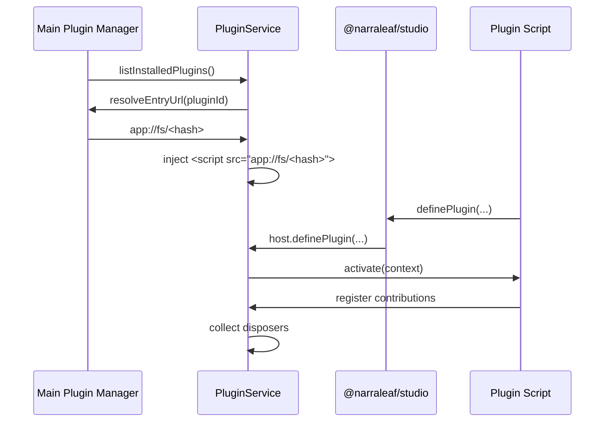

# NarraLeaf Studio - Plugin System（架构指导）

本文档用于约束 NarraLeaf Studio 一期插件系统的总体结构、宿主边界与接入方式。

本文档针对的目标不是“通用第三方沙箱平台”，而是一个**本地可信插件**模型：

- 插件来自本地磁盘，由用户主动安装到 Studio 管理的插件目录。
- 插件代码运行在渲染器进程中，通过 `script` 标签加载。
- 插件的能力来源于 Studio 暴露给它的 service 接口，而不是直接拿到内部单例或 Electron 原始桥接。
- 一期**不做** manifest 权限白名单、签名校验、远程 marketplace 审核流、隔离沙箱。

后续如果要升级到更严格的安全模型，应在本方案的宿主包装层上演进，而不是让插件直接依赖 Studio 内部实现细节。

---

## 1. 目标与结论

### 1.1 本期目标

- 用一个 `PluginService` 统一管理插件的发现、加载、激活、停用与卸载。
- 插件用 manifest 声明基础信息与入口文件。
- Studio 将插件入口文件解析为可供渲染器加载的 `app://fs/<hash>` URL，再通过 `script` 标签注入。
- 仓库新增 `packages/@narraleaf/studio` 包，作为插件侧唯一官方 SDK。
- 插件通过 SDK 从 `window` 上取得 Studio 暴露的接入点与上下文。
- 插件的“权限”来自宿主愿意暴露的 service facade，而不是直接访问 `window` 上的任意对象。
- 插件覆盖范围允许很广，包括 workspace 壳层 UI 与 UI Editor 内部扩展点。

### 1.2 本期非目标

- 不做浏览器级沙箱或独立 JS Realm。
- 不直接把 `RendererPreloadedInterface` 暴露给插件。
- 不允许插件直接操作 `ServiceRegistry` 或获取内部 `Service` 子类实例。
- 不把 manifest 做成“大而全”的静态贡献系统；基础信息放 manifest，动态注册由插件入口执行。
- 不引入远程下载、在线 marketplace、签名校验与审核机制。

### 1.3 一句话架构

**`PluginService` 负责插件生命周期，`@narraleaf/studio` 负责插件侧 SDK，插件能力通过宿主提供的 plugin-facing services 暴露，底层继续复用现有 `UIService`、`WidgetModuleRegistry`、`UIStore` 与 `app://fs` 协议。**

---

## 2. 现有仓库基线与设计约束

### 2.1 已有基线

当前仓库里已经有几块非常适合复用的基础设施：

- 工作区服务容器：`src/renderer/lib/workspace/services/serviceRegistry.ts`
- 服务生命周期：`src/renderer/lib/workspace/services/Service.ts`
- Workspace 上下文：`src/renderer/lib/workspace/services/services.ts`
- UI 壳层总入口：`src/renderer/lib/workspace/services/core/UIService.ts`
- UI 单一状态源：`src/renderer/lib/workspace/services/ui/UIStore.ts`
- workspace 模块定义：`src/renderer/apps/workspace/modules/types.ts`
- 面板 / 标签页 / 顶栏动作契约：`src/renderer/apps/workspace/registry/types.ts`
- widget 扩展入口：`src/renderer/lib/ui-editor/widget-modules/types.ts`
- widget 注册中心：`src/renderer/lib/ui-editor/widget-modules/WidgetModuleRegistry.ts`
- 渲染器 bridge 入口：`src/renderer/lib/app/bridge.ts`
- 预加载接口类型：`src/shared/types/renderer.ts`
- 自定义协议与 `app://fs/<hash>`：`src/main/app/application/managers/protocolManager.ts`、`src/main/app/application/managers/protocol/fileSystemHandler.ts`
- 全局插件命名空间：`src/shared/types/constants.ts` 中的 `UserDataNamespace.Plugins`

### 2.2 设计约束

这些基线同时带来约束：

- `ServiceRegistry` 目前是固定映射，插件不能直接向内部 `Services` 枚举动态塞新服务。
- `UIService`、`UIStore` 已经是 workspace UI 的真相来源，插件不应再绕开它们造第二套状态树。
- `WidgetModuleRegistry` 已经承担控件类型注册职责，插件 widget 应直接复用这个入口。
- `RendererPreloadedInterface` 是内部 bridge，不应直接成为插件 API。
- `app://fs/<hash>` 已经具备“临时文件安全暴露”的基础能力，插件入口 URL 应沿用这个机制，而不是在渲染器里直接拼本地绝对路径。

### 2.3 核心设计原则

- **宿主稳定，插件可变。** 插件只依赖 SDK 契约，不依赖 Studio 内部类名与路径。
- **包装而非透传。** 插件看到的是 plugin-facing services，不是内部 service 实例。
- **动态注册，统一回收。** 所有注册操作都必须返回 disposer，并由 `PluginService` 统一托管。
- **一期信任本地插件，但不把升级路线堵死。** 现在不做白名单，不代表以后不能加。

---

## 3. 总体结构

```mermaid
flowchart TD
    A[Installed Plugin Files] --> B[Main Process Plugin Manager]
    B --> C[Renderer PluginService]
    C --> D[Plugin Host on window]
    D --> E[@narraleaf/studio SDK]
    E --> F[Plugin Entry Bundle]

    C --> G[workspace UI facades]
    C --> H[UI editor facades]
    C --> I[project/assets/dev mode facades]

    G --> J[UIService / UIStore]
    H --> K[WidgetModuleRegistry / editor registries]
    I --> L[existing workspace services]
```

### 3.1 角色划分

#### A. Main Process Plugin Manager

职责：

- 发现已安装插件
- 解析 manifest
- 校验插件目录与入口文件
- 为插件入口分配 `app://fs/<hash>` 读取地址
- 向渲染器返回已安装插件清单与入口 URL

这一层建议放在主进程，因为：

- 插件文件真实路径不应直接在渲染器层拼接与暴露。
- `StorageManager.allocateHash()` 与 `FileSystemHashHandler` 已经在主进程。
- 后续若要加入签名、缓存、升级、卸载，主进程天然更适合作为真相来源。

#### B. Renderer `PluginService`

职责：

- 持有插件运行时记录
- 管理脚本注入与注册握手
- 决定何时激活插件
- 为已运行插件提供 context 与 services
- 统一回收所有注册的 UI/编辑器扩展 disposer

#### C. Window Host

这是宿主暴露给插件 SDK 的全局接入点。

它不应该是“把所有内部对象挂到 `window` 上”，而应该是一个最小、明确、版本化的 host 对象，例如：

- `definePlugin(definition, sourceUrl?)`
- `getRuntime(pluginId)`
- `getApiVersion()`

#### D. `packages/@narraleaf/studio`

这是插件开发者唯一应依赖的官方包。

职责：

- 包装 `window` 上的 host
- 暴露类型定义
- 暴露 `definePlugin()` 等注册 helper
- 暴露 `DisposableStore`、类型守卫、错误类型等轻量工具

#### E. Plugin Entry Bundle

插件入口不直接访问 Studio 内部路径，而是：

1. `import { definePlugin } from "@narraleaf/studio"`
2. 调用 `definePlugin({ activate(ctx) { ... } })`
3. 由 SDK 与宿主完成注册握手

---

## 4. 插件存储与发现

### 4.1 插件物理存储

建议把“一期可执行插件代码”的主存储位置定为：

- 全局安装目录：`userData/plugins/<pluginId>/`

理由：

- 你已经有 `UserDataNamespace.Plugins`
- 这与“编辑器全局存储的插件文件入口”这一设想一致
- 后续更容易支持安装、升级、回滚与跨项目复用

项目内的 `ProjectNameConvention.Plugins`（`.nlstudio/plugins/`）建议本期仅预留为：

- 项目级启用/禁用覆盖
- 项目级插件配置
- 后续 project-local plugin 开发模式

不要在一期同时把“全局安装目录”和“项目内插件源码目录”都做成正式执行真相，否则加载逻辑会变复杂。

### 4.2 推荐目录结构

```text
userData/plugins/
  <pluginId>/
    plugin.json
    dist/
      index.js
    assets/
      icon.png
```

### 4.3 Manifest 约定

一期 manifest 建议保持轻量，只承载静态元数据与加载入口：

```json
{
  "manifestVersion": 1,
  "id": "com.example.motion-pack",
  "name": "Motion Pack",
  "version": "1.0.0",
  "main": "./dist/index.js",
  "description": "Adds motion presets and editor integrations.",
  "engines": {
    "studio": "^0.0.1"
  },
  "activationEvents": [
    "onWorkspaceReady"
  ]
}
```

### 4.4 Manifest 字段建议

| 字段 | 说明 | 一期是否必需 |
|------|------|--------------|
| `manifestVersion` | manifest 自身版本 | 是 |
| `id` | 全局唯一插件 ID，建议反向域名风格 | 是 |
| `name` | 展示名 | 是 |
| `version` | 插件版本 | 是 |
| `main` | 相对入口文件路径 | 是 |
| `description` | 描述 | 否 |
| `engines.studio` | Studio 兼容版本范围 | 是 |
| `activationEvents` | 激活时机 | 是 |
| `icon` | 图标相对路径 | 否 |

### 4.5 为什么不把贡献点全部写进 manifest

因为你设想的覆盖范围很广，尤其包括：

- 侧边栏 / 底栏 / 顶栏 / 标签页
- widget module
- inspector 扩展
- appearance / motion 扩展

这类能力天然更适合在运行时代码里动态注册，而不是把一大套 DSL 塞进 manifest。

因此本期建议：

- manifest 负责“能否加载”
- entry 代码负责“加载后注册什么”

---

## 5. 加载与激活流程

### 5.1 推荐生命周期



### 5.2 详细步骤

#### 1. 发现

主进程扫描全局插件目录，得到安装记录：

- manifest 路径
- 插件根目录
- 入口文件绝对路径
- 基础元数据

#### 2. 校验

至少校验：

- `plugin.json` 是否存在
- `main` 是否能解析到文件
- `id` / `version` / `engines.studio` 是否合法
- 插件 ID 是否冲突

#### 3. 分配入口 URL

不要让渲染器直接拿真实文件路径。

建议流程：

1. 主进程拿到入口绝对路径
2. 调用 `StorageManager.allocateHash(entryPath, true)`
3. 将 hash 标记为 `ready`
4. 返回 `app://fs/<hash>`

这样就能复用已有 `FileSystemHashHandler`。

#### 4. 注入脚本

渲染器 `PluginService` 创建经典脚本标签：

```html
<script src="app://fs/<hash>"></script>
```

本期推荐使用**经典 script** 而不是 `type="module"`，原因是：

- 更容易基于 `document.currentScript` 关联“当前正在加载哪个插件”
- 不需要额外处理模块导出抓取
- 更适合作为 IIFE/UMD 风格的浏览器 bundle 载体

#### 5. 注册握手

脚本执行后，插件侧调用 SDK 的 `definePlugin()`。

宿主不依赖插件在代码里再写一遍 `pluginId`，而是通过以下方式绑定：

- `PluginService` 在注入前记录 `src -> pending plugin record`
- SDK 调用 `window` host 时携带 `sourceUrl`，默认从 `document.currentScript?.src` 推断
- host 根据 `sourceUrl` 找到对应 pending record
- 再将插件定义体与 manifest 绑定

这样能避免：

- manifest ID 与代码内 ID 双写
- 多插件并发加载时全局单槽冲突

#### 6. 激活

宿主按 `activationEvents` 激活插件。

一期建议支持：

- `onStartup`
- `onWorkspaceReady`
- `onCommand:<id>`
- `onUiEditorReady`
- `onDevMode`

为了控制首屏成本，建议：

- 先发现全部 manifest
- 只在对应 activation event 首次命中时注入脚本
- 脚本注入成功后再执行 `activate(context)`

#### 7. 停用与回收

插件注册的所有贡献都必须返回 disposer。

`PluginService` 统一回收：

- panel / action / status bar / keybinding / tab opener
- widget modules
- inspector extenders
- appearance extenders
- context menu extenders
- 事件订阅

---

## 6. `PluginService` 的定位

### 6.1 它应该做什么

`PluginService` 负责：

- 发现插件
- 保存插件记录
- 管理加载状态
- 驱动激活 / 停用
- 提供运行时 context
- 汇总清理逻辑

### 6.2 它不应该做什么

它不应该直接承载所有业务贡献逻辑。

否则它会膨胀成一个“God Service”，后果是：

- UI editor 扩展逻辑与 workspace UI 混在一起
- 未来新增贡献点时全部改 `PluginService`
- 难以维护稳定 API

### 6.3 推荐内部拆分

对外仍然只有一个 `PluginService`，但内部应拆成几层：

- `PluginService`：生命周期编排
- `PluginRegistry`：安装记录与运行时记录
- `PluginLoader`：脚本注入与握手
- `PluginHostBridge`：window 暴露对象
- `PluginApiFactory`：为插件创建 facade context
- `UIEditorPluginRegistry`：编辑器相关贡献点

也就是说：

- **对外**只有一个 `PluginService`
- **对内**按职责拆分，不让外部知道内部复杂度

---

## 7. `@narraleaf/studio` 包设计

### 7.1 包路径

建议新增：

```text
packages/@narraleaf/studio/
```

并将根 `package.json` 的 workspaces 从当前的 `src/*` 扩展为至少包含：

```json
[
  "src/*",
  "packages/@narraleaf/*"
]
```

### 7.2 这个包的职责

- 包装 `window` host
- 提供稳定类型
- 提供注册 helper
- 隔离 Studio 内部结构变化

### 7.3 不应做的事

- 不暴露 Electron 原始 IPC
- 不暴露 `RendererPreloadedInterface`
- 不暴露内部 `ServiceRegistry`
- 不要求插件 import Studio 仓库内部路径

### 7.4 推荐导出

```ts
import { definePlugin } from "@narraleaf/studio";

export default definePlugin({
  activate(context) {
    const dispose = context.services.panels.register({
      id: "com.example.motion-pack.panel",
      title: "Motion Pack",
      position: "right"
    });

    return () => {
      dispose();
    };
  }
});
```

SDK 建议至少提供：

- `definePlugin()`
- `DisposableStore`
- `StudioPlugin`
- `StudioPluginContext`
- 各 service facade 类型
- 基础错误类型与版本检查工具

### 7.5 为什么 SDK 要包装 `window`

因为这样可以把这几个变化点都关在宿主内部：

- `window` 上的全局 key 名
- host 的版本结构
- 注册握手参数
- future capability model

插件侧只认 `@narraleaf/studio`，不认 Studio 内部实现。

---

## 8. 插件 Context 与权限模型

### 8.1 结论

你说的“权限来自这些 service”应解释为：

**插件只能拿到宿主显式暴露的 plugin-facing service facades。**

不是：

- `context.services.get(Services.UI)`
- `window.__NLS_RENDERER_INTERFACE__`
- 任意访问内部类实例

### 8.2 建议的 context 结构

```ts
type StudioPluginContext = {
  manifest: PluginManifest;
  subscriptions: DisposableStore;
  services: {
    workspace: WorkspacePluginService;
    panels: PanelPluginService;
    actionBar: ActionBarPluginService;
    editorTabs: EditorTabPluginService;
    statusBar: StatusBarPluginService;
    commands: CommandPluginService;
    widgetModules: WidgetModulePluginService;
    inspector: InspectorPluginService;
    appearance: AppearancePluginService;
    contextMenus: ContextMenuPluginService;
    project: ProjectPluginService;
    assets: AssetsPluginService;
    devMode: DevModePluginService;
  };
};
```

### 8.3 为什么不要暴露原始 service

如果插件直接拿到内部 service 实例，会立刻出现几个问题：

- API 稳定性完全丧失
- 插件与内部类结构强耦合
- 后续无法在 facade 层加审计、能力限制与兼容适配
- 未来改造 `UIService` 或 `UIDocumentService` 时会破坏插件生态

因此本期虽然是“本地可信插件”，仍然建议一开始就走 facade 模式。

### 8.4 权限边界的现实含义

本期没有白名单，不代表插件无限制。

真实边界应是：

- 宿主只创建有限的 context
- 插件只能通过这个 context 办事
- 宿主根本不提供的能力，插件就不该拿得到

这能给二期升级预留空间：

- manifest capability
- 首次授权弹窗
- 审计日志
- 只读 / 可写 service 分级

---

## 9. 贡献点设计

因为插件覆盖范围会非常广，本期建议把贡献点分成两类：

- **直接复用现有系统的贡献点**
- **需要新增 registry 的贡献点**

### 9.1 可直接复用的贡献点

| 贡献点 | 建议 facade | 底层复用 |
|--------|-------------|----------|
| 左侧栏 / 右侧栏 / 底栏面板 | `services.panels.register()` | `UIStore.registerPanel()` / `UIService.panels` |
| 顶栏动作 / 菜单组 | `services.actionBar.register()` | `UIStore.registerAction()` / `registerActionGroup()` |
| 状态栏项 | `services.statusBar.register()` | `StatusBarService` / `UIStore` |
| 标签页打开器 | `services.editorTabs.open()` | `Registry` / `UIStore` |
| 快捷键 / 命令 | `services.commands.register()` | `UIService.keybindings` |
| 新 widget 类型 | `services.widgetModules.register()` | `WidgetModuleRegistry` |

### 9.2 需要新增 registry 的贡献点

| 贡献点 | 为什么要新增 |
|--------|--------------|
| 对内置 widget 的 inspector 扩展 | 当前 `createInspector()` 主要由 widget module 自己生成，缺少“给已有控件追加 section/tab”的通道 |
| appearance / motion 模块 | 当前动效与外观面板是内聚实现，缺少插件注册 motion preset 的入口 |
| 画布 / Outline 上下文菜单 | 当前是构建函数直出菜单，缺少第三方追加项入口 |
| Dev Mode 扩展入口 | 现有文档里有 `entry.kind = "extension"` 方向，但尚无插件贡献接口 |

### 9.3 推荐拆成三个编辑器侧 registry

- `InspectorExtensionRegistry`
- `AppearanceExtensionRegistry`
- `ContextMenuExtensionRegistry`

然后由 `PluginService` 暴露 facade：

- `services.inspector`
- `services.appearance`
- `services.contextMenus`

### 9.4 关于“动效（motion）”的具体建议

你提到要让插件能注册“界面编辑器可选动效”，这类能力不要直接硬塞进 `WidgetModuleRegistry` 本体。

更合适的结构是：

- `appearance` registry 按 `targetKind` 或 `widgetType` 分组
- 插件注册的是“motion preset / appearance module”
- 宿主在 `AppearanceAuthoringPanel` 或 compact appearance 面板中合并内置与插件项

建议把“动效”抽象为：

- `presetId`
- `label`
- `targetKinds`
- `supportsProperties`
- `buildDefaultValue()`
- `renderEditor?()`
- `serialize / migrate?()`

这样它既能服务 `nl.container`，也能扩到别的 widget。

### 9.5 Inspector 扩展建议

对于像 `container/inspector.tsx` 这样的内置控件，插件不应去覆盖整份 inspector schema。

建议支持三种粒度：

- 给某个 widget 追加一个 section
- 给某个现有 tab 追加 fields
- 注册一个全新 tab

这样风险更小，也更符合“插件扩展”而不是“插件替换内核”的方向。

---

## 10. 推荐的宿主 API 形状

### 10.1 基础插件定义

```ts
type StudioPlugin = {
  activate(context: StudioPluginContext): void | (() => void) | Promise<void | (() => void)>;
};
```

一期不建议要求插件必须实现复杂生命周期，只保留：

- `activate`
- `deactivate` 由 `activate` 返回 disposer 体现

### 10.2 Panels API

建议 facade 与现有 `PanelDefinition` 对齐，但字段保持插件友好：

- `id`
- `title`
- `icon`
- `position`
- `component`
- `defaultVisible`
- `order`
- `badge`

### 10.3 Action Bar API

建议暴露：

- `registerAction()`
- `registerActionGroup()`

不要让插件直接接触 `UIStore.registerAction()`。

### 10.4 Widget Modules API

建议 facade 直接接收接近 `UIWidgetModule` 的结构，但类型来自 SDK 自己，而不是直接 re-export 内部路径。

### 10.5 Inspector API

建议支持：

- `registerSectionExtension(widgetType, extension)`
- `registerTabExtension(widgetType, extension)`

其中 extension 需要带：

- `id`
- `order`
- `when?(context)`
- `createFields?(context)`
- `createTab?(context)`

### 10.6 Appearance API

建议支持：

- `registerMotionPreset(definition)`
- `registerAppearanceModule(definition)`

### 10.7 Context Menu API

建议支持：

- `registerCanvasMenuItems(provider)`
- `registerOutlineMenuItems(provider)`

provider 由宿主在实际菜单构建时调用，这样菜单项可以基于当前选区动态生成。

---

## 11. Script 握手细节

这是本方案最关键的运行时细节之一。

### 11.1 推荐机制

宿主在 `window` 上暴露一个极小对象，例如：

```ts
window.__NLS_STUDIO_PLUGIN_HOST__ = {
  definePlugin(definition, sourceUrl) { ... }
}
```

SDK 的 `definePlugin()` 做的事情只有三步：

1. 找到 host
2. 推断 `sourceUrl`
3. 调用 `host.definePlugin()`

### 11.2 `sourceUrl` 推荐来源

经典 script 下优先使用：

- `document.currentScript?.src`

如果需要兼容特殊 bundler 包装，可允许显式传参覆盖，但不应要求插件开发者手写 manifest 里的入口 URL。

### 11.3 为什么不用“全局导出一个对象再去捞”

不推荐让插件 bundle 简单写成：

- `window.somePlugin = {...}`

因为这样会带来：

- 命名冲突
- 多插件并发污染
- 无法天然关联当前脚本来源

`definePlugin()` 是更稳定的宿主协作协议。

---

## 12. 与现有 Workspace 的集成策略

### 12.1 `PluginService` 加入服务系统

建议把注释占位的 `Plugin` service 正式启用：

- 在 `src/renderer/lib/workspace/services/services.ts` 中取消 `Plugin`
- 增加 `IPluginService`
- 在 `src/renderer/lib/workspace/services/serviceRegistry.ts` 中注册 `PluginService`

### 12.2 初始化顺序

`PluginService` 应依赖至少这些核心服务已准备好：

- `UIService`
- `AssetsService`
- `ProjectService`
- `ProjectSettingsService`

如果插件要参与 UI Editor 扩展，还应保证：

- `WidgetModuleRegistry` 已完成内置模块注册
- editor 侧 registry 已创建

### 12.3 推荐激活时机

建议在 workspace 上下文可用、核心 UI store 已建立之后激活插件。

这样插件注册的：

- panels
- action bar items
- widget modules

都能在首轮渲染中被看到。

---

## 13. 推荐文件结构

以下是建议新增或修改的主要文件，不要求一口气全做完，但方向应一致。

### 13.1 根配置

- 修改：`package.json`
- 目标：加入 `packages/@narraleaf/*` workspaces

### 13.2 SDK

- 新增：`packages/@narraleaf/studio/package.json`
- 新增：`packages/@narraleaf/studio/src/index.ts`
- 新增：`packages/@narraleaf/studio/src/definePlugin.ts`
- 新增：`packages/@narraleaf/studio/src/host.ts`
- 新增：`packages/@narraleaf/studio/src/types.ts`
- 新增：`packages/@narraleaf/studio/src/disposable.ts`

### 13.3 Shared Types

- 新增：`src/shared/types/plugin.ts`

建议放：

- manifest 类型
- runtime plugin record 类型
- activation event 类型
- host / sdk 共享契约类型

### 13.4 Main Process

- 新增：`src/main/app/application/managers/plugin/PluginManager.ts`
- 新增：`src/main/app/application/managers/plugin/types.ts`
- 新增：`src/main/app/application/managers/window/handlers/pluginAction.ts`

职责：

- 枚举插件
- 校验 manifest
- 分配入口 hash URL
- 提供安装清单给渲染器

### 13.5 Preload / Renderer Bridge

- 修改：`src/shared/types/renderer.ts`
- 修改：`src/main/preload/ipc/interface.ts`
- 新增：plugin 相关 preload API

建议对 renderer 暴露：

- `plugins.listInstalled()`
- `plugins.resolveEntryUrl(pluginId)`
- `plugins.getHostApiVersion()`

### 13.6 Renderer Plugin Runtime

- 新增：`src/renderer/lib/workspace/services/core/PluginService.ts`
- 新增：`src/renderer/lib/workspace/plugins/PluginRegistry.ts`
- 新增：`src/renderer/lib/workspace/plugins/PluginLoader.ts`
- 新增：`src/renderer/lib/workspace/plugins/PluginHostBridge.ts`
- 新增：`src/renderer/lib/workspace/plugins/PluginApiFactory.ts`

### 13.7 UI Editor 扩展注册器

- 新增：`src/renderer/lib/ui-editor/plugins/InspectorExtensionRegistry.ts`
- 新增：`src/renderer/lib/ui-editor/plugins/AppearanceExtensionRegistry.ts`
- 新增：`src/renderer/lib/ui-editor/plugins/ContextMenuExtensionRegistry.ts`

---

## 14. 版本、兼容性与冲突处理

### 14.1 双版本

建议区分两个版本：

- `manifestVersion`
- `hostApiVersion`

前者管 manifest 格式，后者管运行时宿主 API。

### 14.2 Studio 兼容范围

manifest 中应声明：

- `engines.studio`

如果不兼容，应在插件列表中展示错误，不进入加载流程。

### 14.3 ID 冲突

如果发现两个已安装插件 `id` 相同：

- 只允许一个进入可激活状态
- 另一个标记冲突
- 不要 silent overwrite

### 14.4 注册冲突

如果两个插件注册同一个贡献 ID，例如：

- panel id
- action id
- widget type
- motion preset id

建议策略是：

- 开发态报错并明确指出冲突源插件
- 生产态拒绝后注册者，并记录日志

不要默默覆盖。

---

## 15. 分阶段落地建议

### Phase 1：基础加载链路

目标：

- manifest 发现
- 入口 URL 解析
- script 注入
- `definePlugin()` 握手
- `PluginService` 基本 lifecycle

先不做：

- Inspector / appearance / context menu 扩展

### Phase 2：workspace UI 贡献点

目标：

- panels
- action bar
- status bar
- commands / keybindings
- editor tab opener

### Phase 3：UI Editor 扩展

目标：

- widget modules
- inspector extenders
- context menu extenders

### Phase 4：Appearance / Motion 扩展

目标：

- motion presets
- appearance module registry
- 与 `AppearanceAuthoringPanel` 合流

### Phase 5：能力模型升级位

目标：

- manifest capability 声明
- facade 分级
- 授权与审计

---

## 16. 关键决策总结

- **主编排服务**：使用一个 `PluginService`，但内部拆层。
- **插件入口载入方式**：通过主进程生成的 `app://fs/<hash>`，由渲染器插入经典 `script` 标签。
- **插件 SDK**：新增 `packages/@narraleaf/studio`，插件只依赖它。
- **权限来源**：来自宿主显式暴露的 service facades，而不是内部 service 实例。
- **Manifest 角色**：只做静态元数据与入口描述，不承载全部扩展 DSL。
- **编辑器广覆盖扩展**：对现有 UI 与 widget registry 复用，对 inspector / appearance / context menu 增设专门 registry。
- **安全边界**：一期按本地可信插件处理，但保留 future capability 升级位。

---

## 17. 最终建议

如果只保留一句最重要的约束，那就是：

**让插件依赖 `@narraleaf/studio`，不要依赖 Studio 内部实现。**

只要这条守住，后面不论你是：

- 调整 `UIService`
- 重做 `RendererPreloadedInterface`
- 增加 capability model
- 把 script 注入改为别的加载器

都还能在宿主与 SDK 之间消化变化，而不会把整个插件生态一起带崩。
