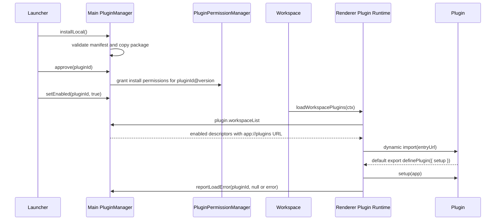

# NarraLeaf Studio 插件系统

本文记录 NarraLeaf Studio Plugin System V1 的真实边界、数据协议、加载链路和权限细节。面向插件创建的步骤文档见 [create-plugin.md](./create-plugin.md)。

## 系统边界

插件是安装在 Studio `userData/plugins` 下的本地已打包代码块。插件包通过 `manifest.json` 注册，运行时只在 workspace 窗口执行，不在 Launcher、Settings、Project Wizard 或 Dev Mode 窗口执行。

V1 插件入口是一个预构建的 ESM 文件。Studio 不编译插件源码，也不解析插件依赖树；渲染器只加载 manifest 声明的单个 `entry` 文件，例如 `main.js`。插件开发者需要提前把依赖打包进该入口文件，运行时稳定的 Studio API 入口是：

```tsx
import { definePlugin, ui } from "narraleaf-studio/plugin";
```

插件如果使用 React/JSX，必须把 `react`、`react-dom`、`react-dom/client`、`react/jsx-runtime`、`react/jsx-dev-runtime` 作为 host external，由 Studio import map 指向宿主版本，避免插件边栏出现第二份 React。

内建插件源码放在 `src/builtin-plugins/*`，构建产物放在 `dist/builtin-plugins/*`。主进程启动扫描前会把发布目录里的内建插件同步到 `userData/plugins`，所以内建插件和本地安装插件走同一套 manifest、descriptor、协议加载和 Launcher 展示模型。

插件代码在用户批准安装后作为可信本地 renderer 代码运行。它不是 sandbox 代码执行，不能作为恶意脚本隔离边界。V1 的安全边界是：

- 渲染器只做加载、路由、UI 注册和请求发起。
- 插件拿不到 `getInterface()`、默认 privileged facade token 或 raw preload 接口。
- 插件需要特权操作时只能走 `app.privileged`。
- `app.privileged` 绑定 `{ kind: "plugin", pluginId, version }` actor。
- 主进程始终是文件系统、API capability 和安装授权的最终审核者。

## Manifest 协议

每个插件包根目录必须包含 `manifest.json`。

```json
{
  "manifestVersion": 1,
  "id": "publisher.plugin-name",
  "name": "Plugin Name",
  "version": "1.0.0",
  "publisher": "Publisher",
  "description": "Short description",
  "entry": "main.js",
  "permissions": []
}
```

字段含义：

| 字段 | 必填 | 说明 |
| --- | --- | --- |
| `manifestVersion` | 是 | 当前只支持 `1`。 |
| `id` | 是 | 命名空间 ID，必须匹配 `publisher.plugin-name` 这类小写点分格式。 |
| `name` | 是 | Launcher 中展示的插件名称。 |
| `version` | 是 | semver-ish 版本，例如 `1.0.0`、`1.2.0-beta.1`。 |
| `publisher` | 否 | 发布者。 |
| `description` | 否 | 简短介绍。 |
| `entry` | 否 | 插件包内的相对入口路径；省略时默认 `main.js`。建议总是显式声明。 |
| `permissions` | 否 | 安装时一次性展示并授予的权限声明。省略时等同空数组。 |

`entry` 必须是包内相对路径。绝对路径、Windows drive path、空路径、包含 `..`、`.`、空字节、`?` 或 `#` 的路径都会被拒绝。主进程还会确认入口文件真实存在并且位于插件包目录内。

V1 支持两类安装权限：

```ts
type PluginInstallPermission =
  | {
      kind: "filesystem";
      path: string;
      mode: "read" | "write" | "readwrite";
      recursive: boolean;
    }
  | {
      kind: "api";
      capability: string;
    };
```

`filesystem` 权限在授权后按路径、读写模式和递归范围授予给 `pluginId@version`。`api` 权限按 capability 字符串授予给同一个版本键。未知 permission `kind` 会被 manifest 校验拒绝；未知 capability 字符串不会在校验阶段拒绝，但只有主进程已有处理器的 capability 才有实际效果。

## 安装注册表

`PluginManager` 使用 `userData/plugins` 作为安装目录，并在同一命名空间内维护持久化注册表。安装本地目录时，Studio 会读取源目录的 `manifest.json`，校验通过后复制到：

```text
userData/plugins/{pluginId}
```

`userData/plugins` 是受保护的应用存储根。插件的 privileged fs 请求即使获得用户授权，也不能读写该目录；这个保护和 `userData/authorization` 使用同一条主进程路径审核链路。内建插件发布目录 `dist/builtin-plugins` 也在保护名单中。

注册表记录形状：

```ts
type PluginInstallRecord = {
  pluginId: string;
  installPath: string;
  enabled: boolean;
  builtIn: boolean;
  manifest: NormalizedPluginManifestV1;
  installSource: { kind: "local-directory"; path: string } | { kind: "builtin"; path: string };
  installedAt: number;
  updatedAt: number;
  grantedManifestVersion?: string | null;
  lastError?: string | null;
};
```

Launcher 看到的是 `PluginListItem`，它在 record 基础上增加 `status`：

| 状态 | 条件 |
| --- | --- |
| `enabled` | 已启用，且 `grantedManifestVersion === manifest.version`，且没有 `lastError`。 |
| `disabled` | 未启用，已完成当前版本授权，且没有 `lastError`。 |
| `needsAuthorization` | 当前 manifest 版本没有授权。 |
| `error` | 最近一次 workspace 加载失败，错误保存在 `lastError`。 |

状态优先级是 `error` > `needsAuthorization` > `enabled` > `disabled`。如果插件加载失败，即使 `enabled` 仍为 true，也会以 `error` 展示，并且不会再次进入 workspace descriptor，直到用户重新启用或重新安装使 `lastError` 清空。

## 授权模型

插件安装和启用是两个动作。安装只把包复制进注册表，不自动授予权限。用户在 Launcher 点击授权时，主进程根据 manifest 构造 `kind: "install"` 的权限请求：

```ts
{
  kind: "install",
  plugin: { id, name, version, publisher },
  source,
  permissions: manifest.permissions,
  persistence: "permanent"
}
```

用户批准后，`PluginPermissionManager` 会把 manifest 中声明的文件系统和 API 权限写入授权存储。授权键带版本：

```text
{pluginId}@{manifest.version}
```

因此只要 `version` 改变，旧授权不会复用。下一次扫描或安装同 ID 新版本时，`PluginManager` 会把 `grantedManifestVersion` 置空，插件进入 `needsAuthorization`，必须由用户重新批准后才能启用。

撤销和卸载行为：

- `disable` 只关闭插件，不清除授权。
- `revoke` 关闭插件、清空 `grantedManifestVersion`，并删除该 `pluginId` 的所有版本授权。
- `uninstall` 删除插件目录和注册表记录，并删除该 `pluginId` 的所有版本授权。
- `builtIn` 插件使用相同 descriptor 模型，但是只读项，不能卸载或被本地插件覆盖。

内建插件同步规则：

- 源目录：`dist/builtin-plugins/{packageName}`。
- 安装目录：`userData/plugins/{manifest.id}`。
- 第一次发现时默认 `enabled: true`、`builtIn: true`、`grantedManifestVersion: manifest.version`。
- 用户可以禁用内建插件，但不能卸载或用本地插件替换它。
- 内建插件 manifest 版本变化时，主进程会重新同步文件并按新版本授予 manifest 权限。
- `yarn dev` 会在内建插件源码变化后重建、复制到 dev userData，并只刷新 workspace 窗口。

## Workspace 加载链路

插件在 workspace 完成早期初始化之后加载。当前入口位于 `WorkSpaceApp`，在核心 module loader 准备好 service、panel、editor、widget registry 后调用 `useWorkspacePlugins()`。



workspace 窗口只能拿到 `status === "enabled"` 的插件 descriptor：

```ts
type WorkspacePluginDescriptor = {
  plugin: {
    id: string;
    name?: string;
    version?: string;
    publisher?: string;
  };
  manifest: NormalizedPluginManifestV1;
  entryUrl: string;
};
```

runtime 会并行导入所有 descriptor 的 `entryUrl`，然后并行执行 `setup(app)`。V1 没有插件依赖图，也不保证插件加载顺序。插件如果依赖其他插件注册的 UI、widget 或 blueprint node，应当能处理目标不存在的情况。

`setup` 支持返回清理函数：

```ts
type PluginCleanup = () => void | Promise<void>;
type PluginSetupResult = void | PluginCleanup;
type PluginSetup = (app: PluginApp) => PluginSetupResult | Promise<PluginSetupResult>;
```

workspace 卸载时会执行已收集的 cleanup，并撤销该插件 renderer 会话里的 privileged token。插件导入或 setup 抛错不会阻断其他插件；错误会写入 `lastError`，并通过 workspace notification 和 Launcher status 展示。

## 协议路由

插件入口通过受控 `app://` 协议提供：

```text
app://plugins/{pluginId}/{version}/{entry}
```

`PluginEntryHandler` 只会返回当前已启用插件的 manifest 声明入口文件。即使插件包内有其他文件，也不能通过改 URL 获取；非入口文件、版本不匹配、未启用插件、路径穿越都会返回 404。响应带 `no-store`/`no-cache`，避免本地更新后使用旧代码。

`narraleaf-studio/plugin` 和 React host externals 不是插件包里的真实文件。Studio 在窗口 HTML 中写入 import map：

```html
<script type="importmap">
  {
    "imports": {
      "narraleaf-studio/plugin": "app://plugin-api/plugin.js",
      "react": "app://plugin-api/react.js",
      "react-dom": "app://plugin-api/react-dom.js",
      "react-dom/client": "app://plugin-api/react-dom-client.js",
      "react/jsx-runtime": "app://plugin-api/react-jsx-runtime.js",
      "react/jsx-dev-runtime": "app://plugin-api/react-jsx-dev-runtime.js"
    }
  }
</script>
```

`app://plugin-api/*` 是主进程生成的 ESM shim。renderer runtime 在加载插件前短暂暴露：

```ts
globalThis.__NLS_PLUGIN_MODULE__ = {
  definePlugin,
  ui,
  AssetType,
  AssetSource,
  PanelPosition,
  externals: {
    react,
    reactDom,
    reactDomClient,
    jsxRuntime,
    jsxDevRuntime
  }
};
```

shim 从该全局对象导出 `definePlugin`、`ui`、`AssetType`、`AssetSource`、`PanelPosition` 和 React runtime。插件在 workspace plugin runtime 之外导入这些 host modules 会得到明确错误。

## 插件 API

插件入口必须默认导出 `definePlugin(...)`，也支持 named export `plugin` 作为兼容入口。

```tsx
import { definePlugin, ui } from "narraleaf-studio/plugin";

export default definePlugin({
  setup(app) {
    app.services.ui.panels.register({
      id: `${app.plugin.id}.panel`,
      title: app.manifest.name,
      icon: null,
      position: "right",
      component: () => (
        <ui.Panel.Root>
          <ui.Panel.Header title={app.manifest.name} />
          <ui.Button size="sm">Action</ui.Button>
        </ui.Panel.Root>
      ),
    });
  },
});
```

`PluginApp`：

```ts
type PluginApp = {
  plugin: PluginIdentity;
  manifest: NormalizedPluginManifestV1;
  services: PluginServices;
  privileged: BoundPrivilegedFacade;
};
```

推荐插件优先使用 curated service map：

```ts
app.services.ui.panels.register(panel);
app.services.ui.actions.register(action);
app.services.ui.actions.registerGroup(group);
app.services.ui.editors.open(tab, groupId);
app.services.ui.keybindings.register(keybinding);
app.services.ui.notifications.info(message);

app.services.assets.get(AssetType.Image, assetId);
app.services.assets.createObjectUrl(asset);
app.services.storage.readJson(namespace);
app.services.storage.writeJson(namespace, data);

app.services.widgets.register(module);
app.services.blueprintNodes.register(def);
app.services.blueprintNodes.registerDynamicSelectOptionsSource(sourceId, provider);
```

项目共享 UI 组件通过 `ui` 导出，插件不要 import `@/lib/components/...` 或 workspace 内部路径。当前公共 UI 面包括：

- 基础控件：`Button`、`IconButton`、`Input`、`TextArea`、`SearchInput`、`InputGroup`、`Select`、`Combobox`、`SelectGroup`、`Switch`。
- Overlay / feedback：`Modal`、`ConfirmModal`、`AlertModal`、`ModalHeader`、`ModalBody`、`ModalFooter`、`ContextMenu`、`ContextMenuSeparator`、`useContextMenu`、`Progress`、`ProgressIndeterminate`、`ProgressCircle`。
- 信息组织：`Accordion`、`AccordionItem`、`NestedAccordion`、`Card`、`CardHeader`、`CardTitle`、`CardDescription`、`CardContent`、`CardFooter`、`InteractiveCard`。
- 插件边栏布局：`ui.Panel.Root`、`Header`、`Toolbar`、`Section`、`Row`、`EmptyState`。
- workspace 资源选择器：`ui.AssetSelector`。

`ui.AssetSelector` 复用 Studio 的工程资源树、搜索、筛选、导入和图片悬停预览。它是懒加载组件，只有插件真正渲染时才加载 workspace assets 模块。插件需要传入 `AssetType.Image`、`AssetType.Audio` 等值；这些值同样从 `narraleaf-studio/plugin` 导出。

`app.services.assets` 是工程资源的插件 facade：

```ts
app.services.assets.getMap();
app.services.assets.list(AssetType.Image);
app.services.assets.get(AssetType.Image, assetId);
app.services.assets.fetch(asset);
app.services.assets.createObjectUrl(asset);
app.services.assets.revokeObjectUrl(url);
```

`fetch`、`createObjectUrl` 失败时会 throw。`createObjectUrl` 对远程资源返回远程 URL，对本地资源创建 blob URL；插件负责在不再展示时调用 `revokeObjectUrl`。

`app.services.storage` 使用 workspace 的 service assets 存储，适合保存插件自己的项目级 JSON 配置：

```ts
const data = await app.services.storage.readJson<{ version: 1 }>(`${app.plugin.id}.settings`);
await app.services.storage.writeJson(`${app.plugin.id}.settings`, { version: 1 });
```

`readJson` 找不到文件时返回 `null`，其他错误会 throw。namespace 应以插件 ID 为前缀。

Blueprint select 动态选项来源由插件注册：

```ts
const dispose = app.services.blueprintNodes.registerDynamicSelectOptionsSource(
  `${app.plugin.id}.items`,
  () => [{ value: "item-a", label: "Item A" }],
);

app.services.blueprintNodes.register({
  type: `${app.plugin.id}.use-item`,
  category: "Plugin",
  inspectorParams: [
    {
      key: "itemId",
      label: "Item",
      kind: "select",
      dynamicOptionsSource: `${app.plugin.id}.items`,
    },
  ],
  // ...
});
```

当插件数据变化时调用 `app.services.blueprintNodes.notifyDynamicSelectOptionsChanged()`，已打开的 blueprint editor 会刷新下拉选项。

`app.services.get<T>(service)` 仍然暴露 workspace service registry，用于当前项目内部的深度集成。它会返回真实 service 实例，不是隔离 facade；插件文档中应把它标为高级接口，默认不要用它修改内部可变文档，除非插件明确绑定当前 Studio 版本。

`app.privileged` 是插件唯一的特权入口：

```ts
app.privileged.fs.requestRead(path, "utf-8");
app.privileged.fs.requestWrite(path, "utf-8");
app.privileged.permissions.request(request);
app.privileged.bash.execute(command, cwd);
```

文件系统请求必须同时满足：

- 插件 manifest 或运行时权限请求已给当前 `pluginId@version` 授权。
- 目标路径不在受保护的应用存储区域。
- 当前窗口策略允许，或窗口允许插件文件授权作为策略来源。

`bash.execute` 的 permission capability 已接入授权检查，但 V1 主进程 handler 当前返回 “Bash execution is not implemented yet”。

## Launcher 管理

Launcher 的 Plugins tab 使用真实插件注册表，不再使用硬编码测试插件或 localStorage 状态。它展示：

- enabled / disabled / needs authorization / load error
- built-in 标记
- version、publisher、description
- install source、install path、updated time
- manifest permissions
- load error 文本

当前动作：

- Refresh：重新读取当前注册表列表。
- Install Local：选择本地插件目录并安装。
- Approve Permissions：弹出权限窗口并批准当前 manifest 版本。
- Enable / Disable：启用或停用插件。
- Revoke：撤销授权并停用。
- Uninstall：删除非 built-in 插件。

在线 GitHub manifest/feed 不属于 V1。`PluginInstallSource` 和 manager API 已经保留 source/provider 的表达空间，但当前 Launcher 只做本地安装和内建项展示。

## IPC 面

Launcher、workspace 和 preload 之间使用这些 IPC：

| IPC | 说明 |
| --- | --- |
| `plugin.list` | Launcher 获取所有已安装插件。 |
| `plugin.installLocal` | Launcher 打开目录选择器并安装本地插件。 |
| `plugin.setEnabled` | Launcher 启用或停用插件。 |
| `plugin.approve` | Launcher 对当前 manifest 版本发起权限批准。 |
| `plugin.uninstall` | Launcher 卸载非 built-in 插件。 |
| `plugin.revoke` | Launcher 撤销插件授权并停用。 |
| `plugin.workspaceList` | workspace 获取可加载 descriptor；非 workspace 窗口会被拒绝。 |
| `plugin.reportLoadError` | workspace 上报插件加载成功或失败；非 workspace 窗口会被拒绝。 |

插件代码本身不应调用这些 IPC。插件只使用 `definePlugin` 和 `PluginApp`。

## V1 限制

- 只支持预打包 ESM 插件；Studio 不构建插件源代码。
- 只加载 manifest 声明的一个入口文件。
- 插件代码不是 sandbox；安装批准意味着用户信任该本地 renderer 代码。
- 没有在线插件商店、远程 feed、自动更新或依赖解析。
- 没有插件间依赖排序。
- 插件注册的 UI、widget、blueprint ID 目前由约定保证，必须以插件 ID 为前缀。
- built-in 插件已走同一套 manifest/descriptor/protocol 模型，但在线商店和远程更新仍不属于 V1。

## 关键实现文件

- Manifest 类型：`src/shared/types/plugins.ts`
- 权限类型：`src/shared/types/pluginPermissions.ts`
- Manifest 校验：`src/shared/utils/pluginManifest.ts`
- 安装权限文案：`src/shared/utils/pluginInstallPermissions.ts`
- 主进程插件管理：`src/main/app/application/managers/pluginManager.ts`
- 插件协议处理：`src/main/app/application/managers/protocol/pluginHandler.ts`
- 插件 IPC handler：`src/main/app/application/managers/window/handlers/pluginManagerAction.ts`
- 权限持久化：`src/main/app/application/managers/pluginPermissionManager.ts`
- actor 审核：`src/main/app/application/managers/window/actorAuthorization.ts`
- preload 接口：`src/main/preload/ipc/interface.ts`
- 公共 renderer API：`src/renderer/plugin/index.ts`
- workspace runtime：`src/renderer/lib/plugins/pluginRuntime.ts`
- workspace hook：`src/renderer/apps/workspace/hooks/useWorkspacePlugins.ts`
- 内建插件源码：`src/builtin-plugins/*`
- 内建插件构建：`project/build/build-builtin-plugins.js`
- Launcher UI：`src/renderer/apps/launcher/tabs/PluginsTab.tsx`
- import map：`project/assets/app-entry-html.ejs`
