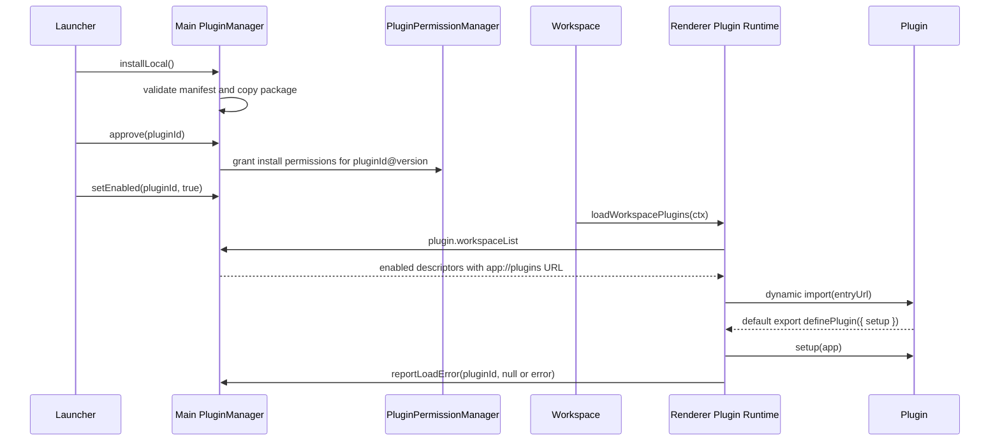

# NarraLeaf Studio 插件系统

本文记录 NarraLeaf Studio Plugin System V2 的真实边界、数据协议、加载链路和权限细节。面向插件创建的步骤文档见 [create-plugin.md](./create-plugin.md)，API 参考见 [studio-api.md](./studio-api.md) 与 [runtime-api.md](./runtime-api.md)。架构设计动机见 `docs/plans/2026-07-11-001-feat-plugin-dual-target-architecture.md`。

## 系统边界

插件是安装在 Studio `userData/plugins` 下的本地已打包代码块。V2 把"执行环境（target）"作为一等公民：一个插件包最多声明两个入口，各自在不同的世界执行。

| target | 执行位置 | Host API | 职责 |
| --- | --- | --- | --- |
| `studio` | workspace 窗口（不在 Launcher、Settings、Project Wizard、Dev Mode 窗口） | `narraleaf-studio/plugin` | 编辑器扩展：边栏、actions、editors、widget、蓝图节点元数据、动态选项源 |
| `runtime` | 所有游戏执行环境：Dev Mode 窗口、Preview、Production | `narraleaf-studio/runtime` | 游戏逻辑：蓝图节点 `execute` 绑定 |

每个入口都是预构建的 ESM 文件。Studio 不编译插件源码，也不解析插件依赖树；每个环境只加载 manifest 声明的对应 entry 文件。插件开发者需要提前把依赖打包进入口文件：

```tsx
// studio entry
import { definePlugin, ui } from "narraleaf-studio/plugin";
// runtime entry
import { defineRuntimePlugin } from "narraleaf-studio/runtime";
```

studio entry 如果使用 React/JSX，必须把 `react`、`react-dom`、`react-dom/client`、`react/jsx-runtime`、`react/jsx-dev-runtime` 作为 host external，由 Studio import map 指向宿主版本，避免插件边栏出现第二份 React。runtime entry 不提供 React；它是纯游戏逻辑代码。

runtime entry 的安全模型与 studio entry 不同：它作为游戏代码运行（打包后跑在玩家机器上），没有 `app.privileged`、没有 Studio services；网络访问由 pack 的网络策略统一管控。

内建插件源码放在 `src/builtin-plugins/*`，构建产物放在 `dist/builtin-plugins/*`。主进程启动扫描前会把发布目录里的内建插件同步到 `userData/plugins`，所以内建插件和本地安装插件走同一套 manifest、descriptor、协议加载和 Launcher 展示模型。

插件代码在用户批准安装后作为可信本地 renderer 代码运行。它不是 sandbox 代码执行，不能作为恶意脚本隔离边界。V1 的安全边界是：

- 渲染器只做加载、路由、UI 注册和请求发起。
- 插件拿不到 `getInterface()`、默认 privileged facade token 或 raw preload 接口。
- 插件需要特权操作时只能走 `app.privileged`。
- `app.privileged` 绑定 `{ kind: "plugin", pluginId, version }` actor。
- 主进程始终是文件系统、API capability 和安装授权的最终审核者。

## Manifest 协议

每个插件包根目录必须包含 `manifest.json`。

```json
{
  "manifestVersion": 2,
  "id": "publisher.plugin-name",
  "name": "Plugin Name",
  "version": "1.0.0",
  "publisher": "Publisher",
  "description": "Short description",
  "entries": {
    "studio": "main.js",
    "runtime": "runtime.js"
  },
  "contributes": {
    "blueprintNodes": ["publisher.plugin-name.node-type"]
  },
  "permissions": []
}
```

字段含义：

| 字段 | 必填 | 说明 |
| --- | --- | --- |
| `manifestVersion` | 是 | 当前只支持 `2`。V1（单 `entry` 字段）不再被接受。 |
| `id` | 是 | 命名空间 ID，必须匹配 `publisher.plugin-name` 这类小写点分格式。 |
| `name` | 是 | Launcher 中展示的插件名称。 |
| `version` | 是 | semver-ish 版本，例如 `1.0.0`、`1.2.0-beta.1`。 |
| `publisher` | 否 | 发布者。 |
| `description` | 否 | 简短介绍。 |
| `entries` | 是 | 按 target 声明的入口对象；`studio` 和 `runtime` 均可选，但至少声明一个。未知 target key 会被拒绝。 |
| `contributes` | 否 | 声明式贡献清单。`blueprintNodes` 列出插件提供的蓝图节点 type（必须以插件 ID 为前缀，自动去重）。省略等同空数组。未知 key 会被拒绝。 |
| `permissions` | 否 | 安装时一次性展示并授予的权限声明。省略时等同空数组。仅作用于 studio entry 的特权请求。 |

`contributes` 是静态校验的锚点：两侧注册 API 都强制"注册的节点 type 必须已声明"，因此 Studio 不需要执行插件代码就能回答"这个节点谁提供、随游戏发布时是否可用"。

每个 entry 必须是包内相对路径。绝对路径、Windows drive path、空路径、包含 `..`、`.`、空字节、`?` 或 `#` 的路径都会被拒绝。主进程还会确认每个已声明的入口文件真实存在并且位于插件包目录内。

支持两类安装权限：

```ts
type PluginInstallPermission =
  | {
      kind: "filesystem";
      path: string;
      mode: "read" | "write" | "readwrite";
      recursive: boolean;
    }
  | {
      kind: "api";
      capability: string;
    };
```

`filesystem` 权限在授权后按路径、读写模式和递归范围授予给 `pluginId@version`。`api` 权限按 capability 字符串授予给同一个版本键。未知 permission `kind` 会被 manifest 校验拒绝；未知 capability 字符串不会在校验阶段拒绝，但只有主进程已有处理器的 capability 才有实际效果。

## 安装注册表

`PluginManager` 使用 `userData/plugins` 作为安装目录，并在同一命名空间内维护持久化注册表。安装本地目录时，Studio 会读取源目录的 `manifest.json`，校验通过后复制到：

```text
userData/plugins/{pluginId}
```

`userData/plugins` 是受保护的应用存储根。插件的 privileged fs 请求即使获得用户授权，也不能读写该目录；这个保护和 `userData/authorization` 使用同一条主进程路径审核链路。内建插件发布目录 `dist/builtin-plugins` 也在保护名单中。

注册表记录形状：

```ts
type PluginInstallRecord = {
  pluginId: string;
  installPath: string;
  enabled: boolean;
  builtIn: boolean;
  manifest: NormalizedPluginManifestV2;
  installSource: { kind: "local-directory"; path: string } | { kind: "builtin"; path: string };
  installedAt: number;
  updatedAt: number;
  grantedManifestVersion?: string | null;
  lastError?: string | null;
};
```

Launcher 看到的是 `PluginListItem`，它在 record 基础上增加 `status`：

| 状态 | 条件 |
| --- | --- |
| `enabled` | 已启用，且 `grantedManifestVersion === manifest.version`，且没有 `lastError`。 |
| `disabled` | 未启用，已完成当前版本授权，且没有 `lastError`。 |
| `needsAuthorization` | 当前 manifest 版本没有授权。 |
| `error` | 最近一次 workspace 加载失败，错误保存在 `lastError`。 |

状态优先级是 `error` > `needsAuthorization` > `enabled` > `disabled`。如果插件加载失败，即使 `enabled` 仍为 true，也会以 `error` 展示，并且不会再次进入 workspace descriptor，直到用户重新启用或重新安装使 `lastError` 清空。

## 授权模型

插件安装和启用是两个动作。安装只把包复制进注册表，不自动授予权限。用户在 Launcher 点击授权时，主进程根据 manifest 构造 `kind: "install"` 的权限请求：

```ts
{
  kind: "install",
  plugin: { id, name, version, publisher },
  source,
  permissions: manifest.permissions,
  persistence: "permanent"
}
```

用户批准后，`PluginPermissionManager` 会把 manifest 中声明的文件系统和 API 权限写入授权存储。授权键带版本：

```text
{pluginId}@{manifest.version}
```

因此只要 `version` 改变，旧授权不会复用。下一次扫描或安装同 ID 新版本时，`PluginManager` 会把 `grantedManifestVersion` 置空，插件进入 `needsAuthorization`，必须由用户重新批准后才能启用。

撤销和卸载行为：

- `disable` 只关闭插件，不清除授权。
- `revoke` 关闭插件、清空 `grantedManifestVersion`，并删除该 `pluginId` 的所有版本授权。
- `uninstall` 删除插件目录和注册表记录，并删除该 `pluginId` 的所有版本授权。
- `builtIn` 插件使用相同 descriptor 模型，但是只读项，不能卸载或被本地插件覆盖。

内建插件同步规则：

- 源目录：`dist/builtin-plugins/{packageName}`。
- 安装目录：`userData/plugins/{manifest.id}`。
- 第一次发现时默认 `enabled: true`、`builtIn: true`、`grantedManifestVersion: manifest.version`。
- 用户可以禁用内建插件，但不能卸载或用本地插件替换它。
- 内建插件 manifest 版本变化时，主进程会重新同步文件并按新版本授予 manifest 权限。
- `yarn dev` 会在内建插件源码变化后重建、复制到 dev userData，并只刷新 workspace 窗口。

## Workspace 加载链路

插件在 workspace 完成早期初始化之后加载。当前入口位于 `WorkSpaceApp`，在核心 module loader 准备好 service、panel、editor、widget registry 后调用 `useWorkspacePlugins()`。



workspace 窗口只能拿到 `status === "enabled"` 且声明了 `entries.studio` 的插件 descriptor：

```ts
type WorkspacePluginDescriptor = {
  plugin: {
    id: string;
    name?: string;
    version?: string;
    publisher?: string;
  };
  manifest: NormalizedPluginManifestV2;
  entryUrl: string; // studio entry 的 app://plugins URL
};
```

runtime 会并行导入所有 descriptor 的 `entryUrl`，然后并行执行 `setup(app)`。V2 没有插件依赖图，也不保证插件加载顺序。插件如果依赖其他插件注册的 UI、widget 或 blueprint node，应当能处理目标不存在的情况。

`setup` 支持返回清理函数：

```ts
type PluginCleanup = () => void | Promise<void>;
type PluginSetupResult = void | PluginCleanup;
type PluginSetup = (app: PluginApp) => PluginSetupResult | Promise<PluginSetupResult>;
```

workspace 卸载时会执行已收集的 cleanup，并撤销该插件 renderer 会话里的 privileged token。插件导入或 setup 抛错不会阻断其他插件；错误会写入 `lastError`，并通过 workspace notification 和 Launcher status 展示。

## Runtime 加载链路

runtime entry 在三个游戏执行环境加载，共用同一个 loader（`src/renderer/lib/ui-editor/runtime/plugins/loadRuntimePlugins.ts`）：

| 环境 | descriptor 来源 | entry URL |
| --- | --- | --- |
| Dev Mode 窗口 | IPC `plugin.runtimeList`（仅 Dev Mode 窗口可调用；已启用 + 声明 runtime entry − 项目依赖 suppression） | `app://plugins/{id}/{version}/{runtimeEntry}` |
| Preview / Production | pack `plugins` 段（编译时按项目依赖表挑选并嵌入） | `nlgame://runtime/plugins/{id}/{runtimeEntry}` |

Dev Mode 的 suppression 与 workspace 一致：主进程读取项目 `.nlproj` 的依赖表，用共享的 `resolveDependencies` 解析——hard 依赖缺失或主版本不兼容的插件不会在该项目的 Dev Mode 会话中执行。解析失败不阻断会话（best-effort）。

加载时机在游戏 boot 之前：Dev Mode 由 `useDevModeRuntimePlugins()` 门控 `GameAppHost.ready`；独立 runtime 由 `GameRuntimeApp` 的 `useRuntimePlugins()` 与资源预载共同门控。所有 runtime plugin 注册完成后 NLR/blueprint 才开始执行，保证插件节点在首个蓝图触发前可解析。

runtime entry 必须默认导出 `defineRuntimePlugin({ setup })`：

```ts
import { defineRuntimePlugin } from "narraleaf-studio/runtime";

export default defineRuntimePlugin({
  setup(app) {
    app.game.blueprintNodes.registerMany(nodes);
  },
});
```

`RuntimePluginApp`：

```ts
type RuntimePluginApp = {
  plugin: PluginIdentity;
  manifest: NormalizedPluginManifestV2;
  game: {
    blueprintNodes: {
      register(def: { type: string; displayName?: string; execute: BlueprintNodeExecuteFn }): void;
      registerMany(defs: ...[]): void;
    };
    log(level: "info" | "warning" | "error", message: string): void;
  };
};
```

行为约束：

- node type 必须以插件 ID 为前缀，且必须在 manifest `contributes.blueprintNodes` 中声明；跨插件同名注册会抛错（该插件记为加载失败）。
- `register` 只读取 `type`/`displayName`/`execute`，可以直接传入与 studio entry 共享的完整 `BlueprintNodeDef` 对象。
- 游戏环境是进程级一次性加载：`setup` 没有 cleanup 语义，返回值被忽略。loader 按 `pluginId@version:entryUrl` 幂等缓存，StrictMode 双调用与 Dev Mode live reload 不会重复执行 setup。
- 单个插件加载失败只记录日志并跳过，不阻断游戏启动，也不阻断其他插件。

完整 API 参考见 [runtime-api.md](./runtime-api.md)。

### 双侧蓝图节点的推荐写法

蓝图节点是横跨两个 target 的扩展点：studio entry 注册完整定义（palette 元数据 + 编辑器内预览的 execute），runtime entry 注册游戏环境的 execute。把节点定义放进共享模块、两个 entry 各自 import，由插件自己的 bundler 打进两份产物，execute 即可单一来源：

```text
my-plugin/
  src/nodes.ts      ← BlueprintNodeDef[]（单一来源）
  src/main.tsx      ← studio entry: app.services.blueprintNodes.registerMany(nodes)
  src/runtime.ts    ← runtime entry: app.game.blueprintNodes.registerMany(nodes)
```

内建 Gallery 插件（`src/builtin-plugins/gallery/`）就是这个模式的参照实现。编辑器里用到了某插件节点、但该插件没有随游戏提供 execute 时，节点在游戏中执行会失败并产生 blueprint 执行错误——不再有核心代码后门（旧 `builtinPluginRuntimeNodes.ts` 已删除）。

## 协议路由

插件入口通过受控 `app://` 协议提供：

```text
app://plugins/{pluginId}/{version}/{entry}
```

`PluginEntryHandler` 只会返回当前已启用插件的 manifest 声明入口文件（`entries.studio` 或 `entries.runtime` 均可按其声明路径请求）。即使插件包内有其他文件，也不能通过改 URL 获取；非入口文件、版本不匹配、未启用插件、路径穿越都会返回 404。响应带 `no-store`/`no-cache`，避免本地更新后使用旧代码。

`narraleaf-studio/plugin`、`narraleaf-studio/runtime` 和 React host externals 不是插件包里的真实文件。Studio 在窗口 HTML 中写入 import map：

```html
<script type="importmap">
  {
    "imports": {
      "narraleaf-studio/plugin": "app://plugin-api/plugin.js",
      "narraleaf-studio/runtime": "app://plugin-api/runtime.js",
      "react": "app://plugin-api/react.js",
      "react-dom": "app://plugin-api/react-dom.js",
      "react-dom/client": "app://plugin-api/react-dom-client.js",
      "react/jsx-runtime": "app://plugin-api/react-jsx-runtime.js",
      "react/jsx-dev-runtime": "app://plugin-api/react-jsx-dev-runtime.js"
    }
  }
</script>
```

独立游戏 runtime 的 `index.html` 只映射 runtime API：

```html
<script type="importmap">
  { "imports": { "narraleaf-studio/runtime": "nlgame://plugin-api/runtime.js" } }
</script>
```

`app://plugin-api/*` 是主进程生成的 ESM shim。renderer runtime 在加载插件前短暂暴露：

```ts
globalThis.__NLS_PLUGIN_MODULE__ = {
  definePlugin,
  ui,
  AssetType,
  AssetSource,
  PanelPosition,
  externals: {
    react,
    reactDom,
    reactDomClient,
    jsxRuntime,
    jsxDevRuntime
  }
};
```

shim 从该全局对象导出 `definePlugin`、`ui`、`AssetType`、`AssetSource`、`PanelPosition` 和 React runtime。插件在 workspace plugin runtime 之外导入这些 host modules 会得到明确错误。

runtime API 的 shim 是同一模式：游戏环境的 runtime plugin loader 在加载入口前暴露 `globalThis.__NLS_RUNTIME_PLUGIN_MODULE__ = { defineRuntimePlugin }`（冻结、不可写）；`app://plugin-api/runtime.js` 与 `nlgame://plugin-api/runtime.js` 提供同一份 shim 源码（`src/shared/utils/pluginRuntimeApiModule.ts`）。在游戏环境之外导入 `narraleaf-studio/runtime` 会得到明确错误。

## 插件 API（studio entry）

studio 入口必须默认导出 `definePlugin(...)`，也支持 named export `plugin` 作为兼容入口。

```tsx
import { definePlugin, ui } from "narraleaf-studio/plugin";

export default definePlugin({
  setup(app) {
    app.services.ui.panels.register({
      id: `${app.plugin.id}.panel`,
      title: app.manifest.name,
      icon: null,
      position: "right",
      component: () => (
        <ui.Panel.Root>
          <ui.Panel.Header title={app.manifest.name} />
          <ui.Button size="sm">Action</ui.Button>
        </ui.Panel.Root>
      ),
    });
  },
});
```

`PluginApp`：

```ts
type PluginApp = {
  plugin: PluginIdentity;
  manifest: NormalizedPluginManifestV2;
  services: PluginServices;
  privileged: BoundPrivilegedFacade;
};
```

插件 API 是一份白名单：`app.services` 只包含 `storage`、`assets`、`ui`、`widgets`、`blueprintNodes`、`story` 这些经过筛选的接口，不暴露 workspace service registry（旧版的 `app.services.get<T>(service)` 与 `app.services.workspace` 已移除）。信任模型：已安装并启用的插件被信任执行项目作用域内的 UI 与数据操作；任何越界能力（工作区之外的文件系统、bash、权限授予）都必须经由 `app.privileged`，由主进程按插件身份逐次校验。插件通过白名单 API 完成的注册（panel、action、keybinding、widget、动态选项源、story action）由宿主自动记录，插件卸载时会被强制回收，即使插件自身的 cleanup 遗漏了它们。

`app.services.story.actions.register(...)` 向场景编辑器的 Action Creator palette（Plugin 分类）注册动作；动作创建的是**标准故事块**，文档不因此依赖插件。需要游戏侧逻辑的动作应生成 Blueprint 块并在其中使用插件蓝图节点。

蓝图节点注册强制两条规则：type 以插件 ID 为前缀，且已在 manifest `contributes.blueprintNodes` 中声明。

完整 API 参考（services、UI kit、AssetSelector、privileged）见 [studio-api.md](./studio-api.md)。

文件系统特权请求必须同时满足：

- 插件 manifest 或运行时权限请求已给当前 `pluginId@version` 授权。
- 目标路径不在受保护的应用存储区域。
- 当前窗口策略允许，或窗口允许插件文件授权作为策略来源。

`bash.execute` 的 permission capability 已接入授权检查，但主进程 handler 当前返回 "Bash execution is not implemented yet"。

## 执行环境矩阵

| 扩展点 | studio entry（workspace） | runtime entry（Dev Mode / Preview / Production） |
| --- | --- | --- |
| 边栏 / actions / editors / keybindings / notifications | ✅ | — |
| widget 模块 | ✅ 编辑面 | ⬜ 游戏渲染面（后续阶段） |
| 蓝图节点 | 元数据 + palette + 编辑器预览 execute | 游戏 execute（须声明于 `contributes.blueprintNodes`） |
| 动态 select 选项源 | ✅ | — |
| story action | ✅ palette 动作（创建标准故事块） | —（故事级逻辑经 Blueprint 块 + 插件蓝图节点执行） |
| assets / storage（项目级 JSON） | ✅ | —（运行时数据经 `ctx.hostAdapter` 的 persistence 在 execute 时访问） |
| privileged（fs/bash/permissions） | ✅ | 永不提供 |
| transform 字段 / transition 预设 | ⬜（等待核心预设系统，见设计文档决策记录） | ⬜ |

## Launcher 管理

Launcher 的 Plugins tab 使用真实插件注册表，不再使用硬编码测试插件或 localStorage 状态。它展示：

- enabled / disabled / needs authorization / load error
- built-in 标记
- version、publisher、description
- install source、install path、updated time
- manifest permissions
- load error 文本

当前动作：

- Refresh：重新读取当前注册表列表。
- Install Local：选择本地插件目录并安装。
- Approve Permissions：弹出权限窗口并批准当前 manifest 版本。
- Enable / Disable：启用或停用插件。
- Revoke：撤销授权并停用。
- Uninstall：删除非 built-in 插件。

在线 GitHub manifest/feed 不属于 V2。`PluginInstallSource` 和 manager API 已经保留 source/provider 的表达空间，但当前 Launcher 只做本地安装和内建项展示。

## 游戏打包（pack）

Preview / Production 的 `GameRuntimePackV2`（`schemaVersion: 2`）包含 `plugins` 段：

```ts
type GameRuntimePackPluginEntry = {
  manifest: NormalizedPluginManifestV2;
  entryRelativePath: string; // e.g. plugins/{pluginId}/runtime.js
};
```

pack 编译前，`PreviewManager` 用 `selectRuntimePluginsForPack()` 按**项目依赖表**（`ProjectDependencyTable`，机器维护、嵌入 `.nlproj`）挑选并校验：

- **挑选**：只打包依赖表中 `hard: true` 且已启用、声明 runtime entry 的插件。启用但项目未使用的插件不进 pack。项目没有依赖表时（从未扫描过）回退为打包全部启用的 runtime 插件，并写入 verbose 日志。
- **静态校验（失败即终止启动）**：项目蓝图用到的每个插件节点 type（依赖表 `usedBy.blueprintNode`）必须有可打包的提供方——插件缺失/被禁用/无 runtime entry、安装版本与项目记录主版本不兼容、或 type 未列入该插件的 `contributes.blueprintNodes`，都会以清晰诊断使 Preview 启动失败，而不是让节点在玩家机器上静默失败。
- soft 依赖（仅 storage 数据）没有运行时角色，不打包、不报错。

选中插件的 runtime entry 文件被复制到 `appDir/plugins/{pluginId}/{entry}` 并写入 `pack.plugins`。独立 runtime 通过 `nlgame://runtime/plugins/...` 静态路径加载这些文件（带根目录逃逸防护）。

## IPC 面

Launcher、workspace、Dev Mode 和 preload 之间使用这些 IPC：

| IPC | 说明 |
| --- | --- |
| `plugin.list` | Launcher 获取所有已安装插件。 |
| `plugin.installLocal` | Launcher 打开目录选择器并安装本地插件。 |
| `plugin.setEnabled` | Launcher 启用或停用插件。 |
| `plugin.approve` | Launcher 对当前 manifest 版本发起权限批准。 |
| `plugin.uninstall` | Launcher 卸载非 built-in 插件。 |
| `plugin.revoke` | Launcher 撤销插件授权并停用。 |
| `plugin.workspaceList` | workspace 获取 studio entry descriptor；非 workspace 窗口会被拒绝。 |
| `plugin.runtimeList` | Dev Mode 窗口获取 runtime entry descriptor；非 Dev Mode 窗口会被拒绝。 |
| `plugin.reportLoadError` | workspace 上报插件加载成功或失败；非 workspace 窗口会被拒绝。 |

插件代码本身不应调用这些 IPC。插件只使用 `definePlugin`/`defineRuntimePlugin` 和对应的 app 对象。

## V2 限制

- 只支持预打包 ESM 入口；Studio 不构建插件源代码，每个 entry 都必须是自包含单文件。
- 插件代码不是 sandbox；安装批准意味着用户信任该本地代码（runtime entry 还会随游戏发布）。
- 没有在线插件商店、远程 feed、自动更新或依赖解析。
- 没有插件间依赖排序。
- 插件注册的 UI、widget、blueprint ID 由约定 + 注册时前缀校验保证，必须以插件 ID 为前缀。
- runtime API 面当前是 `blueprintNodes` + `log`。transform 字段 / transition 预设扩展点等待核心先建立预设系统（当前核心自身也没有可插拔的预设注册点）。
- 插件 widget 只覆盖编辑面；游戏渲染面的插件 widget 属于后续阶段。
- 场景编辑器的 slash 快捷输入（`/` chooser）只列内建命令；插件 story action 从 Action Creator palette 使用。
- 静态校验依据项目依赖表（保存时由 workspace 扫描维护）；未在 workspace 中打开保存过的项目可能没有依赖表，此时打包回退为全部启用插件。

## 关键实现文件

- Manifest 类型：`src/shared/types/plugins.ts`
- 权限类型：`src/shared/types/pluginPermissions.ts`
- Manifest 校验：`src/shared/utils/pluginManifest.ts`
- 安装权限文案：`src/shared/utils/pluginInstallPermissions.ts`
- 主进程插件管理：`src/main/app/application/managers/pluginManager.ts`
- 插件协议处理：`src/main/app/application/managers/protocol/pluginHandler.ts`
- 插件 IPC handler：`src/main/app/application/managers/window/handlers/pluginManagerAction.ts`
- 权限持久化：`src/main/app/application/managers/pluginPermissionManager.ts`
- actor 审核：`src/main/app/application/managers/window/actorAuthorization.ts`
- preload 接口：`src/main/preload/ipc/interface.ts`
- 公共 renderer API（studio）：`src/renderer/plugin/index.ts`
- 公共 runtime API：`src/renderer/lib/ui-editor/runtime/plugins/runtimePluginApi.ts`
- runtime plugin loader：`src/renderer/lib/ui-editor/runtime/plugins/loadRuntimePlugins.ts`
- runtime API shim 源码：`src/shared/utils/pluginRuntimeApiModule.ts`
- workspace runtime：`src/renderer/lib/plugins/pluginRuntime.ts`
- workspace hook：`src/renderer/apps/workspace/hooks/useWorkspacePlugins.ts`
- Dev Mode hook：`src/renderer/apps/dev-mode/hooks/useDevModeRuntimePlugins.ts`
- pack 插件挑选与静态校验：`src/main/app/application/managers/preview/selectRuntimePlugins.ts`
- 项目配置读取（main）：`src/main/app/application/utils/projectConfigFile.ts`
- pack 编译：`src/main/app/application/managers/preview/compiler/gameRuntimeArtifactCompiler.ts`
- 独立 runtime 协议：`src/runtime/main/main.ts`
- 独立 runtime 加载：`src/runtime/renderer/GameRuntimeApp.tsx`
- 内建插件源码：`src/builtin-plugins/*`
- 内建插件构建：`project/build/builtin-plugins.js`
- Launcher UI：`src/renderer/apps/launcher/tabs/PluginsTab.tsx`
- import map（Studio 窗口）：`project/assets/app-entry-html.ejs`
- import map（独立 runtime）：`project/build/build-runtime.js`
