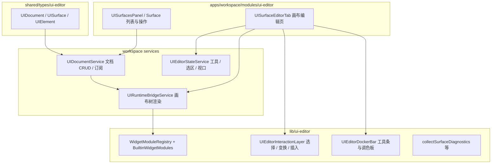

# 界面编辑系统架构与内置控件说明

本文档基于当前代码库（`src/renderer/lib/ui-editor`、`src/renderer/apps/workspace/modules/ui-editor`、`src/shared/types/ui-editor`）总结 **UI Surface 编辑器** 的分层架构，并逐项说明 **内置控件类型** 的类型标识、属性、行为特性与典型用途。

---

## 1. 工作区入口与职责边界

`src/renderer/apps/workspace/modules/ui-editor/index.tsx` 仅负责将「UI」左侧面板注册为工作区模块（`PanelModule`）：元数据（标题、图标、位置、焦点区域）与面板组件 `UISurfacesPanel`。**不包含**画布、运行时或控件实现；这些集中在 `lib/ui-editor` 与共享服务中。

---

## 2. 分层架构概览

**数据流要点：**

- **UIDocument**：`elements` 为按 id 索引的字典；`surfaces` 描述多个界面面（App / Stage），每个 Surface 有 `designSize`、`rootElementId` 等。
- **UIRuntimeBridgeService.renderSurface**：按 Surface 根节点递归 `renderElementTree`，通过 **ElementRendererRegistry**（由 `BuiltinWidgetModules` 映射而来）解析每个 `element.type` 的 `render`；未知类型走占位回退。
- **EditorNodeWrapper**：根据父节点是否为「流式布局容器」决定子节点是 **绝对定位** 还是 **flex 流式**（见下文「布局模式」）。
- **UIEditorInteractionLayer**：选区、Moveable 变换、插入预览、与文档服务协同更新 `layout`。
- **属性面板**：`getElementInspector` 根据 `widgetModuleRegistry.get(element.type)` 调用各模块的 `createInspector`。
- **Docker 条**：选中元素时合并各模块的 `createDockerBarItems`；多选时仅保留各选中模块均提供的、同 `id` 的项。

---

## 3. 文档与元素模型（核心类型）

| 概念 | 说明 |
|------|------|
| **UISurface** | `UIAppSurface`（`host: "app"`）或 `UIStageSurface`（`host: "player"`），含设计分辨率 `designSize`、根元素 `rootElementId`；Stage 另有 `mount`、`link`、`slots` 等演出相关字段。 |
| **UIElement** | `type`（控件类型字符串）、`layout`（几何与可见性）、`props`（控件专有属性，弱类型 `Record`）、`style`、`behavior`（事件绑定）、父子 `childrenIds`。 |
| **UILayout** | `x, y, width, height`，可选 `rotation`、`opacity`、`visible`。 |
| **UIBehavior / UIBehaviorBinding** | 支持 `noop`、`actions`、以及 **Blueprint M2** 的 `blueprintEvent`（`blueprintId` + `eventId`）。 |

---

## 4. 布局模式：绝对定位 vs 流式（Flow）

常量 `UI_FLOW_LAYOUT_PARENT_ELEMENT_TYPES`（见 `document.ts`）定义三类父容器：**`nl.stack`、`nl.scroll`、`nl.listRepeater`**。

- 这三类容器的 **直接子节点** 在编辑器包装层中按 **flow** 布局参与 flex，而不再按画布绝对坐标摆放。
- 其他父节点下的子元素仍为 **absolute** 布局（相对父级坐标系）。

因此：**Stack / Scroll / ListRepeater** 用于编排子控件排列；**Container、Rectangle** 等常用于分组与装饰，子级多为绝对布局（除非嵌套在上述三类之下）。

---

## 5. 控件模块（UIWidgetModule）统一接口

定义于 `src/renderer/lib/ui-editor/widget-modules/types.ts`：

| 能力 | 作用 |
|------|------|
| `type` | 全局唯一类型 id（如 `nl.text`）。 |
| `supportsBlueprintLogic` | 为 `true` 时，创建该控件可关联 **widget 主蓝图（Blueprint M2）** 实例逻辑。 |
| `createDefaultElement` | 插入控件时的默认 `type`、`name`、`layout`、`props`。 |
| `render` | 画布/运行时实际渲染（与 `UIRuntimeBridgeService` 共用）。 |
| `createInspector` | 属性检查器 schema（在通用布局字段之后追加）。 |
| `createDockerBarItems` / `createMultiSelectDockerBarItems` | 选中时的快捷条控件。 |

注册表：`registryInstance.ts` 在启动时 `registerMany(BuiltinWidgetModules)`。

---

## 6. 内置控件类型详解

以下 **类型 id** 与 `BuiltinWidgetModules` 顺序一致（`builtin/index.ts`）。

### 6.1 `nl.rectangle`（Rectangle）

| 项目 | 内容 |
|------|------|
| **用途** | 矢量风格矩形：纯色或图像填充、可独立圆角、描边与高级描边选项；适合背景、卡片底、装饰块。 |
| **Blueprint** | `supportsBlueprintLogic: true` |
| **默认尺寸** | 200×150（见 `rectangle.tsx` 的 `createDefaultElement`） |

**主要 `props`（与 `rectangle/types` 及默认创建逻辑一致）：**

- **填充**：`fillType`（`color` | `image`）、`backgroundColor`、`backgroundImage`、`backgroundFit`、`imageFill`（可选，见 `ImageFill`）、`fillVisible`、`fillOpacity`。
- **圆角**：`borderRadius`、四角独立 `borderRadiusTL/TR/BL/BR`、`borderRadiusLinked`、`cornerAdvanced`。
- **描边**：`strokeVisible`、`strokeOpacity`、`strokeAlign`（`none` \| `center` \| `inside` \| `outside`）、`strokeSide`、`borderJoin`。
- **边框**：`borderColor`、`borderWidth`、`borderStyle`。

---

### 6.2 `nl.text`（Text）

| 项目 | 内容 |
|------|------|
| **用途** | 展示与编辑文本；支持编辑态覆盖（`textEdit` interaction override）。 |
| **Blueprint** | `supportsBlueprintLogic: true` |
| **默认尺寸** | 240×48 |

**`TextWidgetProps`：**

| 属性 | 说明 |
|------|------|
| `text` | 文本内容 |
| `fontSize` | 字号（px） |
| `color` | 颜色（hex 等） |
| `fontWeight` | `normal` \| `bold` \| `600` |
| `textAlign` | `left` \| `center` \| `right` |
| `lineHeight` | 行高倍数 |

---

### 6.3 `nl.image`（Image）

| 项目 | 内容 |
|------|------|
| **用途** | 以 **图像填充** 为主的矩形区域（默认 `fillType: "image"`），与资源 `assetId`、裁剪 `cropPlacement` 等配合；与 Rectangle 共享大量几何/描边字段。 |
| **Blueprint** | `supportsBlueprintLogic: true` |
| **默认尺寸** | 200×200 |

**特点：** 默认 `props` 含 `imageFill: { mode: "cover", assetId: null }`，并沿用 Rectangle 系列字段（圆角、描边、`ImageFill` 等）。`ImageFill` 类型见 `shared/types/ui-editor/imageFill.ts`（`mode`：`cover` \| `contain` \| `stretch` \| `crop` \| `tile` 等）。

---

### 6.4 `nl.container`（Container）

| 项目 | 内容 |
|------|------|
| **用途** | 通用分组容器：背景、圆角、边框、是否裁剪子内容；子元素默认 **绝对布局**（除非父链上有 Stack/Scroll/ListRepeater）。 |
| **Blueprint** | `supportsBlueprintLogic: true` |
| **默认尺寸** | 320×240 |

**`ContainerWidgetProps`：**

| 属性 | 说明 |
|------|------|
| `backgroundColor` | 背景色 |
| `borderRadius` | 圆角 |
| `borderWidth` / `borderColor` / `borderStyle` | 边框 |
| `clipContent` | `overflow: hidden` 与否 |

---

### 6.5 `nl.button`（Button）

| 项目 | 内容 |
|------|------|
| **用途** | 可点击区域：外观由 props 控制；**标签内容通常来自子节点**（如 Text）。运行时若存在 `hostAdapter.blueprintRuntime` 且未 `interactionDisabled`，点击/键盘会派发元素蓝图 `click` 事件。 |
| **Blueprint** | `supportsBlueprintLogic: true` |
| **默认尺寸** | 160×48 |

**`ButtonWidgetProps`：**

| 属性 | 说明 |
|------|------|
| `backgroundColor`、`borderRadius`、`borderWidth`、`borderColor`、`borderStyle` | 外观 |
| `paddingX` / `paddingY` | 内边距 |
| `clipContent` | 子内容裁剪 |
| `interactionDisabled` | 运行时禁用交互（不改存档 props） |

---

### 6.6 `nl.stack`（Stack）

| 项目 | 内容 |
|------|------|
| **用途** | Flex 堆叠容器；**直接子级为 flow 布局**，用于垂直/水平排列、对齐与间距。 |
| **Blueprint** | `supportsBlueprintLogic: false` |
| **默认尺寸** | 360×280 |

**`StackWidgetProps`：**

| 属性 | 说明 |
|------|------|
| `direction` | `horizontal` \| `vertical` |
| `gap` | 主轴间距 |
| `paddingTop/Right/Bottom/Left` | 内边距 |
| `alignItems` | `start` \| `center` \| `end` \| `stretch` |
| `justifyContent` | `start` \| `center` \| `end` \| `space-between` \| `space-around` |

---

### 6.7 `nl.scroll`（Scroll）

| 项目 | 内容 |
|------|------|
| **用途** | 单轴滚动：另一轴隐藏溢出；内部为 flex 子区域。子级为 **flow**。 |
| **Blueprint** | `supportsBlueprintLogic: false` |
| **默认尺寸** | 320×240 |

**`ScrollWidgetProps`：**

| 属性 | 说明 |
|------|------|
| `axis` | `x`：横向滚动；`y`：纵向滚动 |

---

### 6.8 `nl.spacerDivider`（Spacer / Divider）

| 项目 | 内容 |
|------|------|
| **用途** | 在 **流式父容器** 中占位（spacer）或绘制分隔线（divider）；divider 支持水平/垂直线与 inset。 |
| **Blueprint** | `supportsBlueprintLogic: false` |
| **默认** | mode `spacer`，orientation `horizontal` |

**`SpacerDividerWidgetProps`：**

| 属性 | 说明 |
|------|------|
| `mode` | `spacer` \| `divider` |
| `orientation` | `horizontal` \| `vertical` |
| `thickness` | 线粗或 spacer 交叉轴尺寸提示（px） |
| `color` | 分隔线颜色（hex） |
| `insetStart` / `insetEnd` | 线端内缩 |

---

### 6.9 `nl.listRepeater`（List / Repeater）

| 项目 | 内容 |
|------|------|
| **用途** | 设计时 **重复预览** 子树若干份（上限 32），模拟列表；仅 **第一份** 响应指针事件，其余为视觉预览。子级在每一份内为 **flow**（`templateDirection` / `templateGap`）。 |
| **Blueprint** | `supportsBlueprintLogic: false` |
| **默认** | `previewCount: 4`，纵向重复 |

**`ListRepeaterWidgetProps`：**

| 属性 | 说明 |
|------|------|
| `previewCount` | 预览重复份数（设计时） |
| `itemGap` | 重复块之间的主轴间距 |
| `repeatDirection` | 多份排列方向：`horizontal` \| `vertical` |
| `templateDirection` | 每份内子元素排列方向 |
| `templateGap` | 每份内子元素间距 |

---

## 7. 与其他子系统的关系（简表）

| 子系统 | 关联方式 |
|--------|----------|
| **诊断** | `collectSurfaceDiagnostics` 等结合文档与蓝图，对 Surface / 元素给出布局、交互、资源等提示。 |
| **蓝图运行时** | `supportsBlueprintLogic` 的控件可与实例主蓝图配合；Button 等在存在 `blueprintRuntime` 时派发事件。 |
| **Dev Mode** | `UISurfaceEditorTab` 可从编辑器启动当前 Surface 预览。 |

---

## 8. 扩展新控件类型的步骤（实现层面）

1. 在 `widget-modules/builtin` 下实现模块：实现 `UIWidgetModule`（`render`、`createDefaultElement`、可选 inspector/docker）。
2. 将模块加入 `BuiltinWidgetModules` 数组（`builtin/index.ts`）。
3. 若子级需 **flow 布局**，将父类型加入 `UI_FLOW_LAYOUT_PARENT_ELEMENT_TYPES`（需同步 `document.ts` 与运行时包装逻辑）。

---

*文档生成依据仓库源码结构；若后续增加控件或调整默认 props，请以 `BuiltinWidgetModules` 与各 `types.ts` / `*.tsx` 模块为准。*
